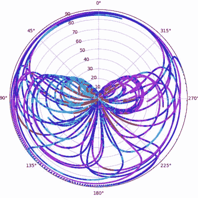

# 追踪让我们保持在轨道上的卫星；监控 GPS、伽利略、北斗和 GLONASS

> 原文：<https://hackaday.com/2019/09/24/tracking-the-satellites-that-keep-us-on-track-monitoring-gps-galileo-beidou-and-glonass/>

我们可能并不总是意识到这一点，但我们周围的科技世界的日常功能非常依赖卫星导航系统。它帮助 DHL 递送你所期待的零件，并保持全球金融和通信系统精确定时运行。因此，当这些系统有糟糕的一天，他们可以在全球范围内传播痛苦。为了关注这些关键星座，[Bert Hubert]和他的朋友们建立了一个全球开源监控网络，旨在跟踪 GPS、伽利略、北斗和 GLONASS 星座中的每一颗卫星。

 

通过头顶的 GPS、伽利略和北斗卫星的当地方位角和当地仰角【经由[@ Galileo sats](https://twitter.com/GalileoSats/status/1173312768986030081)】

现成的 GNSS 接收器用于向运行 Linux/OSX/OpenBSD 的机器提供导航消息。消息被处理以[计算位置(星历)](https://ds9a.nl/articles/posts/galileo-notes/)，提取每个卫星的原子钟定时和状态码。然后利用公开的轨道数据对有关卫星的身份进行有根据的猜测。

所有这些数据使[Bert]能够确定星历表的不连续性、时间偏移和原子钟跳动。该项目的 twitter feed， [@GalileoSats](https://twitter.com/GalileoSats) ，非常活跃，提供有趣的更新。去看看！所有收集的数据都可用于研究目的，Github 上有[软件。](https://github.com/ahupowerdns/galmon/)

GPS 黑客在这里永远不会短缺，另一个开源卫星网络 [SatNOGS](https://hackaday.com/2015/02/19/ground-stations-are-just-the-beginning-the-satnogs-story/) 在赢得 [2014 年黑客日奖](https://hackaday.com/2014/11/13/satnogs-wins-the-2014-hackaday-prize/)后，已经在黑客日上出现了多次。

谢谢你的提示[黑暗面戴夫]！