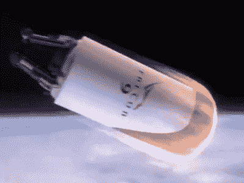

# 制定可持续航天的指导方针

> 原文：<https://hackaday.com/2019/10/22/developing-guidelines-for-sustainable-spaceflight/>

在太空飞行的早期，只有美国和苏联政府有能力将物体送入轨道，即使是最富于幻想的未来学家也很难相信商业实体有一天会一次发射 60 颗卫星。我们头顶上曾经看起来无限广阔的地方现在开始变得很小，而且随着时间的推移，它只会变得更加拥挤。SpaceX 正准备在 2020 年代中期之前为他们的 Starlink 网络发射近 12，000 颗独立卫星，这只是目前正在工作的“巨型星座”之一。

Just some of the objects in orbit around the Earth

地球轨道过度拥挤似乎是遥远未来的问题，但人们只需看看最近的事件就能看到麻烦的最初迹象。9 月 2 日[,欧洲航天局宣布](https://spacenews.com/esa-spacecraft-dodges-potential-collision-with-starlink-satellite/),由于与第一代 Starlink 卫星相撞的风险高于可接受水平，其一艘研究飞船不得不执行规避动作。仅仅两周后，美国空军通知毕格罗航空航天公司，一颗已经报废的俄罗斯宇宙 1300 卫星[将有 1/20 的几率撞击他们的创世纪二号空间站原型](https://www.space.com/no-space-junk-collision-russian-satellite-genesis-ii-habitat.html)。

两颗卫星在轨道上的碰撞几乎肯定是灾难性的，最终两个航天器要么完全摧毁，要么严重损坏。但在最坏的情况下，车辆之间的相对速度可能如此之大，以至于撞击产生成千上万的碎片。由此产生的弹片云可以环绕地球数年甚至数十年，威胁着任何不幸经过的航天器。

幸运的是，避免这些冲突应该不难，前提是每个人都能在为时已晚之前达成共识。最近成立的太空安全联盟(SSC)由二十多家航空航天公司组成，这些公司认识到采取积极措施的重要性，通过为未来的航天器建立一些共同的“道路规则”，确保人类能够不受阻碍地进入外层空间。

## 不再有秘密

SSC 在他们的文件*“空间*
*操作的可持续性的最佳实践”*中提出的第一个指令是最容易也是最难完成的:在航天器所有者和操作者之间建立一个公开的对话，讨论他们各自的航天器实际上能够做什么。航天工业是出了名的秘密，但 SSC 认为，当涉及到安全时，公司将不得不透露更多关于他们的硬件的信息，而不是他们传统上感到舒服的信息。

根据该文件，至关重要的是，所有操作人员都应了解每架飞机的机动能力，以及在需要采取规避行动时的预期“飞行计划”。这将允许在近距离超车时快速确定哪辆车有通行权。就像较小的船会避开较大且机动性较低的船一样，如果其他因素都相同的话，逻辑上来说，更灵活的太空船应该会主动进行规避动作。

或许是预测到航空航天公司不愿意详细说明其专有硬件和软件的能力，SSC 澄清这一信息的交换必须以诚信的方式进行，并以尊重各方知识产权的方式进行。换句话说，不要指望这些信息会很快出现在维基百科上；虽然对于航天机构和运营商来说，了解彼此的航天器的能力很重要，但公众不一定需要知道。

## 用你的钱包投票

第二项指令针对的是那些从商业供应商处购买发射服务的人，并规定客户应在其合同中规定，将航天器送入轨道的助推器必须尽一切努力在成功完成任务后负责任地自行处置。换句话说，一旦火箭的上面一级将你的卫星送入预定轨道，它就必须调整自己的轨道，要么在大气层中烧毁，要么继续深入太空。

SpaceX concept for a reusable upper stage

具体来说，SSC 表示，将航天器送入低地球轨道的运载火箭在任务完成后至少要有 90%的成功率才能脱离轨道。在航天器朝着更高的地球同步轨道前进的情况下，运载火箭应该能够将自己推进到深空轨道，这将确保它至少在 100 年内不会返回。

通过要求运营商在为他们的航天器预订通道时考虑运载火箭的任务后处置，SSC 正在寻求有效地激励更强大的助推器的开发。如果客户不使用你的火箭，因为它不能在有效载荷分离后安全地脱离轨道，你会突然有一个非常令人信服的理由来研究和实现这种能力。将这一想法更进一步，它甚至可能刺激可重复使用的上面级的开发，这是 SpaceX 多年来一直在考虑的概念。

## 安全源于设计

文件的其余部分，实际上是大部分，与设计和制造航天器的最佳实践有关。这些建议包括可以采取的主动和被动措施，以使航天器在越来越拥挤的空域中获得最佳的生存机会，以及确保飞行器不会无意中成为太空垃圾的方法。

这似乎是不言而喻的，但第一个建议是在地面上彻底测试航天器，以防止到达时死亡(DOA)的情况。但现实情况是，测试可能既昂贵又耗时，而新一代低成本微型卫星 T1 的设计和组装往往预算极其紧张。你不用花很长时间就能找到立方体卫星从运载火箭上一释放就失败的例子。

SSC 还建议将卫星部署到更低、交通更少的轨道，直到自我诊断测试确认它们完全正常工作。这意味着将卫星送入预定轨道需要更多的时间和推进剂，但好处是如果飞行器最终到达，它不太可能对导航造成危害。在低轨道上，即使一个不起作用的航天器也会在相对较短的时间内坠入大气层并烧毁。SpaceX 在第一次 Starlink 发射中使用了这种方法，最终发现六十颗卫星中有三颗从未通过自检，并且未能从最初的“停泊”轨道上继续前进。

最后，SSC 同意欧洲航天局的观点，未来的卫星应该利用“死亡设计”或 D4D。这些设计原则确保即使一颗不起作用的卫星也会脱离轨道，在大气层中完全烧毁。这些技术包括使大气阻力最大化的航天器形状和方向，以及使用热反应粘合剂，这种粘合剂会在再入过程中随着飞行器的升温而释放。

## 事实胜于雄辩

虽然空间安全联盟列出的在地球轨道上设计和操作航天器的最佳做法是合理的，在许多情况下也是合乎逻辑的，但该组织没有权力实际执行这些做法。因此，任何决定遵守这些规则的公司都是出于自愿。小型卫星发射提供商美国维珍轨道公司和火箭实验室已经决定签署该文件，一些运营卫星舰队的公司，如 SES 和铱星公司也决定签署该文件。

虽然看到业内人士的早期支持令人鼓舞，但目前仍有一些知名度很高的名字没有出现在代言人名单中。首先也是最重要的是 SpaceX，它不仅是世界上首屈一指的商业发射服务提供商，而且在未来将运营有史以来最大的单个航天器舰队。同样缺席的还有波音、诺斯罗普·格鲁曼和洛克希德·马丁等大型航空航天公司，这些公司负责设计和制造大量民用和军用卫星。

如果该行业有任何希望掌握近距离航天飞行的关键要素，如避免碰撞和航天器处置，这将需要更多的公司签署非约束性协议。需要说服较大的公司尽快与空间安全联盟的理想保持一致，因为轨道发射的速度越来越快，这意味着在事情达到临界点之前，我们可能没有多少时间了。