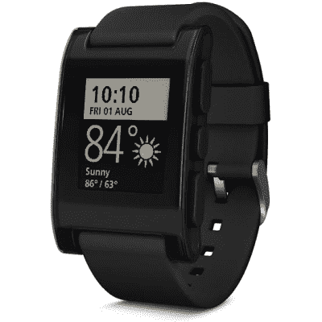

# 问 Hackaday:有什么完美的黑客智能手表？

> 原文：<https://hackaday.com/2019/10/07/ask-hackaday-whats-the-perfect-hacker-smart-watch/>

自 1946 年迪克·特雷西(Dick Tracy)以来，智能手表已经抓住了公众的想象力。在几次失败的开始之后，这项技术在过去 10 年左右经历了一次复兴。对于普通消费者来说，市场上的硬件激增，有几十种不同的型号可供选择。然而，对于黑客来说，选择的余地更小一些。那么对于我们当中的修修补补者来说，最好的智能手表是什么呢？

## 新产品

These fears were allayed somewhat after a photo of an actual prototype was revealed.

最近，Pine64 宣布[开发他们的 PineTime 智能手表](https://wiki.pine64.org/index.php/PineTime)。眼尖的观众很快发现[早期的照片似乎是全球速卖通](https://twitter.com/thepine64/status/1172837428526223366)的现有产品，尽管 Pine64 表示他们的设备只是利用了现有的底盘和机身来降低生产成本。

据报道，该器件内部采用 nRF52832 或 nRF52840 片上系统，包含一个 64MHz ARM Cortex-M4F CPU 内核。这应该提供足够的咕噜声，还有蓝牙 5.0 低能耗连接目的。显示分辨率为 240×240，可能使用有机发光二极管屏幕。

它被吹捧为一个开源项目，能够运行各种实时操作系统。人们一直在谈论实现从 FreeRTOS 到 Mbed 的一切，开发社区可能会塑造该平台的未来。

Using a Photoshopped image of an AliExpress watch raised eyebrows on Twitter.

这里有很多乐观的看法，当然，很难说他们是否能够实现这些功能，或者坚持在这个过程的早期浮动的 25 美元的可疑低价。对于一个能够运行自制代码的现成智能手表平台来说，这是一个相当有吸引力的价格。你还记得十年前 TI 的 Chronos 手表以 49 美元的价格上市吗？那个从未被广泛追踪，但明天是新的一天。感兴趣的人应该熟悉[松木时间规格表](https://wiki.pine64.org/index.php/PineTime)，并开始考虑各种可能性。

## 为 Pebble 倒一杯

曾几何时，黑客的最爱是轻松 Pebble。作为一个相对开放的平台，任何人都可以轻而易举地为该设备进行开发。像 AutoPebble 这样的应用程序帮助成千上万的人充分利用了这款设备，尤其是在与 Tasker 这样的 Android 收藏夹结合使用时。Pebbles 开始在航海和家庭自动化等不同领域工作，而用户群可以根据自己的喜好自由定制自己的表盘。

Pebble smartwatches were loved for their simplicity and great usability. Unfortunately, the financial side just didn’t work out.

不幸的是，一切都不顺利。在艰难的几年后，Pebble 被 Fitbit 买断。这结束了 Pebble 服务器和硬件生产，生态系统在合并后慢慢消亡。他们创新的 smartstrap 硬件扩展系统[也没能大获成功](https://liliputing.com/2016/12/what-pebbles-shutdown-means-for-smartstrap-makers.html)。一个名为 Rebble 的专门团体[仍然存在，他们在没有官方公司支持的情况下继续在该平台上进行黑客攻击。通过他们的工作，尽管最初的服务器在 2017 年关闭，但仍有可能继续使用您的 Pebble。然而，由于没有进一步的产品生产，Pebble 似乎不太可能在未来蓬勃发展。](https://rebble.io/)

## 还有其他选择

这些年来，我们也看到了针对各种智能手表的其他黑客攻击。早在 2013 年，[索尼推出了一套工具](https://hackaday.com/2013/06/14/hackit-sony-invites-you-to-hack-its-smartwatch-firmware/)，让开发者能够为当时的智能手表创建自己的固件。我们也看到个人接受挑战，无论是[【克日西克】挑战 WeLoop Tommy](https://hackaday.com/2015/07/16/hackaday-prize-entry-new-firmware-for-a-smartwatch/) 还是[【亚伦】摆弄 NRF 各种各样的全球速卖通健身乐队。](https://hackaday.com/2019/02/20/custom-firmware-for-cheap-fitness-trackers/)

AsteroidOS is an open-source project targeting WearOS watches, in a similar way CyanogenMod did with Android phones.

其他项目由更大的社区组成，这些社区为了一个共同的目标聚集在一起。AsteroidOS 旨在为基于 Wear OS 的智能手表创建一个开源软件生态系统。 [OpenWatch](https://github.com/openwatchproject) 的目标是做同样的事情。这些项目承诺解锁顶级商用智能手表的功能，供渴望的黑客们玩。然而，在对大多数硬件实现完全支持之前，还有许多开发工作要做。

这些努力可以获得巨大的成果，但通常单独黑客的有限资源不足以跟上新硬件的发布时间表。再加上一些制造商不断逼近的限制性固件更新的威胁，数小时的努力很容易就白费了。

## 少了什么？

While this interface gives us a headache, it’s a testament to the amount of functionality in the latest Apple Watch.

现代早期的智能手表只不过是蓝牙连接的显示器，依赖于连接的智能手机来提供处理能力和访问外围设备。快进到今天，像 series 5 Apple Watch 这样的设备拥有强大的处理能力，以及成熟的板载蜂窝调制解调器和千兆字节的存储空间。这使他们能够完全独立地运作。有了心率监测器、步数追踪器和其他各种各样的小玩意，如今你在腕戴式电脑上能得到的东西已经不多了。

通常，黑客是第一个着手将新功能推向前台的人。不过，智能手表的外形也带来了一些困难。许多手表都配有表壳，几乎不可能不损坏就打开，即使能打开也不太可能找到空间来安装额外的硬件。不管怎样，总会有人去尝试。

现代设备中有如此多的东西，很难在硬件层面上为设备增加更多的功能。十有八九，简单地升级到装备更好的型号会更有意义，而不是取消保修并冒着损坏昂贵手表的风险。这并不是说这不可能，只是标准设置得相当高。

## 那么最好的黑客手表是什么呢？

鉴于入侵智能手表硬件的难度，很可能大多数修补者对软件方面的东西更感兴趣。考虑到这一点，你认为最好的黑客手表是什么？它是一个像 PineTime 一样从一开始就开放的平台，还是 Pebble 的顽固开发者社区仍然让它处于领先地位？也许你的品味是追求终极性能，在这种情况下，只有尖端的 Wear OS 设备才可以。无论你有什么想法，一定要在下面的评论中分享出来！