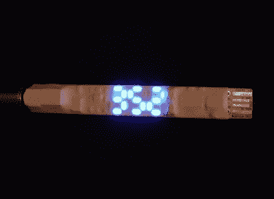

# 焊接你自己的烙铁

> 原文：<https://hackaday.com/2019/10/06/soldering-your-own-soldering-iron/>

一个即使是 DIY 爱好者通常也不会想到去 DIY 的设备就是不起眼的烙铁。然而，这正是一个 Hackaday.io 用户所做的，他制作了一个性能比 5 美元的中国焊锡笔更好的 USB 供电的焊锡笔。

 该项目从【vlk】的另一款[韦勒 RT 基于尖端的焊笔](https://hackaday.io/project/18899-rt-soldering-pen)中汲取灵感，尽管该项目的显示屏比有机发光二极管更简单。总部位于斯洛伐克的制造商[ [ bobricius ](https://hackaday.io/bobricius) ]受到了基于西地[atsamd 11 c 14 开发板的启发。该项目使用相同的 32 位 ATMEL ARM 微控制器和 USB 引导程序，这使得更新固件容易得多。](https://hackaday.io/project/10210-dixi-arduino-sam-d11-usb-stick)

两个按钮控制加热(+/-)，Weller RT 焊嘴的插孔通过 PWM 控制电源输出。对于显示器，20 个 Charlieplexed 3014 LEDs 用于显示 0-399 的温度。最后一个缺失的 LED 被遗漏了，因为 5 个 GPIO 引脚只能驱动 20 个 LED。

假设主要加热控制与[vlk]的项目相同，笔使用电流传感器和加热控制器对加热模块进行 PID 控制，加热模块连接到 Weller RT 烙铁头的 SMT 连接器。温度传感器使用运算放大器放大来自 K 型热电偶的信号。

虽然目前还没有针对 PCB 的 GERBER 文件，但该项目是基于[vlk]的开源有机发光二极管显示焊笔项目，其器件原理图已经公布。

 [https://www.youtube.com/embed/juPdUFx_khk?version=3&rel=1&showsearch=0&showinfo=1&iv_load_policy=1&fs=1&hl=en-US&autohide=2&wmode=transparent](https://www.youtube.com/embed/juPdUFx_khk?version=3&rel=1&showsearch=0&showinfo=1&iv_load_policy=1&fs=1&hl=en-US&autohide=2&wmode=transparent)

The [HackadayPrize2019](https://prize.supplyframe.com) is Sponsored by:     