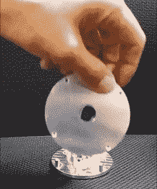

# 人形机器人的关节可以激发灵感

> 原文：<https://hackaday.com/2019/10/20/humanoid-robot-has-joints-that-inspire/>

除了保持直立之外，人形机器人面临的挑战之一是找到执行器和关节机构的紧凑组合，以便在保持良好强度的同时实现良好的平稳运动。为了实现这一目标，韩国技术教育大学 IRIM 实验室的研究人员开发了 [LIMS2-AMBIDEX](https://www.youtube.com/watch?v=Sg1z725Dsd8&list=PLBaa5KMGRYLBWbDLSl9BZ6fXD7g6R3pze&index=9) 机器人人形上身，它使用了无刷电机、滑轮和一些非常有趣的关节机构的组合。(视频，嵌在下面。)

The wrist mechanism. Anyone willing to tackle a 3D printed version?

从肩膀到手指，每个手臂都有七个自由度，这使得机器人能够实现一些非常平滑和真实的上身运动。除了手腕旋转致动器，所有的致动器都位于肩部，运动通过一系列电缆和滑轮传递到所需的关节。这使得手臂很轻，惯性很低，允许手臂快速移动，而不会损坏任何东西或推翻整个机器人。

手腕和肘部的机制尤其有趣。腕部模拟只有旋转关节的两个球体之间的滚动接触。它还允许驱动轴通过机构的中心，将旋转运动从一端传递到另一端。肘部是一个滚动的双关节，允许真正的 180 度旋转。

我们不知道为什么这花了两年时间才出现在我们的 YouTube 上，但我们很高兴它终于出现了。休息之后，请观看一些演示视频。

 [https://www.youtube.com/embed/aLaqMreVj9o?version=3&rel=1&showsearch=0&showinfo=1&iv_load_policy=1&fs=1&hl=en-US&autohide=2&wmode=transparent](https://www.youtube.com/embed/aLaqMreVj9o?version=3&rel=1&showsearch=0&showinfo=1&iv_load_policy=1&fs=1&hl=en-US&autohide=2&wmode=transparent)

 [https://www.youtube.com/embed/Sg1z725Dsd8?version=3&rel=1&showsearch=0&showinfo=1&iv_load_policy=1&fs=1&hl=en-US&autohide=2&wmode=transparent](https://www.youtube.com/embed/Sg1z725Dsd8?version=3&rel=1&showsearch=0&showinfo=1&iv_load_policy=1&fs=1&hl=en-US&autohide=2&wmode=transparent)

我们已经介绍了一些模仿自然界外形的机器人，包括[波士顿动力公司的机器狗](https://hackaday.com/2019/09/25/ask-hackaday-what-good-is-a-robot-dog/)和[迪斯尼的后空翻机器人](https://hackaday.com/2018/07/08/disneys-humanoid-stunt-robots-throw-multiple-backflips-no-sweat/)。