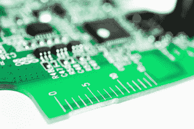

# 什么规模？鼠标拆卸带来一些惊喜

> 原文：<https://hackaday.com/2019/10/13/what-the-scale-mouse-teardown-throws-up-a-few-surprises/>

[Eric weinhofer]和他的同事对罗技的 MX Master 3 和 MX Master 2S 鼠标做了一次很好的对比。拆除是非常有趣的，往往最终会教会我们很多。观察产品的内部可以告诉我们很多关于如何解决某些问题或避免陷阱的信息。开放同一个产品的两个版本提供了更多有用的信息，这些信息是关于产品设计如何基于早期版本的经验而发展的。罗技在鼠标设计方面不是新手，所以 MX Master 2S 已经近乎完美。但是看一下 Master MX 3 就可以看出早期版本的不足之处以及如何改进。

这些鼠标有智能滚轮，可以在“缓和”或“自由”模式下旋转。缓和允许较慢的精确滚动，而自由滚动允许快速滚动。这两种小鼠模型具有完全不同的、有趣的实现这些动作的方法。旧版本有一个橡胶涂层的车轮，并使用一个电机，转动凸轮。这将迫使制动球进入制动模式的车轮内侧，并在自由模式下将其释放。一旦橡胶磨损，老鼠几乎是走向垃圾箱。新的金属车轮取消了橡胶涂层，以及噪音大、速度慢、容易磨损的电机组件。现在使用双稳态电磁体进行驱动。一个 25 伏的脉冲磁化位于车轮内部的线圈，并拉动车轮内缘的小金属齿。这给人一种无声的缓和感，没有任何身体接触。第二个 25 伏的尖峰使线圈退磁，允许滚轮自由旋转。

[Eric]指出了设计中的几个渐进变化，这些变化改善了人体工程学。他还发现了一些有用的信息。使用可互换的模具镶件有助于延长模具的使用寿命，同时还能灵活地改变成型零件。有趣的是看到一些特殊的部件被用来承受振动和高 G 力。其中一些见解对那些从原型开发转向生产的人来说可能是有用的。在新的印刷电路板上有一个令人困惑的特征[埃里克]无法弄清楚。蓝牙天线上有一个 15 毫米的丝网印刷刻度。如果你对它的目的有答案，请在下面的评论中告诉我们。

如果你是左撇子(我们中有 10%是左撇子)，这些右撇子鼠标会让你倒霉，你可能会想在几个要求左撇子版本的[在线请愿书](https://www.change.org/p/logitech-mx-master-left-handed-mouse)上签名。