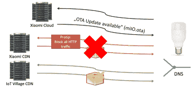
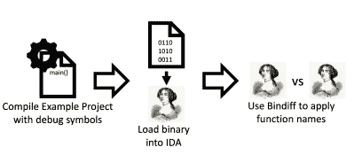

# 定制小米 ARM Cortex-M 固件

> 原文：<https://hackaday.com/2019/10/19/customizing-xiaomi-arm-cortex-m-firmware/>

这一黑客行为不久前在 DEFCON26 上被披露，但它仍然是对影响一些最广泛使用的物联网设备的漏洞的迷人审视。

[Dennis Giese]找到了一种方法来修改基于 ARM Cortex-M 的固件，用于定制设备的功能或取消对供应商的访问。显然，这种类型的黑客可以进行更多的恶意活动，就像任何利用固件的行为一样，但它们(也)显然不会被宽恕。

在进入二进制修补固件的一步一步的方法之前，谈话进入小米生态系统和产品的结构。第一步是获取固件，方法是转储 SPI 闪存(使用 JTAG、SWD 或脱焊闪存引脚)，或者在固件更新期间拦截流量并下载固件。也有可能使用 URL 下载固件，尽管这可能更难找到。

然后可以解析固件，这首先需要将格式从专有格式转换为 ELF 文件。这种转换使其更容易加载到 IDA pro 中，并给出固件段及其入口点的信息。幸运的是，Python 工具可以将二进制文件转换成 ELF，这简化了任务。

将 ELF 文件加载到反汇编程序后，您将需要找到密钥存储区，在示例固件中用“TAG_MAC”、“TAG_DID”和“TAG_KEY”表示(用于存储 MAC 地址、设备 ID 和密钥)。为了准备 Nexmon 的固件——一种支持 ARM Cortex-A 和 ARM Cortex-M 二进制文件的基于 C 的固件二进制补丁的软件——您需要在内存中为补丁划分一些空间，并知道固件的函数名称和签名。

后者是通过在反汇编器中对未知可执行文件和示例可执行文件进行差异比较来完成的。

收集了必要的信息后，现在可以使用 Nexmon 进行修改了。事实上，这可以在家中的智能设备上实现，这意味着您获得的智能设备——尤其是那些由他人分区的智能设备——可能包含恶意代码，因此在处理二手设备时要小心。

 [https://www.youtube.com/embed/Qvxa6o2oNS0?version=3&rel=1&showsearch=0&showinfo=1&iv_load_policy=1&fs=1&hl=en-US&autohide=2&wmode=transparent](https://www.youtube.com/embed/Qvxa6o2oNS0?version=3&rel=1&showsearch=0&showinfo=1&iv_load_policy=1&fs=1&hl=en-US&autohide=2&wmode=transparent)

