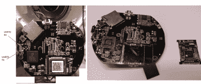

# 逆向工程小米物联网固件

> 原文：<https://hackaday.com/2019/10/24/reverse-engineering-xiaomi-iot-firmware/>

物联网设备很少能做到宣传的那样。它们几乎总是会占用比需要更多的空间，除此之外，它们的处理器和内存本身就应该足以运行大量其他任务，而不一定会影响它们的功能。

这是任何设备扎根的部分动机，但对于小米设备来说，这更有趣一些——也就是说，当你从零开始对其固件进行[逆向工程](https://dgiese.scripts.mit.edu/talks/DEFCON26/DEFCON26-Having_fun_with_IoT-Xiaomi.pdf)时，会更难一些。

类似于他在 DEF CON 26 上关于修改 ARM Cortex-M 固件的另一场演讲，[Dennis Giese]带着如何对小米物联网设备进行逆向工程的演练回来了。他首先谈到了小米的生态系统，以及在连接到同一个云网络的所有不同设备之间重用固件的缺点，然后开始介绍如何访问这些设备。

针对 Aquara Smart IP 摄像机，首先要在将设备分块后识别串行端口(这是连接到文件系统的必要步骤)。由于 MCU (Zigbee NXP JN5169)上的 JFFS2 文件系统没有正确清理，大量的凭证被泄露，这基本上足以通过 telnet 找到设备。一旦您用 SSH 替换 telnetd，更改 root 密码，并更改相机软件，您就有了一个修改过的智能相机！

对于一个不同的设备，一个 WiFi 网络扬声器，甚至设备拆卸都是不必要的。在 HTTP 上的固件更新中未发现输入验证–没有签名，信息打包为 XML 格式。这使得简单地通过 OTA 重写固件变得更加容易。

最后，对于真空清洁机器人来说，需要更多的电路来为设备提供基础。在通常的方法中，MMC 数据线是捷径，导致系统陷入 FEL 模式。使用 USB 连接器和加载执行工具，MMC 闪存被转储。然后，可以修改该映像并将其重新写入闪存。

事实证明，对于许多设备来说，您甚至不需要通过阻塞设备来获得 root 访问权限。虽然自那次讲话以来，小米不可避免地修补了大多数漏洞，但总会有更多漏洞。

 [https://www.youtube.com/embed/DHsqb2poGII?version=3&rel=1&showsearch=0&showinfo=1&iv_load_policy=1&fs=1&hl=en-US&autohide=2&wmode=transparent](https://www.youtube.com/embed/DHsqb2poGII?version=3&rel=1&showsearch=0&showinfo=1&iv_load_policy=1&fs=1&hl=en-US&autohide=2&wmode=transparent)

