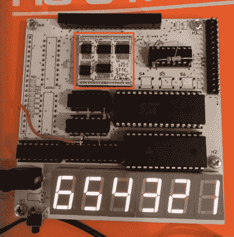

# 世界上最小的自制 TTL CPU

> 原文：<https://hackaday.com/2019/10/16/the-smallest-homebrewed-ttl-cpu-in-the-world/>

这很可能是我们见过的最小的自制 TTL CPU。这种微小的芯片尺寸为 1 平方英寸，拥有 40 个连接、8 位数据总线、16 位地址总线、64 kB 存储空间、复位和时钟输入以及 5 V 电源线。

TTL(晶体管晶体管逻辑)逻辑芯片今天已经相当过时了，但它们确实拥有构建计算机所需的所有基本要素——逻辑门、计数器、缓冲器和寄存器。与电阻-晶体管逻辑(RTL)和二极管-晶体管逻辑(DTL)相比，晶体管既执行逻辑又执行放大。在 60 年代，当这项技术还是相当新的时候，TTL ICs 通常用于计算机和工业控制。即使在超大规模集成电路出现之后，TTL 集成电路仍然被用于连接更密集集成的芯片。即便如此，大多数 TTL 芯片往往体积较大，这也是[roelh]的项目如此独特的原因。整个 PCB 几乎不比一枚硬币大。

除了硬件规格之外，[roelh]还实现了几个有用的软件功能:零页面寻址、加载/存储/比较指令、堆栈、条件分支、子程序调用和内存映射 I/O。寄存器也在 RAM 中，过去出于速度考虑(参见 [TMS9900](https://en.wikipedia.org/wiki/Texas_Instruments_TMS9900) )在微处理器中实现，但在这种情况下是出于尺寸限制。

为了限制尺寸，设计中还省略了一个 ALU，仅在 2 层 PCB 的两侧留下 8 个 IC。

微程序存储在闪存中，可以用 Raspberry Pi 编程。通过将汇编代码保存到存储卡并下载汇编的二进制代码。一旦 Raspberry Pi 连接到开发板，您就可以使用 [Python 脚本](https://hackaday.io/project/161251/files)将二进制代码刻录到开发板的闪存中。还有一个[在线 Javascript 编辑器](http://www.enscope.nl/simas_nac/)用于为芯片汇编汇编代码和模拟 CPU。

目前有一种为 CPU 制造的开发板，它包括六个七段显示器和一个 I/O 连接器，用于运行数字时钟和其他应用程序。[roelh]此后围绕该芯片建立了一台[复古 TTL 计算机](https://hackaday.io/project/164897-kobold-retro-ttl-computer)，它重新引入了 ALU，并包括地址寄存器、256 KB RAM、VGA 视频、PS/2 键盘端口、音响系统和 I/O 引脚。这是一个非常令人兴奋的项目，它极大地推动了复古计算的发展。

The [HackadayPrize2019](https://prize.supplyframe.com) is Sponsored by:     