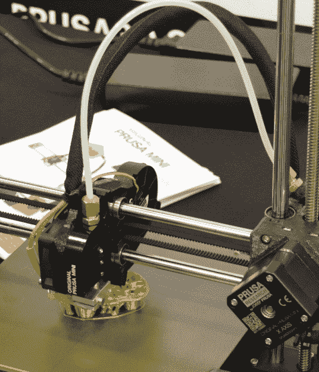
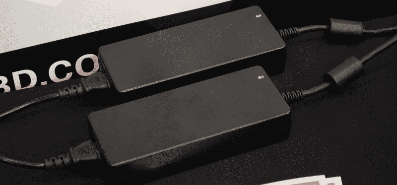
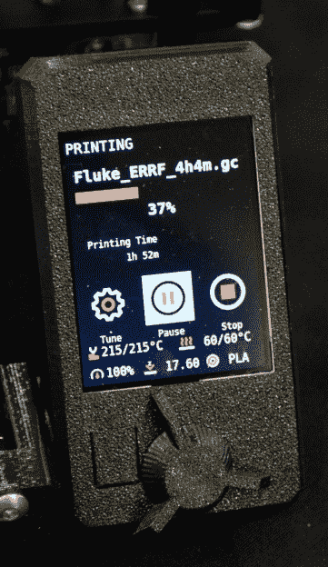

# Prusa 推出新的迷你 3D 打印机，震撼竞争

> 原文：<https://hackaday.com/2019/10/13/prusa-unveils-new-mini-printer-shakes-up-the-competition/>

在过去的几年里，1000 美元以下的消费者桌面 3D 打印机分为两大类:500 美元以下的所有产品和最新的 Prusa i3。有很多由 Monoprice 和 Creality 等公司制造的体面打印机可供选择。这不是每个人都可以证明的奢侈品，但如果你有预算为 Prusa 的 i3 套件支付 749 美元，这个选择就变得显而易见了。

当然，那是在 Prusa Mini 之前。这是 Prusa Research 有史以来最便宜的打印机，作为一个套件，售价仅为 349 美元。但这不仅仅是一些更名的硬件，它也没有在理想上妥协，这些理想使该公司的旗舰机成为事实上的开源 FDM 打印机。以不到 i3 MK3S 一半的价格，你不仅可以获得大部分大型打印机的最佳功能和 Prusa 著名的客户支持，甚至还可以获得可能要到 MK4 发布后才能进入 i3 生产线的功能。

约瑟夫·průša 在 2019 年东海岸 Reprap Festival 上正式推出了他的最新打印机[，在那里我有机会近距离接触这款小巧的机器。虽然我们可能还需要一段时间才能对 Mini 进行全面的评估，但可以肯定地说，这款小型打印机将对入门级市场产生巨大影响。](http://eastcoastreprapfestival.com/)

## 简化的设计

考虑到价格的大幅下降，你可能会认为 Prusa Mini 已经取消了许多使 i3 家族最近的产品如此受欢迎的功能。但在很大程度上，Mini 应该提供或多或少相同的体验，普瑞萨车主已经开始期待。

The Prusa Mini uses a 3:1 geared Bowden extruder

这意味着通过感应探头实现自动网床调平、磁性弹簧钢打印床(有光滑和纹理两种)、Trinamic 步进驱动器带来的近乎静音的操作、[PrusaSlicer](https://hackaday.com/2019/05/24/3d-printering-the-past-and-future-of-prusas-slicer/)中的开箱即用支持，以及低成本打印机经常缺少的自检和安全功能。

当然，某些地方必须有一些削减。首先，Prusa Mini 取消了传感器(尽管它是可选的)，如果打印机用完了灯丝，它会暂停打印机。[这是 i3 MK3](https://hackaday.com/2018/10/22/a-close-look-at-the-prusa-i3-mk3/) 的关键升级之一，不可否认，对于长打印来说，这是一个不错的功能。但考虑到很少有其他打印机提供这种功能，它不是 Mini 的标准配置这一事实当然不会使它处于劣势。事实上，它甚至可以作为官方选项，而不是你必须自己动手组装的东西，这实际上是对这个价格范围内其他打印机的改进。

为了减轻重量，Prusa Mini 还从直接驱动切换到鲍登式挤出机。同样，这在这个价格上并不特别不寻常，并且很容易让人想起在 Monoprice Mini 上使用的[布置。但对于习惯于直接驱动挤出机的 Prusa 业主来说，这肯定是一个调整。例如，鲍登挤出机往往更加挑剔，并且众所周知难以与柔性细丝一起工作。顺便提一下，切换到鲍登挤出机也意味着 Prusa Mini 与该公司的多材料升级(MMU)不兼容。](https://hackaday.com/2016/06/13/review-monoprice-mp-select-mini-3d-printer/)

最后，值得注意的是，Prusa Mini 放弃了集成电源，而是使用笔记本电脑风格的“电源砖”。虽然这是一个有点乏味的变化，但这不太可能成为任何人的交易破坏者。但是，在考虑将机器放在哪里，或者为机器设计外壳时，这肯定是需要考虑的事情。

Printrbot called, they want their power supplies back.

## 现在你在玩弄权力

虽然与更大的前身相比，Prusa Mini 的机械方面得到了简化，但电子设备却朝着相反的方向发展。至少在这方面，新打印机实际上比 i3 MK3S 更先进一些。显而易见，Mini 将成为下一代 Prusa 打印机电子产品的测试平台，因此潜在买家应该明智地预计到一些成长的烦恼。

The display is bright and easily visible from a distance.

迷你的特点是一个完全改进的控制板和附带的用户界面。配备新的 32 位 ARM STM32F407 的“Buddy”控制器比 Prusa 在 i3 中使用的 8 位板强大得多，并且由于其板载以太网和 USB，可以执行您当前必须用运行 OctoPrint 的 Raspberry Pi 执行的所有任务。

或者至少，将来会。Prusa 表示，包括网络摄像头支持在内的那些更高级的功能将作为软件更新推出。说到这里，伙伴板能够通过互联网下载自己的固件更新；所以不用再把它插到电脑上手动刷新最新的十六进制文件。随着 ESP 模块的 DIY 添加，它甚至可以通过 WiFi 来完成。

控制器中增加的计算能力也使得打印机的 2.8 英寸 LCD 上能够显示一些相对华丽的图形。在正常操作中，320×240 的屏幕不仅看起来比 i3 过时的显示器更好，而且它允许所选 STL 的 3D 渲染预览。用户将能够直观地确认他们将要打印的内容，而不必记住特定对象的文件名。

尽管 Buddy board 有这么多新功能，但至少有一个遗漏可能会让长期购买 Prusa 的用户感到奇怪:它不支持 SD 卡。STL 现在可以通过网络或者从 USB 大容量存储器中加载。可以说这是一个进步，但仍然有点出乎意料，因为自从 MakerBot Cupcake 以来，几乎每台桌面 3D 打印机都有 SD 插槽。

## 家庭的新成员

有一点非常清楚，Prusa Mini 并不打算与 i3 系列竞争，更不用说作为它的替代品了。约瑟夫 Průša 说，i3 MK3S 仍然很强大，并将随着时间的推移继续更新。他还表示，该团队正在开发一款代号为“Prusa XL”的新型 CoreXY 打印机，但我们必须等到明年才能看到这款打印机的任何具体成果。

Mini 被视为理想的入门打印机，或者甚至可以作为辅助打印机，以便您可以并行处理大型任务。Prusa 表示，它的小尺寸和集成的远程控制功能也使它成为印刷农场的理想选择。无论人们以这个价格购买它们的目的是什么，我们预计在可预见的未来，Prusa Mini 将会有很高的需求。

 [https://www.youtube.com/embed/ipulB4_Xdm8?version=3&rel=1&showsearch=0&showinfo=1&iv_load_policy=1&fs=1&hl=en-US&autohide=2&wmode=transparent](https://www.youtube.com/embed/ipulB4_Xdm8?version=3&rel=1&showsearch=0&showinfo=1&iv_load_policy=1&fs=1&hl=en-US&autohide=2&wmode=transparent)

