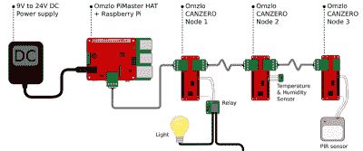

# 一种简化物联网传感器数据的低功耗解决方案

> 原文：<https://hackaday.com/2019/10/18/a-low-power-solution-to-streamlining-sensor-data-for-iot/>

对于家用物联网系统，从集中到单个 Raspberry Pi 的大量物理位置获取传感器数据可能是一项困难的工作，尤其是考虑到通过 WiFi 进行这项工作所需的功耗。例如，当您使用 ESP8266 时，更换电池和解决连接问题对于长期解决方案来说可能是一个很大的麻烦。由[Alain Pannetrat]创建的[NoCAN 平台](https://omzlo.com/articles/the-nocan-platform)使用有线方法解决了这个问题，该方法[改进了 CAN 总线的使用](https://omzlo.com/articles/introduction-to-the-nocan-platform)。

由于 SPI 和 I2C 仅适用于短距离，因此 RS-485 和 CAN 总线等方法更适合此类设置。对于具有一个集中点的系统，RS-485 工作得最好——因此，当您考虑在一个环境中使用多个主机时，CAN 总线是更好的方法。

CAN 设备通常需要一个静态地址，因此消息传递需要将数据发送到目的设备的已知地址。使用 NoCAN，动态地址分配方案允许节点在启动时向节点管理器请求地址(类似于 DHCP)。命令行应用程序还允许用户使用发布/订阅实现从节点发送和接收消息——设备向通道发送消息，订阅通道的每个设备都接收消息。

NoCAN 平台的硬件包括一个带有“PiMaster”帽子的 Raspberry Pi 和一个 Arduino 兼容的 CANZERO 板。PiMaster HAT 使用 STM32F042 ARM Cortex M0 MCU，作为 Pi 和 CAN 总线之间的接口，并通过软件控制的智能开关防止过流事件。CANZERO 基于 SAMD21G18 ARM Cortex M0+,运行频率为 48MHz，类似于 Arduino MKR Zero，CAN 总线网络使用 STM32F042 ARM Cortex M0。双 MCU 设计允许副 MCU 在因编程错误而卡住时复位主 MCU，并通过 CAN 总线发送消息。

为了将网络连接在一起，四线电缆将总线网络中的节点以菊花链形式连接起来，提供长达 1000 英尺的连接。12V 或 24V DC 电源通过网络，在每个节点降低到 5V 或 3.3V。这种方法类似于 PoE(以太网供电),尽管速度较慢且成本较低。总的来说，对于无线连接无法满足的环境来说，这似乎是一个不错的解决方案。