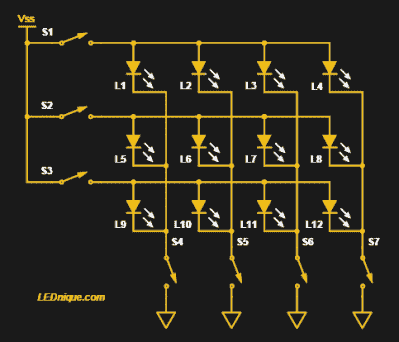
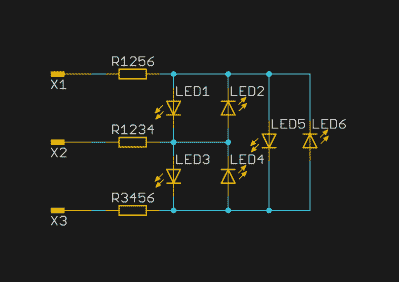
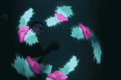
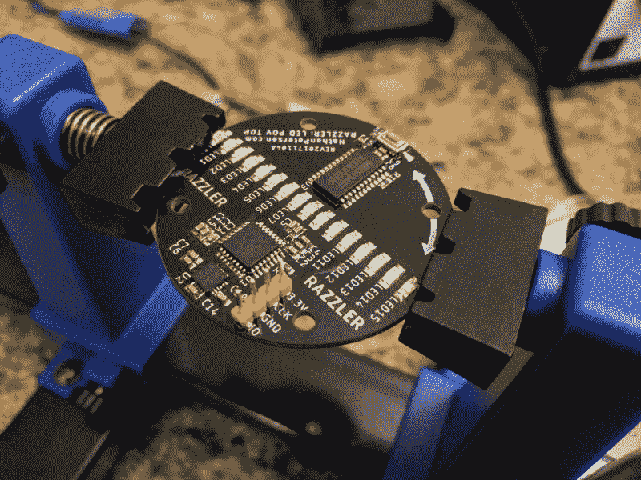
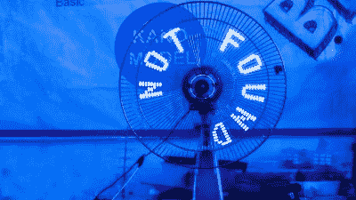
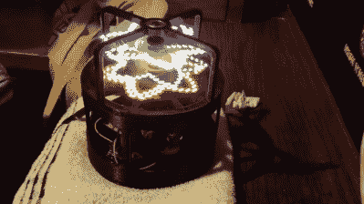

# 远景项目持续性的基础

> 原文：<https://hackaday.com/2019/10/29/the-basics-of-persistence-of-vision-projects/>

视觉暂留(POV)是人类视觉系统中一个奇怪的部分。这是光线停止进入眼睛后，对图像的感知仍然存在的效果。这就是为什么旋转的螺旋桨看起来像圆盘，为什么燃烧的火花看起来会在空中留下痕迹。它也通常被用作一种显示技术，一系列闪烁的发光二极管可以用来创建似乎漂浮在空中的信息。POV 显示器是一个流行的微控制器项目，今天，我们将探讨这种构建所需的基本技术和技能。

## 你会想要驱动一些发光二极管

A multiplexing layout for driving LEDs. Source: LEDnique.com

绝大多数 POV 显示器都由单色 led 制成。它们很容易用微控制器驱动，低功耗器件只需要一个 I/O 引脚和一个限流电阻。最简单的显示器使用一排发光二极管，来回扫过或旋转，来产生图像。我将在本文后面更多地讨论移动的视点显示，但首先让我们讨论一下我们周围使用视点效果的静止显示。

当试图驱动 led 时，一个常见的技巧是以一种称为*多路复用的方式设置它们。*led 以矩阵布局连接。阳极按行连接，而阴极按列连接。然后，每行和每列都连接到一个 IO 引脚。IO 引脚的三态特性允许系统工作，其中每个引脚可以是高电平、低电平或设置为高阻抗输入，实际上就像断开一样。这种布置允许 2n 个引脚驱动 n 个 ^(2 个)led，或者例如 6 个引脚驱动 9 个 led。要驱动特定的 LED，请将其 row 引脚设置为高电平，将其相应的 column 引脚设置为低电平，同时将相邻的行和列设置为高阻抗输入状态。如果您足够快地扫描该显示器的行，由于视觉暂留(POV)效应，所有的 led 将看起来被点亮。

A charlieplexing LED layout. Note the significant increase in complexity over other setups.

如果这还不够的话，charlieplexing 将会更进一步。在每对 IO 引脚之间，安装了一对相对的 led。这种布置允许 n 个引脚驱动 n 个 ^(2 个) -n 个 led，或者例如 6 个引脚驱动 30 个 led。它在数量上弥补了什么，它在复杂性上付出了代价，但如果你需要用很少的引脚驱动大量的 led，这是很难打败的。它同样使用三态，并依赖于这样一个事实，即一对串联的 LED 将具有太高的压降而无法点亮，这使得单独控制每个 LED 成为可能。

Smart RGB LED strips can take the pain out of driving a lot of LEDs. Plus, full color is always a nice bonus.

当然，现在是 2019 年，做一堆艰苦的工作来驱动少数单色 led 的想法可能看起来繁重而无聊。令人欣慰的是，技术提供了一条出路——完全有可能简单地连接一串智能 RGB LEDs，并使用预先烘焙的库来驱动它们。[ws 2811 和 WS2812B](https://hackaday.com/2019/03/26/can-you-live-without-the-ws2812/) 等 RGB LEDs 有自己的板载控制器，只需几根电线，就可以通过标准接口轻松向它们发送命令。这不需要 POV 就可以工作，并且还具有提供宽色域的优势，对于快速而漂亮的显示来说非常值得考虑。

## 你也会想摇摇它们的

Spinning top POV board built by Nathan Petersen we [featured back in December](https://hackaday.com/2018/12/29/pov-tops-hobbyist-abilities/)

现在，大多数人认为 POV 显示依赖于快速移动一些 led，这样看起来你比实际存在的多得多。除了移动的 LED 会同时出现在几个地方之外，这里使用了上面讨论的使所有 LED 看起来同时打开的现象。诀窍在于时序，因此对于这种安排，直接用微控制器引脚驱动 led 比使用多路复用技术更有用。

A fan makes an excellent basis for a cool POV project.

你可以拿一排发光二极管，像扇叶一样旋转它们，创造出一整盘发光二极管作为显示屏的幻觉。[许多手持设备依靠用户来回摇动设备](https://hackaday.com/2018/03/09/a-simple-pov-business-card/)。这需要个人付出一些努力来获得正确显示图像的速度，但这是一种快速而肮脏的获得 POV 图像的方法。[增加一个 IMU 可以帮助](https://hackaday.com/2018/05/27/a-nicely-crafted-pov-lightsaber/)获得一致且笔直的图像。但是[正如这只挥舞的猫所展示的](https://hackaday.com/2018/05/15/lucky-cat-pov-display-ditches-the-waving-and-windmills-out-of-control/)，旋转加上一个位置传感器是建立一个稳定可读显示器的久经考验的方法。像霍尔效应传感器和磁铁这样简单的东西就能很好地完成这项工作。

 [https://www.youtube.com/embed/wcM7Y_jDjSY?version=3&rel=1&showsearch=0&showinfo=1&iv_load_policy=1&fs=1&hl=en-US&autohide=2&wmode=transparent](https://www.youtube.com/embed/wcM7Y_jDjSY?version=3&rel=1&showsearch=0&showinfo=1&iv_load_policy=1&fs=1&hl=en-US&autohide=2&wmode=transparent)

旋转视点显示是一种非常流行的构建方式，无论是在水平面还是垂直面。这就产生了一个平面圆盘或圆柱形的显示器。这是为 POV 显示创建规则、一致的运动的简单方法。它们是自行车轮子或[台式风扇](https://hackaday.com/2019/07/23/persistance-of-vision-on-an-old-fan/)的绝佳补充。为了同步显示并显示稳定的图像，您的微控制器需要知道 led 在旋转开始时何时返回，以便 led 的闪烁模式与运动完全同步。同步显示器有许多选择，包括霍尔效应传感器和磁铁、光学传感器，甚至机械开关。

旋转设备也可能面临供电问题——如何为旋转的电子设备供电？将所有的电子设备和电池安装在旋转装置上，小型项目通常可以通过完成。[较大的项目通常使用滑环](https://hackaday.com/2019/07/25/college-project-nets-360-degree-pov-display/)，通过旋转机构允许电力和数据信号通过。通过正确的设计，甚至可以用这种技术将事物带入三维空间，[创建立体视点显示](https://hackaday.com/2019/07/20/a-multi-layered-spin-on-persistence-of-vision/)。

Who said POV displays had to be limited to two dimensions?

其他项目使用了替代方法。我们已经看到柔性印刷电路板与磁场结合使用来[创造一个摆动的显示器，](https://hackaday.com/2019/07/09/flexled-is-a-unique-take-on-persistence-of-vision/)以及 [3D 打印的往复矩阵构建。](https://hackaday.io/project/1148-locomatrix-3d-pov-a-different-approach)在这两种情况下，关键是要创造一种运动，这种运动足够快，能够引发视觉暂留效应，并且理想情况下可以重复，从而创造出稳定清晰的图像。

## 最终考虑

掌握了控制 led 和运动的基础知识后，您应该可以制作出可行的 POV 显示器了。然后可以考虑其他因素，例如如何与设备通信并控制设备，如何为设备创建图像或消息，或者如何使其在服务中更加健壮和可靠。这些都是工程上的挑战，可以使一个有趣的实验和一个有用而令人兴奋的展示有所不同。当你在自己的构建中解决这些障碍时，继续努力，如果你已经构建了一些很棒的东西，一定要让我们知道。黑客快乐！