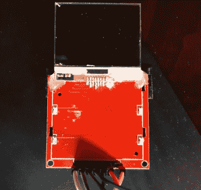

# 未来如此光明，我要戴上液晶显示器

> 原文：<https://hackaday.com/2019/10/22/the-futures-so-bright-i-gotta-wear-lcds/>

无论是来自太阳的光线进行了 1.5 亿公里的旅行，只是为了破坏你的一天，还是某人不合理的明亮的售后车灯，在某个时候或其他时候，我们都经历过眼睛亮点的不适。但是除了一直戴着焊工护目镜，我们还能做什么呢？幸运的是，[【尼克·比尔德】提出了一个解决方案](https://github.com/nickbild/light_brakes)。算是吧。

Modifying the LCD so it can be seen through.

通过在一副标准太阳镜上添加液晶显示器，[尼克]创造了一种他称之为“轻刹车”的东西。这个想法是，去掉了背衬的液晶显示器，本质上可以被用作可编程的快门，以阻挡通过它们的图像的特定部分。通过添加树莓 Pi 和摄像头，光闸可以识别异常明亮的光源，并通过在液晶显示器上绘制足够大的斑点来阻挡佩戴者的视线。

至少，是这样的想法。正如你在休息后的视频中看到的，液晶显示器阻挡移动光源的能力有些值得商榷。也不清楚这种“阻挡”会对紫外线产生什么影响，所以你绝对不应该戴着这种眼镜看太阳。

也就是说，这个概念的改进版本可能会有一些非常有趣的应用。例如，想象一下，一副眼镜可以有效地阻挡广告或其他令人不快的图像进入你的视野。如果这一切听起来有点像《黑镜》的某一集，那是因为事实如此。

细心的读者可能已经注意到，这并不是这些时尚镜框第一次登上 Hackaday 的版面。整个夏天，它们被用于一个非常有趣的[视野家庭自动化项目中，这个项目是【Nick】正在进行的](https://hackaday.com/2019/08/15/home-automation-at-a-glance-using-ai-glasses/)。这也不是[第一次以进步的名义把一对小液晶](https://hackaday.com/2019/06/23/vr-on-the-6502/)粘在眼前。我们开始在这里发现某种趋势，尽管我们当然不会抱怨。

 [https://www.youtube.com/embed/ycbBn75e3yE?version=3&rel=1&showsearch=0&showinfo=1&iv_load_policy=1&fs=1&hl=en-US&autohide=2&wmode=transparent](https://www.youtube.com/embed/ycbBn75e3yE?version=3&rel=1&showsearch=0&showinfo=1&iv_load_policy=1&fs=1&hl=en-US&autohide=2&wmode=transparent)

