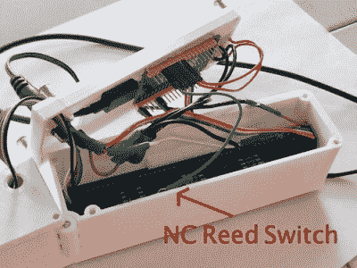

# 带转换 LED 矩阵的 ESP32 时钟

> 原文：<https://hackaday.com/2019/10/29/an-esp32-clock-with-a-transforming-led-matrix/>

多年来，我们已经看到了无数种显示当前时间的方法，从有多少新的时钟项目达到了提示线来看，似乎没有尽头。当然，我们不是在抱怨。这款由【Alejandro Wurts】生产的 [ESP32 供电的台式时钟是罕见钟表万神殿中的最新成员，它具有折叠式 LED 矩阵显示屏](https://www.alejandrowurts.com/projects/iot-led-clock/)。

 这款时钟使用了 8 个独立的 8×8 LED 阵列，包含在一个 3D 打印的外壳中，外壳在中间铰接。打开时，时钟的可用分辨率为 8 x 64，折叠时分辨率变为 16 x 32。

这种可变的物理分辨率允许交替的显示模式。当硬件检测到它被折叠成两倍高的排列时，它会进入所谓的“大时钟”模式，这样更容易从远处看到时间。但是在单一高度模式下，有更多的水平空间来添加当前温度或其他自定义数据。最终[Alejandro]希望使用 MQTT 将消息推送到显示器上，但目前它只是将他的名字显示为占位符。

整个项目的关键是铰链外壳和用于检测其当前位置的簧片开关。除此之外，在为 MAX7219 和 MAX7221 LED 矩阵控制器编写的 MD_Parola 库的帮助下，还开发了一个 ESP32 和一些聪明的代码[。[Alejandro]公布了他的时钟代码，这对突然决定在生活中也需要折叠 LED 矩阵的人来说应该很有帮助。](https://github.com/MajicDesigns/MD_Parola)

现在，如果您心目中的 ESP32 LED 矩阵项目需要全色和高刷新率，请不要担心，[我们已经为您提供了解决方案](https://hackaday.com/2018/04/21/fast-led-matrix-graphics-for-the-esp32/)。

 <https://hackaday.com/wp-content/uploads/2019/10/foldingled_video.mp4?_=1>

[https://hackaday.com/wp-content/uploads/2019/10/foldingled_video.mp4](https://hackaday.com/wp-content/uploads/2019/10/foldingled_video.mp4)