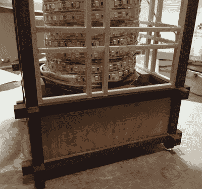

# 用这款日本风格的时钟起床吧

> 原文：<https://hackaday.com/2019/11/03/rise-and-shine-with-this-japanese-inspired-clock/>

在他华丽的“日出闹钟”的 [Hackaday.io 页面上，【大的】很快指出，他的设计只是受到了日本灯笼的启发，并没有使用正宗的材料或传统的木工技术。也许这对某些人来说是一个重要的事实，但我们只想说，当最终结果看起来这么好时，所用的材料就显得不那么重要了。](https://hackaday.io/project/168165-sunrise-alarm-clock)

 不幸的是【大家伙】没有提供他的时钟的任何内部照片，因为听起来内部线路的美学不太符合*外部设定的标准。但是他提供了一份简明的零件清单、接线图和源代码，所以我们对它有了一个很好的了解。*

这个时钟由 uBBB 32u 4(T1)驱动，这是一个 ATMega32u4 开发板，是[大公司]与[沃伦扬森斯]共同开发的。它使用流行的 MAX7219 LED 矩阵进行显示，并使用 DS3231 RTC 模块来帮助保持时间。机上还有一个 DFPlayer 迷你模块，允许他在闹钟响起时播放任何他想要的音效或音乐。

当然，这场展览的明星是照亮 shji 风格柱子的 LED 灯条。这些显然已经被包裹在一个装有所有东西的咖啡罐周围，这不仅是一种方便的握持条带的方式，而且[大的那个]说实际上使扬声器听起来更好一些。嘿，不管怎样都行。

这并不是第一个为这些页面增色的“灯笼”钟，但与之前项目的[高科技展示相比，我们不禁被这件木质杰作的优雅和高贵所折服。](https://hackaday.com/2013/12/06/dcf77-powered-clock-is-a-work-of-art/)