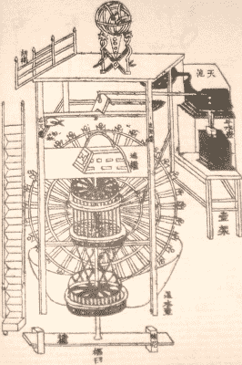
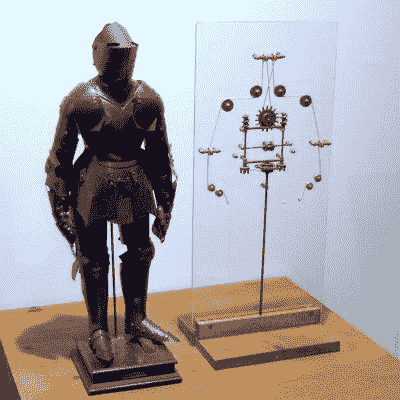
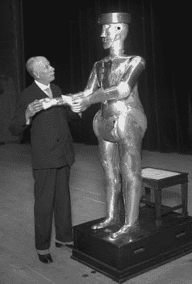

# 现代机器人的诞生

> 原文：<https://hackaday.com/2019/12/19/the-birth-of-the-modern-robot/>

当艾萨克·阿斯米洛夫写《我，机器人》的时候，机器人学领域还处于起步阶段。正如他在*的《完整的机器人*中指出的那样，随着该领域开始成熟，它开始显示出符合科幻作家关于机器人应该是什么的流行观点的迹象。人形机器人的概念，机器人在家庭环境中的功能，甚至人工智能伦理学家今天面临的伦理困境，都是早期科幻作家的主题。

机器人的概念——至少是自动机的概念——早于机器人领域。独立自动机的想法可能早在古埃及人中国人和希腊人就已经存在，他们试图建造类似动物和人类的自动操作机器。犹太传说中的[泥塑人像](https://www.jewishvirtuallibrary.org/the-golem)和北欧传说中的[泥塑巨人](https://norse-mythology.net/lesser-known-giants-in-norse-mythology/)的神话延续了人造生物能够模仿生物行为的理念。一个来自克里特岛的公元前 400 年的[神话](https://www.ancient-origins.net/myths-legends/talos-crete-00157)讲述了一个青铜人守卫他们的岛屿免遭海盗袭击。

1066 年，中国发明家【苏颂】建造了一个[水钟](https://www.uh.edu/engines/epi120.htm)，由一个带有机械功能的塔组成，可以报时。这座塔有可编程的鼓，鼓上有挂钩，可以碰到杠杆来操作打击乐器。后来，在 13 世纪，穆斯林科学家[Ismail al-Jazari]创造了一个可以为顾客倒茶的[人形女服务员](https://www.robotshop.com/community/blog/show/fathers-of-robotics-ismail-al-jazari)。饮料储存在蓄水池里。饮料会从桶里滴到杯子里，然后女服务员可以通过敞开的门端上来。几个世纪后，[莱昂纳多·达·芬奇]将为一个机械骑士绘制草图，这个骑士可以坐起来，挥动手臂，移动头部。

然而，直到 1920 年，机器人这个术语才开始被用来描述这些自动机。捷克作家[卡雷尔·恰佩克]出版了一部名为 *R.U.R.* 的关于没有灵魂的人造身体的戏剧，该剧借用了捷克语中农民奴隶(“机器人”)的名称。这个故事讲述了在工厂流水线上工作的机械人反抗他们的人类主人，这是一个反复出现的故事情节，后来成为科幻小说的一个主要分支。

1932 年，发明家[W. H. Richards]在伦敦的模型工程师协会展示了第一批人形机器人。该框架由带有 11 个电磁铁的铝制主体和由 12 V 电源供电的电机组成。1948 年，来自布里斯托尔 Burden 神经学研究所的[William Grey Walter]基于他的脑细胞之间的连接可以产生复杂行为的理论，创造了第一个复杂的自主机器人。Elmer 和 Elsie 是机器龟，它们有一个向光性的塑料外壳，同时也是一个碰撞传感器。该设备显示了光敏和触敏控制机制之间的相互作用，模拟具有触觉和视觉输入的神经细胞。这些系统相互作用得足够好，以至于这些乌龟在绕过障碍物时表现出了行为。

虽然对该领域的确切起源存在争议，但模拟电子技术可以模拟大脑过程的想法——这一想法[艾伦·图灵]和[约翰·冯·诺依曼]也因娱乐而闻名——可能推动了后来的机器人研究。

肯塔基州的发明家乔治·c·迪沃通常被认为是在 1954 年创造了第一个现代机器人，被称为终极机器人。这个机器人是第一台工业机器，在通用汽车公司的装配线上工作。在他的商业伙伴[约瑟夫·恩格尔伯格]的帮助下，两人创办了第一家机器人制造公司。机器人的工作是从装配线上运输压铸件，并将零件焊接到汽车车身上。自动化是一项特别有用的任务，因为这项工作对人类工人来说特别危险，如果他们不小心，可能会被有毒气体中毒或受伤。

就机器人研究而言，科学研究仍然是机械工程、电气工程和计算机科学之间的交叉学科。在这个领域发挥作用的许多理论都是从控制、设计、信息处理和这些分支的其他子领域借用来的。鉴于机器人技术的应用范围非常广泛——从自动驾驶汽车到假肢再到工业机器人——机器人技术的许多分支跨越了许多相邻的领域。

## 回到科幻

最著名的机器人学定律可能是由【阿西莫夫】—提出的机器人学三定律:

> 第一定律:机器人不能伤害人类，也不能坐视人类受到伤害。
> 
> 第二定律:机器人必须服从人类给它的命令，除非这些命令与第一定律相冲突。
> 
> 第三定律:机器人必须保护自己的存在，只要这种保护不与第一或第二定律相冲突。

这些定律支配着阿西莫夫的机器人故事背后的潜在宇宙，旨在作为它们与人类和彼此互动的安全特征。每当他的一个机器人做出违反直觉的行为时，这通常是应用于该情况的一个法则的直接结果。虽然它们可能起源于小说的一个方面，但它们也已经被纳入人工智能伦理的研究中。

随着机器人研究的成熟，以及将更多的研究应用到人工智能和智能代理中，伦理思想作为该领域进一步工作的真正障碍变得更加突出。虽然早期的机器人可能天生就能执行某些机械动作，但随着机器人变得更加自由，能够根据达到某些目标的优化来选择动作，用于管理这些动作的算法的微妙之处受到了更多的质疑。人工智能伦理中的问题涉及人工一般智能是否可能，机器是否天生危险，是否有办法遏制这种危险，以及机器是否具有某种意识和某些权利的外表。《黑镜》所涵盖的同样的想法是当今哲学家正在处理解决的非常真实的问题。

至于机器人研究的现状，取决于你问谁，观点会有很大的不同。正如一个类比所言，对成年人来说很难的任务——比如在庞大的数据库中快速识别差异——对机器人来说可能很容易。然而，对于人类婴儿来说很容易的任务——比如抓球和扔球——对于机器人来说几乎是不可能的。即使在[救援工作](https://onlinelibrary.wiley.com/doi/full/10.1002/rob.21887)中，机器人可能还没有准备好充当唯一的响应者，仅仅是因为它们在速度、多功能性和易用性方面的不足。

机器人最大的变化和未来前景，大概就是自主智能体入侵我们社会的程度。随着有能力为运输、制造、医药和其他高利润领域开发更先进技术的公司的全球机会的增加，只会有更多的机器人被部署到曾经由人类工人担任的角色中。我们可能还没有生活在(阿西莫夫)提出的机器人反乌托邦中，但它不再只是科幻小说了。