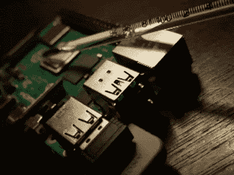

# Raspberry Pi 4 和电子游戏仿真的现状

> 原文：<https://hackaday.com/2020/01/14/raspberry-pi-4-and-the-state-of-video-game-emulation/>

像素艺术的现代理想是一个谬误。塞进盒式磁带和软盘的视频游戏艺术得益于他们那个时代的 CRT 显示技术。在昏暗的黄色 RCA 连接器模糊的范围内传输模拟视频，图像实际上只是屏幕上形状的建议，而不是清晰定义的图形。即使使用优质的 RGB 视频电缆，大多数消费级 CRT 电视也不会产生超过 400 行的图像，因此当电子束跟踪时，数字化图形的精确特性就变成了模糊的光栅。直到上世纪 90 年代末，高分辨率 PC 显示器、文件共享和开源仿真软件的融合，才让大众看到了清晰的方块色块像素。

更重要的是，仿真软件并不局限于任何一种显示技术，也不局限于运行它的设备层。视频游戏模拟器的开源性质似乎总是聚集在最低公分母的设备周围，给了最广泛的游戏玩家玩游戏的机会。现在，那个“L.C.D .”很可能就是树莓 Pi 4。单板计算机以令人惊讶的可承受的入门级价格混合了易于修补的 IO，使其成为仿真器的天然家园，但在 50 美元的仿真场景中有什么选项可以解锁？

## 不确定的价格标签仍然相当低，全包

The raspberry pi 4 runs a little hot out of the box.

树莓 Pi 4 和它的前辈之间的技术[差距相当大。时钟速度提升 22%，内存提升 4 倍以上，支持 4K 分辨率，同时保留相同的占用空间](https://hackaday.com/2019/07/10/raspberry-pi-4-benchmarks-processor-and-network-performance-makes-it-a-real-desktop-contender/) 。这些进步伴随着更高的 3A 功率要求，这意味着额外的成本，而不是任何 USB-C 上的 PSU 都会这样做。 所有那些[额外的安培数加起来表面温度](https://www.tomshardware.com/news/raspberry-pi-4-firmware-update-tested,39791.html) 在启动固件 上从 50 到 80 摄氏度的任何地方。即使有了更新的固件，任何认真的用户都会想要一个额外的冷却解决方案。你还需要为所有游戏装备支付一些费用:键盘/游戏手柄、微型 HDMI 电缆和闪存。最终，廉价仿真箱的前景取决于现有设备的数量。但即使考虑到所有的附加功能，以这样的入门级价格拥有一台专用游戏装备也是非常不可思议的。问题是，什么样的游戏是可能的？ 

当谈到树莓派上的街机游戏模拟时，大多数用户的第一站是 RetroPie 发行版。它提供了一个轻量级的用户界面，可以很好地适应各种分辨率。RetroPie 使用 advMAME v3.9 作为其街机仿真软件。虽然功能强大，但 advMAME 实际上是 MAME 0.108 版的一个端口，其历史可以追溯到 2006 年。当时编写的大部分仿真器通常优先考虑速度而不是精度，以保持可玩性，因此鉴于 2000 年代中期的硬件限制，CRT 滤波器或控制台芯片级周期精度的概念几乎不可能实现。这个例子并不是要贬低 advMAME 或 RetroPie 包装器的任何开发者，而是要指出 Raspberry Pi 的相对便利性是有代价的。如果模拟的熟练程度退居到最初 Xbox 的时代，那么为什么不用一个 Xbox 来代替呢？反驳就简单两个字……run ahead 模式。Pi 4 的四核特性使它非常适合这一点。

## 跑(Kokiri)森林，跑

对于外行来说，Retroarch 是一个前端，它聚集了大量的仿真软件，是 retroPie 的一部分。Retroarch [背后的开发团队宣布 Raspberry Pi 4 支持一种被称为 runahead mode](https://www.libretro.com/index.php/retroarch-runahead-and-raspberry-pi-4-the-results-are-in/) 的延迟减少过程。他们的描述强调了这项工作的低延迟优势:“runahead 功能在后台尽可能快地计算帧，以尽可能接近所请求的输入命令来回滚操作。”仿真器可能是资源密集型的，会耗尽所有可用的 CPU 能力和内存。当一个特定的游戏序列变得更加苛刻时，控制器轮询可能会与屏幕上当前显示的内容不同步。事情会变得拖沓。

在特定仿真内核(Genesis Plus GX、Snes9x 2010 和 VBA Next)上启用 Retroarch 的 runahead 模式可以缓解仿真器本身造成的输入延迟。

Process flow diagram of two-instance runahead mode in Retroarch.

当 runahead 模式在 Raspberry Pi 4 上正确实现时，游戏控制或多或少就像在原始硬件上一样。这意味着在 run n' gun 中失去一条生命，像 *Gunstar 英雄*仅仅是由于用户的错误。另一方面,《最终幻想》中的回合制游戏在不启用提前运行模式的情况下也是安全的。那些庞然大物肯定是有耐心的人。

应该注意的是，这一革命性的功能是基于搭配一个不太像样的 LCD 和有线游戏手柄/键盘。不幸的是，一个游戏的所有同步实例都无法克服糟糕的像素响应时间或低于标准的蓝牙无线电控制器。

## 光学介质进入视野

在 Pi 血统中，第一次有了基于磁盘的控制台模拟器的多种选择。 [Dreamcast、PSP、Saturn，甚至 PlayStation 2 core via retro arch v 1 . 7 . 8](http://www.lakka.tv/articles/2019/09/15/lakka-2.3-with-retroarch-1.7.8/)都已经登上了树莓 Pi 4。尽管这些系统中的大部分还没有全速运行，但仍有一些真正的佼佼者处于其新生的测试形式。特别是最近开发的 Sega Dreamcast 模拟器 redream，尽管没有稳定的 Raspberry Pi 版本，但已经取得了显著的进展(如下视频)。在 720p 的分辨率下，游戏可以以每秒 60 帧的速度播放。备受尊崇的[海豚模拟器(Gamecube/Wii)甚至已经显示出在单板计算机上运行](https://www.youtube.com/watch?v=l4TyYU9Xhcs&feature=emb_logo)的前景。

除了 Gamecube 之外，还有一系列街机游戏，由于它们的复杂性，现在才被模仿，而且在未来几年内也不太可能在树莓 Pi 上运行。重现真实的 20 世纪街机体验在这种外形下可能无法实现，因为更全面的模拟器，如当前迭代的 MAME，目前运行起来太费力了。每年一次的新 Pi 设备修订将很难吸引开发人员的注意力，而仿真软件的进一步成熟只会有助于缓解设备缺乏原始计算能力的问题。Runahead 模式和对以前无法访问的模拟器的访问无疑增强了 Raspberry Pi 4 作为一体化解决方案的可行性，尽管最重要的是这些好的 ol '游戏正在被玩。

 [https://www.youtube.com/embed/PuqQQfA371A?version=3&rel=1&showsearch=0&showinfo=1&iv_load_policy=1&fs=1&hl=en-US&autohide=2&start=128&wmode=transparent](https://www.youtube.com/embed/PuqQQfA371A?version=3&rel=1&showsearch=0&showinfo=1&iv_load_policy=1&fs=1&hl=en-US&autohide=2&start=128&wmode=transparent)

