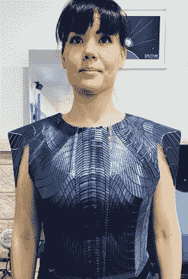
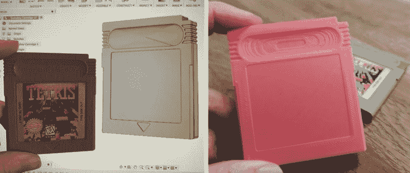
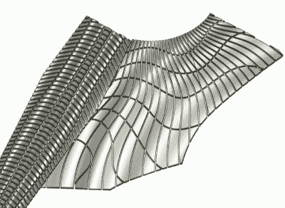

# super co Talk:Sophy Wong 正在设计可穿戴技术的未来

> 原文：<https://hackaday.com/2019/11/27/supercon-talk-sophy-wong-is-designing-the-future-of-wearable-technology/>

对我们中的许多人来说，“可穿戴技术”这个词让人想起《星际迷航》中的博格人:粗糙的机械形状和裸露的电线被随意移植到一个人形上，留下了一个运动范围，就像前油罐铁皮人一样。它只是我们所熟悉的那种硬件的投影。黑客项目往往是大量的电线和印刷电路板被自由应用的热熔胶所控制，很少被称为有机设计。当你在构建一个台式电源时，这可能没问题，但不幸的是，在人体上找不到多少直角。

Believe it or not, this garment designed by Sophy Wong is 3D-printed

谢天谢地，我们有像 Sophy Wong 这样的设计师。尽管使用了我们大多数人都会联想到机械设计的工具和软件，但她的艺术眼光和时尚知识帮助她创造出符合穿着者身体自然轮廓的灵活组件。任何人都可以将现有的一件硬件绑在一个人的手臂上，但她的作品旨在像一件量身定制的衣服一样合身；如果可穿戴技术要超越高科技手表，这是一个必要的发展。

[在帕萨迪纳 2019 年 Hackaday Superconference 的演讲*“用机器制造:3D 打印&用于可穿戴电子产品的激光切割”*](https://www.youtube.com/watch?v=Z9jChZtsVhA) 中，Sophy 向与会者介绍了她多年来致力于可穿戴产品的设计过程。她的设计始于现实世界，偶尔会以草图的形式直接绘制在她正在制作的任何东西的表面上，然后进行数字化处理和复制。

她的许多作品以优美的曲线和镶嵌图案为特色，创造了复杂且不可否认的未来感，如果没有现代的加减制造方法，将会非常难以创作。但即便如此，索菲解释说，3D 打印机和激光切割机并不神奇；这些机器将我们从耗时的重复性任务中解放出来，但是创建它们所需要的设计文件所需的技能和努力却是非常重要的。

 [https://www.youtube.com/embed/Z9jChZtsVhA?version=3&rel=1&showsearch=0&showinfo=1&iv_load_policy=1&fs=1&hl=en-US&autohide=2&wmode=transparent](https://www.youtube.com/embed/Z9jChZtsVhA?version=3&rel=1&showsearch=0&showinfo=1&iv_load_policy=1&fs=1&hl=en-US&autohide=2&wmode=transparent)

## 期望与现实

在她的演讲的早期，Sophy 将她使用 3D 打印机和激光切割机的经历比作一种工具，这种工具在普通 Hackaday Supercon 与会者的工作室中可能不太常见:缝纫机。她解释说，当她第一次得到她的缝纫机时，她想象自己坐下来，轻松地完成项目。但实际上，她的大部分时间都花在了设计和准备上。当她最终准备好使用缝纫机时，这个项目已经进入最后阶段。

同样，她表示，新的 3D 打印机或激光切割机所有者需要明白，在你能够只按一下按钮就收到最终产品之前，还有大量的工作要做。对于这些机器节省的体力劳动，它们在设计和软件方面增加了等量(如果不是更多)的时间。

Sophy 认为这很好，因为她的平面设计背景意味着她已经习惯于将自己的想法数字化。正如她在演讲中多次提到的，需要一些 CAD 元素来操作的机器“会说她的语言”。但这并不意味着这是一个简单的转变。索菲精通 2D 工具，但把东西带入第三维需要一些时间来适应。

她对 3D 设计初学者的建议是边做边学。仅仅在网上看教程和重复为你准备的步骤是不够的。在她的案例中，她挑战自己，在一个月的时间里每天都用 3D 设计一些东西，这样她就可以适应这个工作流程。

Duplicating real-world objects is an excellent way to practice your CAD skills.

有时她会设计商标或小玩具，有时她会重新创作她在房子周围找到的物品。你创造了什么并不重要，只要你对工具足够自信，能够快速准确地向坐在你工作台上的机器表达你的想法。

## 挑战极限

我们遇到的大多数 3D 打印零件都采取电子外壳、支架或定制适配器的形式。这些实用的东西设计得很匆忙，而且通常很少考虑，因为黑客宁愿把他们的精力花在项目中更令人兴奋的元素上。

Sophy’s designs push the limits of traditional CAD tools.

但是，一旦你了解如何使用你的设备，尤其是如果你对 CAD 过程感兴趣，你就可以开始真正充分利用它的独特功能。

Sophy 已经能够在她被普遍认为是廉价的 3D 打印机 Creality CR-10 上生产出的东西是非常惊人的。通过在打印过程中在打印机床上拉伸一个薄网，她能够将数百个单独的元素连接成一个有粘性的织物。每一个元素之间的仔细间隔赋予了织物独特的属性，例如根据折叠或弯曲的方式改变形状。

在她的演讲中，Sophy 提到了她最近的一个项目，由数千个独立的 3D 元素组成，非常复杂，她需要转移到一台更强大的计算机上，以防止她的 CAD 软件锁定。她解释说，在这一点上，越来越明显的是，为传统 CAD 开发的工具将很难跟上她大规模印刷织物的复杂性。印花服装的进一步发展可能需要一套全新的 CAD 工具来满足他们独特的设计要求。

## 追随让你感动的事物

Sophy 和社区中其他一些有才华和创造力的人一起致力于 3D 打印纺织品的最前沿。这些项目是迈向某一天可能成为我们日常生活一部分的技术的第一步。[至少对我们中更时髦的人来说是这样。](https://hackaday.com/2019/11/24/mimic-artfully-employs-leds-in-fashion/)

但是，即使你不喜欢裹在紧身的 PLA 里，Sophy 的演讲也是鼓舞人心的，因为它展示了个人制造商和黑客在负担得起的硬件上有多大的能力，以及将它投入使用的决心。她建议对你的工具更加自信，并采用迭代设计方法，无论你想构建什么，这都是有效的。谁知道呢？如果你以她为榜样，你可能会在明年的超级舞台上告诉我们这一切。