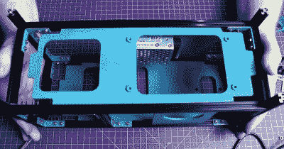

# 建造一台仿复古便携式电脑

> 原文：<https://hackaday.com/2019/12/01/building-a-faux-retro-portable-computer/>

现代笔记本电脑起源于 20 世纪 80 年代中后期，当时计算机硬件的缩小和电池技术的改进最终使移动计算变得可行。但是在现在标志性的翻盖外形成为标准之前，所谓的“便携式”电脑是有市场的。这些机器通常就像带着键盘的行李箱，即使在巅峰时期，它们也远不如今天的超薄笔记本电脑实用。但对于我们当中更怀旧的人来说，这些老式便携式电脑确实有一种特殊的魅力。

为了用现代组件重现这种魔力， [[davedarko]已经开始开发他自己的 Raspberry Pi 便携式电脑](https://www.element14.com/community/docs/DOC-94098/l/episode-421-raspberry-pi-4-commodore-sx-64-inspired-portable-computer)。就像过去的那些机器一样，他的构建被设计成一个可以随身携带的独立计算体验，但不是你在火车上突然打开的东西。它的挤压铝框架容纳了显示器、电源和音频硬件，如果 T2 决定装上几个硬盘或更奇特的东西，还有足够的空间来放置额外的硬件。

The skeletal frame has plenty of room for activities.

我们特别喜欢他设计的 3D 打印铰链和锁定机制，它可以将键盘紧贴在框架的前面。经验丰富的老读者会记得这一特殊功能是 Osborne 1 和 Compaq Portable 等笔记本电脑的定义特征，很高兴看到它包含在这里。现在只需要在侧面增加一个皮革手柄，就能让外观更加完美。

[davedarko]仍然有一些工作要做，因为最终他想用激光切割面板完全包围他的计算机框架。但是这个构建确实进展得很好，坦率地说，我们已经可以在下一次 hackerspace 会议上毫无问题地完成它了。在像这样的构建[和我们最近报道的越来越多的网络平台](https://hackaday.com/2019/07/16/raspberry-pi-cyberdeck-inspired-by-rare-msx/)之间，看起来好像[20 世纪 80 年代的设计美学在黑客社区中仍然很活跃](https://hackaday.com/2019/09/20/3d-printed-virtuscope-is-a-raspberry-pi-4-cyberdeck-with-a-purpose/)。

 [https://www.youtube.com/embed/vXGr7-_U_tY?version=3&rel=1&showsearch=0&showinfo=1&iv_load_policy=1&fs=1&hl=en-US&autohide=2&wmode=transparent](https://www.youtube.com/embed/vXGr7-_U_tY?version=3&rel=1&showsearch=0&showinfo=1&iv_load_policy=1&fs=1&hl=en-US&autohide=2&wmode=transparent)

【感谢 HappyFox 的提示。]