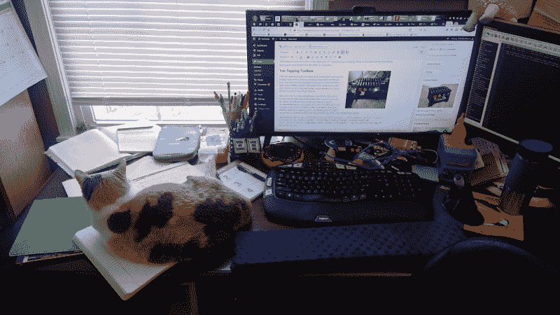
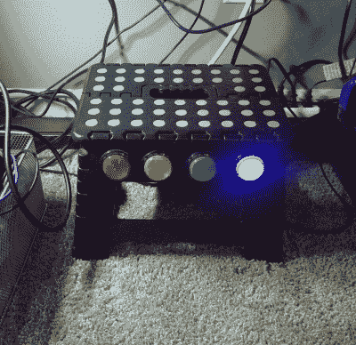
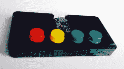

# Macro 脚凳帮助我提高工作效率

> 原文：<https://hackaday.com/2019/12/20/macro-foot-stool-helps-me-get-a-leg-up-on-work/>

宏的本意是让我们的生活变得更容易，但它们实现了这一承诺，却带来了好坏参半的结果。一般来说，宏是键盘上执行自定义任务的特殊组合键，它们的目标是通过避免在菜单中使用鼠标来提高您的工作效率。但是一旦一个宏需要两个以上的键，输入起来就有点麻烦了。我个人发现重复使用需要`ctrl` + `shift`的宏会[潜在地导致问题](https://hackaday.com/2018/05/28/stretching-my-skills-how-and-why-i-made-my-own-compression-sleeves/)。我不知道你是怎么想的(你的重复性压力里程可能会有所不同)，但人身伤害与我想要的本应方便的东西截然相反。

我越是想到拥有一个专用的一键宏按键区域该有多好，我的生活就越显得不完整。我合唱的每一个不舒服的三键快捷键都比上一个更有激励性。

我喜欢键盘快捷键，不仅仅是因为我更喜欢键盘导航。很多关于网络写作的小事都可以用快捷方式简化，比如写`html`标签和做图像处理。我一直在寻找一个更好的工作流程来锁定我转瞬即逝的思维碎片，至少直到那一天我可以打开 Dropbox thinks 并将我的脑电波直接刻录到磁盘上。

## 为什么是脚凳？

 
大多数宏机都像键盘，生活在桌面上。我的桌面被活页纸、法律垫、文件夹和猫科动物覆盖，我不想担心保持另一个输入设备不被覆盖。此外，猫和我不需要另一个永久固定装置占用宝贵的空间。反正我已经在用脚凳了，因为我的桌子高得出奇，我必须把椅子抬高才能舒服地坐在上面打字。

我让[制作一个脚踏键盘](https://hackaday.io/project/167267-macro-foot-stool)的原因之一是为了提高我的注意力。我想要一种快捷方式，不会让我的手指离开文字创作。我有越多的捷径，我就有越多的时间在状态中，完善我的双关语游戏。大部分快捷方式都是为了后期制作细节。例如，看到开始下一节的副标题了吗？这是一个专门的`<h2>`标签，可以很好地处理图像。

一旦我设法记住了，我就厌倦了把它们打出来，只是偶尔让 WordPress 偷偷地把它们转换成普通的标签。我还有一个快捷方式，它会吐出一个`<a href>`标签。它们都使用一个`for`循环来移动光标到正确的位置，所以我可以继续打字。没有一条捷径本身能节省大量时间，但效果是累积的。

##  敲脚趾工具箱

物理上，凳子上只有四个按钮，但有一个“银行”系统，可以将凳子扩展到 20 个潜在的宏。对于总共五个存储体，每个按钮根据哪个按钮被点亮(或者默认情况下没有按钮被点亮)而获得一个新的宏。目前，我拥有的宏观房地产比我知道的要多得多。这是一件好事，就像零件柜里有空抽屉一样。意味着我有成长的空间。

当凳子位于默认存储库时，没有任何 led 灯亮起，尽管按下按钮时它们会短暂亮起。我可以通过长按相应的按钮来访问不同的颜色库。一旦完成，LED 将一直亮着，直到我换银行。一个很好的功能是，我可以直接切换到另一家银行，而不用先回到默认银行。我可以通过再次长按激活颜色库的按钮回到默认库。

我绞尽脑汁，试图决定在每家银行存入哪种捷径。根据上下文或类型对快捷方式进行分组会更好吗？目前，它们是按类型组织的。默认银行是所有的`ctrl` + `shift` + `letter`组合，红色银行是所有的片段——像花哨的`<h2>`标签和`<a href>`标签。

##  它是如何制造出来的

老实说，我希望这很简单。我越早掌握这个关键工具，我就能越早消除浪费的时间和捷径疲劳。

这个操作的大脑是一个用 CircuitPython 编程的智能 M0。这是一个巨大的帮助，该板已经提出了一个 HID，编码就像在大容量存储设备上编辑文本文件一样容易。当然，用 Arduino 或 C 或裸机编程感觉很好，但这样做的目的是提高生产率。

只要我想到一个新的快捷方式，我所要做的就是将我的文本编辑器切换到`main.py`，编写一个新的方法，在适当的库中调用该方法，并保存文件。从程序上来说，这是一个相当便携的设备。

##  微宏脚凳

在使用脚凳的第一天内，我就上瘾了。但当时它只有默认银行和总共四个插槽。我想继续改进它，但是我不想因为我的实验而搞砸它，或者同时停止使用它。我别无选择，只能建造第二个更小的版本。

唯一的功能差异是，micro macro 脚凳使用了一个小 M0，而不是一个小 M0，而且没有发光二极管，所以我无法测试这些变化。

## 学习经历

我在制作这个凳子的过程中学到了一些东西，这是任何好项目的标志。首先，我以前从未钻过这么大的洞，也没在塑料上钻过多少孔。现在我可以放心大胆地在任何坚硬的塑料上钻孔了。从封闭的角度来看，这种折叠凳很容易拆卸，可以平放，便于钻孔。让我想知道还能对这些凳子做什么。

另一个额外的好处是有机会和 CircuitPython 一起在草丛中漫步。在这个项目之前，我并没有用它做很多事情，但是它已经蜿蜒进入了我的内心。我很感激生活在这样一个项目进入门槛如此之低的时代。无论你是想建立这样的东西来防止重复性压力伤害，还是为了更好的 noob pwnage，CircuitPython 都能让它变得简单。

我在 Hackaday 家庭办公室不穿鞋，但如果我穿了，你可以打赌我会试着用[踏脚转盘开关](https://hackaday.com/2018/01/19/a-keyboard-to-stomp-on/)。