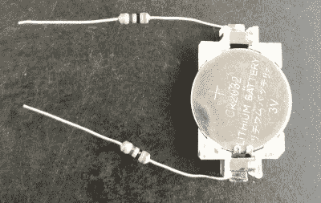
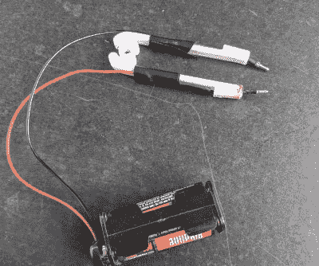

# Supercon SMD 挑战赛获得 3D 打印探针:打造您自己的

> 原文：<https://hackaday.com/2019/12/12/supercon-smd-challenge-gets-3d-printed-probes-build-your-own/>

今年是 Supercon 的第二次 SMD 挑战赛，因此我们很可能从去年学到了一些东西。如果你不熟悉这个挑战，你会得到一些非常传统的工具，你必须焊接一个 led 越来越小的电路板，直到你得到 0201 元件。即使使用合适的工具，这些都是具有挑战性的，但是令人惊讶的是，许多人甚至使用我们提供的笨重的大熨斗也成功地建造了它们。

 在第一次挑战中，我们确实发现了一个问题。所有指示灯都标记了极性。然而，由于我们不提供超高倍放大，通常很难确定极性，尤其是在较小的零件上。去年，[xBeau]生产了一些快速 LED 测试器来帮助克服这个问题。今年，我们对它们进行了一些改进。

正如你所看到的，2018 年的模型非常聪明地利用了手头的东西。CR2032 支架为探针供电，探针本身是两个电阻。如果你能用探针点亮 LED，你就知道哪根引线是阳极，哪根是阴极。一点红墨水就更明显了。

## 弄糟成功

一种观点认为，这些探测器在 2018 年表现良好，因此我们可以为 2019 年的挑战建立更多的探测器。然而，尽管这些功能足够好，但使用起来并不方便。这些小金属丝不是真正的弹簧，长时间使用后会疲劳。

我想要的东西能更好地抵御滥用，并有一点点更好的人体工程学。我考虑过 3D 打印什么的。正如我在尝试设计某样东西之前经常做的那样，我快速搜索了一下，看看是否有类似的东西。

在 Thingiverse 上，[Tom20170]正好有我需要的。这是一个简单的 SMD 测试夹具的 3D 打印。它有一个有弹性的小塑料线圈，和一个容纳试验板电缆的外壳，用作探针。

## 定制

打印很容易，但我不想有太多的电线或连接，所以我做了两个非常简单的修改。

这是我的材料清单:

*   eagle Plastic Devices 12bh 443 b-GR–4 AAA 电池座，带 9 V 卡扣
*   keystone 237-M–9V 电池单元，带 8”导线
*   我的垃圾箱中的 100ω电阻(见下文)
*   Molex 02-06-2132–压接销(仅第二种型号需要)
*   热收缩管
*   电工胶带

9 V 快照非常理想。我得到了更好的那种，有一个成型的身体，而不是那些便宜的，往往在 9 或 10 次快照后就坏了。它们确实要贵一点，但即使你只买一个，它们也不到一美元。省五毛钱，隔几个月就坏连接器，绝对是假经济。

我用 Molex 引脚做了几个，并决定裸露的电阻引线可能也一样好，所以我没有使用其余的引脚。当我使用它们的时候，我用了热收缩。如果你愿意的话，你也可以使用 Thingiverse 设计所要求的电线。

电阻器是我手头上有的。他们不是超级挑剔的，如果我必须再做一次，他们是我要改变的少数事情之一。

## 建筑

 我在一台 ANET A8 上用 PLA 打印了一堆 0.3 mm 层高的探针体。我用了 20%的填充，但这可能不是很重要。它们不需要很长时间就能打印出来，所以我一次把尽可能多的东西放在床上，然后运行了几次。

电阻器很好地嵌入两侧的空腔中，一点热收缩隐藏了焊点。电工胶带或热收缩带将电线绑在两侧，以消除所有应力。和以前一样，一点红墨水很容易看出哪个引线是正的。

如果你仔细观察，你会发现永久标记并不是标记 PLA 的最佳方式。它会渗透到你不想去的地方。然而，对于一个积极的分数来说，这并不重要。不过，我不会用它来给 3D 打印上色，如果颜色区域清晰很重要的话。

## 更多调整？

我们真的不知道是否有人更喜欢尖端，而不是裸露的电阻引线。电池可拆卸无疑使探头的运输变得更加容易。

电阻器根据 LED 的正向电压限制电流。通常，LED 的压降在 1.8 V 到 3.3 V 之间。对于 100ω电阻，计算出的范围为 13.5 mA 至 21 mA。这在高端有点热，您可能可以安全地增加电阻值。使用两个 470ω电阻，电流大约在 3 mA 至 8 mA 之间。1kω应该也可以，但可能有点暗。

我没有使用更高的电阻，而是考虑串联第二个 LED，这样镊子就可以兼作连续性探针。例如，如果短接探针，1.8 V 红色 LED 的电流约为 12 mA，但在 100ω电阻下，大多数受测 LED 的电流仍为 5 或 6 mA。

## 正确的东西

当然，如果你的万用表有一个二极管设置，这可能是这项工作的正确工具。如果设备点亮，正极探针将指示 LED 的阳极。如果它不亮，就把探头调换一下。

如果你看一下 LED 数据手册，你应该能找到一种光学识别极性的方法。例如，有些有绿色条纹、圆点或凹口。如果它有一个透明的透镜，你也可以通过观察 LED 内部的连接来直觉判断极性。有时焊盘的形状会告诉你。如果组件在一个卷轴上，卷轴通常有办法分辨，但如果你只有几个松散的部分，那就帮不了你了。

看看 Vishay 的这张 [LED 数据表。您可以看到端子和焊盘看起来有些不同。这张来自](https://www.vishay.com/docs/81602/vlmw11.pdf) [Kingbright](http://www.kingbrightusa.cimg/catalog/SPEC/AA3535SEL1Z1S.pdf) 的照片清楚地显示了一个截止角。你可以在这个 [Digikey TechForum 帖子](http://www.kingbrightusa.cimg/catalog/SPEC/AA3535SEL1Z1S.pdf)中看到许多例子。

如果你想了解更多关于 SMD 挑战的信息，请查看[【丹·马洛尼】的经历](https://hackaday.com/2019/11/18/a-newbie-takes-the-smd-challenge-at-supercon/)。也许你更喜欢你的[镊子更聪明一点](https://hackaday.com/2012/11/07/measuring-smd-parts-with-a-home-brew-version-of-smart-tweezers/)。然而，如果你真的做了一对，请把它们贴出来，并给我们发一个链接。同时，你可以开始为明年的比赛练习。永远不会太早。