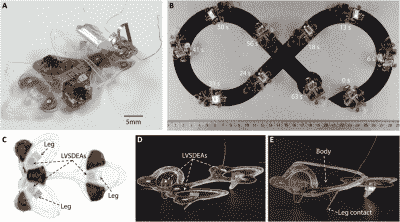

# 从苍蝇拍下幸存下来的柔软的机器昆虫

> 原文：<https://hackaday.com/2019/12/31/a-soft-robotic-insect-that-survives-the-fly-swatter/>

无法被拍走的成群机器昆虫可能不再是科幻小说和《黑镜》剧集的产物。EPFL 工程学院的一个团队开发了一种推进速度为 3 厘米/秒的昆虫，被称为[DEAnsect](http://robotics.sciencemag.org/lookup/doi/10.1126/scirobotics.aaz6451)。

这个机器人的独特之处在于它异常坚固。最初开发了两个版本的机器人，一个用超细电线拴着，能够用鞋子挤压而不影响其功能，另一个完全无线和自主。该机器人重量不到 1 克，配备有微控制器和光电二极管，可以识别黑白图案。

这种昆虫因其电介质弹性体致动器(DEAs)而得名，这是一种人工肌肉，通过振动推动它，使它能够轻盈快速地移动。

DEAs 由楔入软电极之间的弹性体膜制成，当施加电压时，软电极相互吸引，压缩膜。当电压关闭时，薄膜恢复到其原始形状。通过每秒 400 次开关电压来产生运动。该团队使用纳米制造技术降低了薄膜的厚度，并开发出只有几个分子厚的柔软、高导电电极。他们计划安装更多的传感器和发射器，让昆虫能够直接相互交流，进行更大的群体活动。

 [https://www.youtube.com/embed/dMLqnf3AIGQ?version=3&rel=1&showsearch=0&showinfo=1&iv_load_policy=1&fs=1&hl=en-US&autohide=2&wmode=transparent](https://www.youtube.com/embed/dMLqnf3AIGQ?version=3&rel=1&showsearch=0&showinfo=1&iv_load_policy=1&fs=1&hl=en-US&autohide=2&wmode=transparent)

