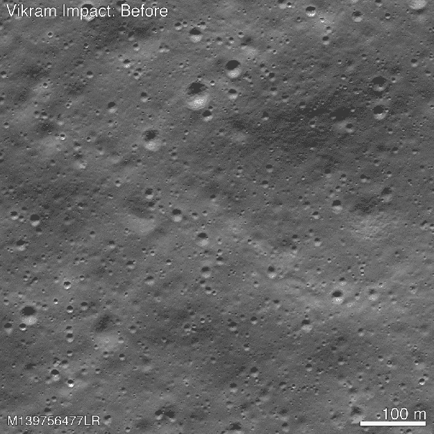

# 公民科学家发现月船 2 号；让我们想起冥王星的发现

> 原文：<https://hackaday.com/2019/12/06/chandrayaan-2-found-by-citizen-scientist-reminds-us-of-pluto-discovery/>

冥王星——不是狗，而是非行星——与印度发射的维克拉姆月球着陆器有什么共同点？两者都是通过与照片进行非常细微的对比而发现的。你可能会认为在月球上着陆已经是老生常谈了，但事实证明只有三个国家做到了。月船 2 号任务将使印度成为第四个国家。但是在离地面两英里的地方，飞船偏离了计划轨道，失去了无线电信号。

印度声称知道着陆器坠毁的地点，但从未透露任何照片或实际坐标。美国宇航局的月球勘测轨道飞行器对着陆区拍了几次照片，但没有看到预期的疤痕，就像注定失败的以色列着陆器在 4 月坠毁时留下的疤痕。许多人开始关注美国宇航局的照片，一位印度计算机程序员和机械工程师 Shanmuga subra manian[似乎已经成功了](https://www.nasa.gov/image-feature/goddard/2019/vikram-lander-found)。

根据 Shanmuga 和美国宇航局的说法，他查看了最后已知的位置和速度，并用它来估计哪里可能有碎片。离预定着陆点约一公里远的一个白色斑点在同一地区的早期图像中并不存在。美国宇航局收到了可疑发现的报告，并确认了它以及发现的碎片喷雾。

## 到底是不是？

根据美国宇航局的说法，相机分辨率约为每像素 1.3 米，最大的碎片约为两个平方像素。印度空间研究组织(ISRO)声称他们已经知道着陆器坠毁的地点。另一方面，一名 ISRO 高级官员对美国国家航空航天局的图像表示怀疑，尽管他指出这是他个人的观点。尽管如此，你会假设如果他们知道它在哪里，他们肯定会知道美国宇航局的分析是正确的还是错误的。

## 亲自看

美国宇航局有一个伟大的前后图像，非常清楚地显示了差异。你可以在下面看到:

## 转眼间冥王星

这不禁让我想起冥王星是如何使用一种叫做[眨眼比较仪](https://en.wikipedia.org/wiki/Blink_comparator)的机器发现的。这台机器可以追溯到 1904 年，像许多东西一样，已经被现代技术所取代。1930 年，科学家们知道有东西牵引着行星的轨道，但他们不知道它在哪里。

闪烁比较器通过快速连续地向您显示两个摄影底片来帮助您找到移动的东西。两块板上同一点上的任何东西看起来都是静止的。画面中任何移动的物体都会突出出来，就像从一个地方跳到另一个地方一样。

1906 年，珀西瓦尔·洛威尔开始认真寻找“X 行星”。10 年后，他去世了，却不知道他在 1915 年两次拍摄了冥王星，却没有注意到它。追溯到 1909 年，当时至少有 14 张类似行星的照片没有人注意到。

1929 年——在洛厄尔天文台和洛厄尔遗孀之间进行了多次法律诉讼后，克莱德·汤博(Clyde Tombaugh)将这项任务交给了一位年轻的天文学家，于是搜寻工作重新开始。汤博两人一组拍摄夜空，用眨眼比较仪观察是否有东西移动。他有一架 13 英寸的望远镜——不错，但以今天的标准来看并不算大。

这一发现发表于 1930 年 3 月。你知道从那以后冥王星仍然没有绕太阳转一周吗？冥王星上的一年将近 250 地球年长。你可以在下面的视频中看到更多关于洛厄尔天文台的比较仪。

 [https://www.youtube.com/embed/FKmT-8yjXiY?version=3&rel=1&showsearch=0&showinfo=1&iv_load_policy=1&fs=1&hl=en-US&autohide=2&wmode=transparent](https://www.youtube.com/embed/FKmT-8yjXiY?version=3&rel=1&showsearch=0&showinfo=1&iv_load_policy=1&fs=1&hl=en-US&autohide=2&wmode=transparent)

## 现代科学

虽然从技术上讲，汤博不是一名公民科学家，但我们可以获得他做梦也想不到的工具。虽然眨眼比较仪已经成为过去，但我们拥有一整套数字成像工具，以及来自地面、空间和车载望远镜和相机的大量图像。我们赞扬 Shanmuga Subramanian 如此成功地利用了这些工具。

如果你愿意，你甚至可以和一群人一起做观察。你也可以在网上使用一些[相当大的望远镜](https://hackaday.com/2016/10/13/skynet-takes-over-academia/)。同时，祝即将到来的 ISRO 第三次任务好运。