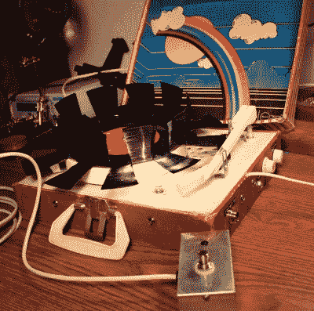

# 从一个旧电唱机建立的吉他效果

> 原文：<https://hackaday.com/2019/12/09/guitar-effect-built-from-an-old-record-player/>

雅各布·埃尔泽(Jacob Ellzey)仅仅用一台被掏空了内脏的电唱机、一个灯泡和传说中的 555 定时器 IC，就为他的吉他构建了[这种非常光滑的光学颤音效果。通过调节输入信号的音量，该设备在休息后创建了视频中演示的摇摆效果。](https://imgur.com/a/7iT9X5x)

 钥匙是一张乙烯基唱片，上面剪有很大的标签。随着唱片的旋转，这些空隙交替地挡住和打开一个小白炽灯泡。一个普通的 GL5537 光敏电阻，安装在最初固定玩家指针的手臂上，拾取不同的光线水平，并将其传递给甲板下的电子设备。这里需要注意的一点是，不同间距和大小的切口会改变效果产生的声音。[Jacob]已经做出了一些不同的设计，并计划在电子产品完成后进行更多的实验。

在引擎盖下有一个分压器和低增益放大器连接到光敏电阻，还有一个 555 定时器电路驱动白炽灯泡。一旦他摆弄完它们，电路就被移到一个整洁的小原型板上。通过电唱机侧面安装的一对电位计允许调节效果本身的深度，以及输出音量。当然，还有一个外部脚踏板，允许您的手不离开吉他就可以打开和关闭效果。

通常情况下，这个项目的一切都很顺利，直到最后一刻，当[Jacob]发现电路和灯泡都在同一个变压器供电时变暗。作为一个快速解决方案，他取出一个 Keurig 的内脏，用它的变压器自己驱动灯泡。有了独立的电源，他可以尽情摇滚了。

当然，这不是我们第一次看到[一件消费电子产品被改装成吉他效果](https://hackaday.com/2019/01/09/the-t-pain-toy-is-now-a-guitar-effect/)，但是如果你正在寻找更有针对性的东西，[有很多高科技选项让你忙个不停](https://hackaday.com/2018/05/08/stomping-microcontrollers-arduino-mega-guitar-effects-pedal/)。

 [https://www.youtube.com/embed/ujUUqQC3YaQ?version=3&rel=1&showsearch=0&showinfo=1&iv_load_policy=1&fs=1&hl=en-US&autohide=2&wmode=transparent](https://www.youtube.com/embed/ujUUqQC3YaQ?version=3&rel=1&showsearch=0&showinfo=1&iv_load_policy=1&fs=1&hl=en-US&autohide=2&wmode=transparent)

