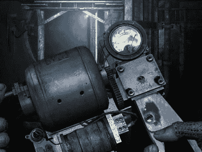

# 3D 打印地铁充电器为荒地做好准备

> 原文：<https://hackaday.com/2019/12/13/3d-printed-metro-charger-ready-for-the-wasteland/>

在视频游戏 *Metro 2033* 及其后续系列中，玩家使用简易武器和工具在后世界末日版本的俄罗斯中杀出一条血路，这些武器和工具是由核战争幸存者可能从废墟中捡来的零碎东西拼凑而成的。游戏中最有用的设备之一被称为“通用充电器”:一种手动发电机，玩家必须定期使用它为他们的电子设备充电。

The in-game Universal Charger

作为该系列的粉丝，[【Nikola Petrov】想要打造自己版本的 *Metro 2033* 充电器](https://www.thingiverse.com/thing:4025987)；但是，他没有去寻找一个精确的屏幕复制品，而是决定探索机制本身，看看他是否可以 3D 打印一个功能性的设备。

正如休息后的视频所示，他的充电器设法产生足够的能量，在每次扣动扳机时点亮一个 LED。不过，如果我们收拾行装去另一个未来的莫斯科与变异的野兽战斗，我们可能会寻找更刺激的东西。

除了 3D 打印的零件，充电器还使用了几根 8 毫米的短杆，一个 NEMA 17 步进电机和一个单向轴承，通常用于拉动启动小型汽油发动机。

有趣的是，[Nikola Petrov]对 3D 打印发电并不陌生。如果你有兴趣从 NEMA 17 踏步机中获得一些真正的动力，[他神奇的印刷风力涡轮机是必看的](https://hackaday.com/2018/10/15/wind-turbine-pushes-limits-of-desktop-3d-printing/)。

 [https://www.youtube.com/embed/8zk7IVHSvHQ?version=3&rel=1&showsearch=0&showinfo=1&iv_load_policy=1&fs=1&hl=en-US&autohide=2&wmode=transparent](https://www.youtube.com/embed/8zk7IVHSvHQ?version=3&rel=1&showsearch=0&showinfo=1&iv_load_policy=1&fs=1&hl=en-US&autohide=2&wmode=transparent)

 [https://www.youtube.com/embed/lKog973s8js?version=3&rel=1&showsearch=0&showinfo=1&iv_load_policy=1&fs=1&hl=en-US&autohide=2&wmode=transparent](https://www.youtube.com/embed/lKog973s8js?version=3&rel=1&showsearch=0&showinfo=1&iv_load_policy=1&fs=1&hl=en-US&autohide=2&wmode=transparent)

