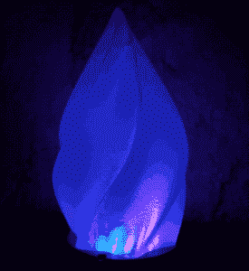

# LED 火焰照亮噪音之美

> 原文：<https://hackaday.com/2019/12/28/led-flame-illuminates-the-beauty-of-noise/>

你是否曾经完成了一个漂亮的 blinky 项目，却对光线或颜色模式的可预测性感到失望？当[点燃这支 LED 蜡烛](https://www.instructables.com/id/LED-Flame-Controlled-by-Noise)时，【真菌阿蒙格斯】也是如此。但是有一个更好的方法，它涉及到噪音。

 柏林噪音是肯·柏林在 80 年代早期创作的，当时他正在制作电影*创*。由于对计算机图形学的现状感到沮丧，并且空间太有限而无法使用图像，他设计了一种生成自然纹理的算法。基本上，你生成一串 0 到 1 之间的数字，然后给这些数字赋值，比如从黑色(0)到白色(1)的灰度值范围，或者色轮中的值。结果比随机数字漂亮得多，因为任何给定数字的相邻值没有根本的不同。你几乎没有任何开销就可以获得很好的随机性。

[真菌 amungus]正在使用 FastLED 的噪声函数来生成数字，但这里还有更多事情要做。正如他在休息后的精彩视频中解释的那样，如果你想让这些价值观生动起来，你只需添加它们的另一个维度。虽然[真菌 amungus]使用的是 Trinket Pro 和 NeoPixel 戒指，但我们认为简化版可以用内置 led 的 Circuit Playground Express 来完成。

如果你想用强硬的方式来做这件事，[从制作自己的 NeoPixel 戒指](https://hackaday.com/2018/06/16/definitely-not-neopixel-rings-from-scratch/)开始。

 [https://www.youtube.com/embed/4Yxb9cXf8a4?version=3&rel=1&showsearch=0&showinfo=1&iv_load_policy=1&fs=1&hl=en-US&autohide=2&wmode=transparent](https://www.youtube.com/embed/4Yxb9cXf8a4?version=3&rel=1&showsearch=0&showinfo=1&iv_load_policy=1&fs=1&hl=en-US&autohide=2&wmode=transparent)

