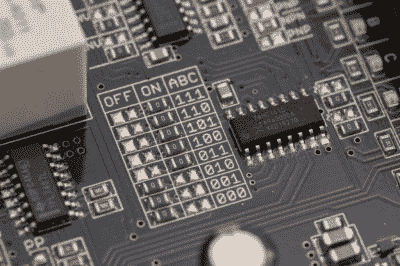

# 通用接口板拯救更大的项目

> 原文：<https://hackaday.com/2019/12/19/universal-interface-board-comes-to-the-rescue-of-bigger-projects/>

一旦一个项目涉及到其他组件、部件或模块，事情就会变得更加复杂。风扇、冷却装置、探头、泵或照明等设备可能有简单的电气要求，但它们很少相同。因此，一个整洁的项目最终不得不处理，例如，一个由 5 V 高电平有效逻辑控制的泵，一个输出 5 V 低电平有效逻辑的传感器，预期用 24 VDC 切换的灯，以及一个现在需要继电器的风扇。但这在未来可能会改变。

正是这一点促使[Lukas fs sler]设计并制造了[通用接口](https://soldernerd.com/2019/12/17/universal-interface/)，该板旨在成为所有此类设备的通用转换器和接口。这个想法是为每个外部设备提供一个通用接口板。对于每块板，各种输入组合控制一个输出。电路板是“硬件可编程的”,跳线(零欧姆电阻)用于以黑白形式准确显示输入组合导致的输出状态。通过这种方式，可以实施一些标准化和清晰的控制，同时仍然具有足够的灵活性来适应变化。

Jumper-configured logic table defining with utter clarity which combination of inputs results in an OFF or ON.

每个通用接口板都有三个输入和一个使能线，每个都有自己的 LED 指示灯，可以直观地确认其状态。输入为 24 V 容差，可以配置为上拉、下拉和高电平有效或低电平有效。有一个输出，但它有几种形式:一个坚固的继电器，一个强大的集电极开路输出，一个 5 V 逻辑输出，和一个 24 V 逻辑输出。配置哪种输出状态对应于跳线设置的哪种输入组合，因此电路板非常“所见即所得”。

[Lukas]目前在他的 CNC 轧机项目中使用了四个这样的设备，所有这些设备都有不同的配置，它们工作可靠。感兴趣吗？项目的 [GitHub 库拥有所有的电路板设计文件。](https://github.com/soldernerd/UniversalInterface)