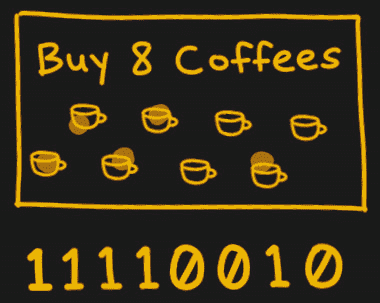

# 在 Go 中构建更好的 BitTorrent 客户端

> 原文：<https://hackaday.com/2020/01/18/building-a-better-bittorrent-client-in-go/>

说到点对点文件共享协议，BitTorrent 可能是最著名的协议之一。它需要一个实现程序的客户端和一个追踪器来列出可以传输的文件，并找到对等用户来传输这些文件。据估计，BitTorrent 于 2001 年开发，至今已经获得了超过 2.5 亿的用户。

虽然大多数用户选择使用现有的客户端，但[Jesse Li]希望在 Go 中从头开始构建一个客户端，Go 是一种编程语言，因其内置的并发特性和相对于 c 的简单性而被广泛使用。

Client-server versus peer-to-peer architecture

客户端的第一步是找到下载文件的对等点。追踪器是运行在 HTTP 上的网络服务器，它作为一个集中的场所，用来相互介绍对方。由于集中化，如果服务器为非法内容交换提供便利，它们就有被发现和关闭的风险。因此，让对等点发现成为一个分布式的过程，对于防止追踪器步现已不存在的 TorrentSpy、Popcorn Time 和 KickassTorrents 的后尘是必要的。

客户端首先读取一个. torrent 文件，该文件描述了所需文件的内容以及如何连接到跟踪器。文件中的信息包括跟踪器的 URL、创建时间以及文件的每一部分或一大块的 SHA-1 散列。一个文件可以由成千上万个片段组成——客户端需要从对等点下载片段，根据 torrent 文件检查哈希，最后将片段组装在一起以最终检索文件。对于实现，[Jesse]选择在 Go 程序中保持合理的扁平结构，将应用程序结构与序列化结构分开。片段还被分成多个散列片段，以便更容易地访问单个散列。

The bitfield explained as a coffee shop loyalty card.

接下来，对 torrent 文件中的“announce”URL 的 GET 请求向对等体宣布客户端的存在，并从跟踪器检索具有对等体列表的响应。为了开始下载片段，客户端启动与对等方的 TCP 连接，完成双向 BitTorrent 握手，并交换消息以下载片段。

消息中交换的一个有趣的数据结构是一个位字段，它充当一个字节数组，检查对等体拥有哪些数据块。当它们各自的状态改变时，位就会翻转，有点像贴有邮票的忠诚卡。

虽然与一个对等点对话可能很简单，但是管理同时与多个对等点对话的并发性需要解决一个经典的难题。[Jesse]在 Go 中通过使用通道作为线程安全队列来实现这一点，建立了两个通道来分配工作和收集下载的片段。请求随后被流水线化以增加吞吐量，因为网络往返是昂贵的，并且单独发送块是低效的。

GitHub 上有完整的实现[,如果你喜欢构建自己的客户端，可以很容易地将其用作替代客户端或演练。](https://github.com/veggiedefender/torrent-client)