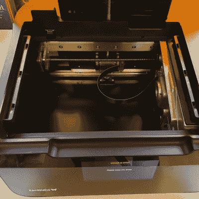

# 表格 3 SLA 打印机拆卸，邦尼风格

> 原文：<https://hackaday.com/2020/01/21/form-3-sla-printer-teardown-bunnie-style/>

[Bunnie Huang]与我们分享了他拆卸 Formlabs 的 Form 3 SLA 打印机的详细过程(在上图的左侧),他说当他打开打印机往里看时，首先注意到的是一个很大的空白空间，他希望在那里看到镜子和光学元件。[Bunnie]避开了任何关于打印机设计和工作原理的剧透，所以他肯定很感兴趣。

The view inside the Form 3.

拆卸不仅揭示了[Bunnie]对 Formlabs 的预期的深思熟虑的设计和构造，还揭示了 Form 3 在工作方式上已经走向了一个全新的方向。新机器现在围绕 Formlabs 所谓的 LPU 或光处理单元构建，该单元与新的构建槽和灵活的构建表面结合使用，而不是一对电流计来控制激光束穿过构建表面(如 Form 1 和 Form 2 打印机中所示)。简而言之，激光和光学系统现在装在一个超薄的环保密封装置中，可以在打印机中左右滑动。当 LPU 水平移动时，内部的一个检流计垂直控制激光。这种方法的回报包括更好的激光分辨率，整个光学系统不再需要直接位于液态树脂的下方，并且建造尺寸可以更大。此外，由于 LPU 的工作方式，模型承受的任何剥离力都较低。

关于 Form 3 具体如何工作的细节可以在 Formlabs 的网站上[获得，你也可以在](https://formlabs.com/)[亚当·沙维奇的测试](https://www.tested.com/tech/3d-printing/893200-formlabs-form-3-sla-3d-printer-review/)(视频链接)上从实际角度看它的工作，但这里真正的乐趣是通过具有【邦尼】工程经验的人的眼睛看组件和装配的非常有趣的外观。他从功能、供应、制造的角度提供了见解，甚至指出了在 LPU 内部可以找到的一点美国宇航局的幽默。

[Bunnie]了解他的硬件，他对 Formlabs 的工作肯定不陌生。他早先的二年级拆解同样详细，就像他之前的一年级拆解一样[。他的观点是，Form 3 及其工作方式代表了早期设计的一种进化变化，他承认自己肯定没有预见到这种变化。](http://www.bunniestudios.com/blog/?p=3110)