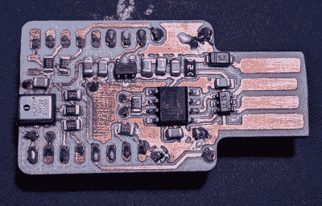

# USB 端口中的 ESP8266 环境监视器

> 原文：<https://hackaday.com/2020/01/08/an-esp8266-environmental-monitor-in-your-usb-port/>

在这一点上，我们都已经看到了足够多的 ESP8266“气象站”来了解这个过程:您只需将 ESP 和温度传感器放入一个 3D 打印的外壳中，并让所有这些辉煌的 Internet Points 流入即可。这是一个简单的，也许更重要的是实用的，似乎永远不会过时的项目。但这并不意味着没有创新的空间。

[cperiod]对现有解决方案不必要的庞大体积感到恼火，他提出了一种可以直接插入标准 USB 端口的 ESP8266 温度和湿度传感器。插入 USB 壁式充电器或电源组，这种小型板可以在您需要的任何地方提供不显眼的远程环境监控。为了获得额外的黑客积分，这种电路板甚至是在一家 PCB 工厂里生产的。

 除了 ESP-7 或 12 模块(如果需要更换，可以通过接头插入)，该板还具有一个 [CH330N USB 转 UART 芯片](https://hackaday.com/2018/10/03/new-part-day-the-fifty-cent-usb-chip/)和 HT7233 稳压器。对于传感器本身，[cperiod]有点打破常规，选择了与 I2C 有关的 AHT10，而不是更常见的东西，如 BME 家族的成员。

不幸的是，这种设计遇到了我们在其他紧凑型环境监控解决方案中看到的同样问题；也就是说，芯片本身产生的热量会扭曲温度读数。为了解决这一问题，固件中内置了积极的节能功能，以确保 ESP 尽可能多地处于深度睡眠状态。虽然这不是一个完美的解决方案，但它确实可以防止 ESP 将 PCB 加热到使报告的数据无效的程度。

到目前为止，特别敏锐的读者可能已经意识到，用于该板 USB 端的所有附加元件严格来说都不是必要的。毕竟，如果您可以[将 ESP 模块从头部中取出并单独编程](https://hackaday.com/2019/12/07/simple-pogo-programmer-for-esp8266-modules/)，那么您实际上不需要在每个传感器节点中包含该功能。虽然是真的，但当黑客展示他们的设计时，我们很难抱怨。