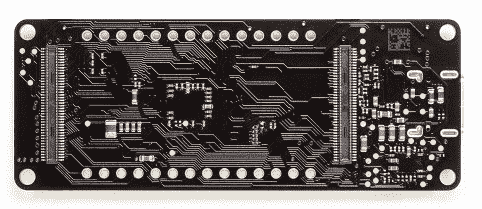
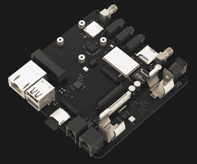

# 新零件日:Arduino 搭配 Portenta H7 成为专业产品

> 原文：<https://hackaday.com/2020/01/15/new-part-day-arduino-goes-pro-with-the-portenta-h7/>

拉斯维加斯的消费电子展传统上是科技大腕们展示他们即将推出的产品的地方，2020 年的展会也不例外。有新的智能手机、电视和家庭自动化设备，来自所有常见的嫌疑人。甚至有几辆电动车偷偷溜进去。但是，在电子巨头们浮华的展示中，夹杂着一家对 Hackaday 的读者来说很亲近的公司的一份相当克制的声明:Arduino 即将成为专业版。

虽然 Arduino 自成立以来一直专注于 DIY 和教育市场，[新推出的 Portenta H7 是为希望快速开发适合工业应用的强大硬件的专业用户而设计的](https://store.arduino.cc/usa/portenta-h7)。凭借内置的无线硬件和开箱即可运行 Python 和 JavaScript 的能力，强大的双核主板拥有类似的专业价格标签；目前预购价格为 99 美元一个，这个价格远远超出了公司传统的 DIY 和教育市场。随着来自其他低成本微控制器的竞争加剧，Arduino 似乎正在寻求扩大其舒适区，并找到新的收入来源。

## 那有很多别针

显而易见，Portenta H7 与我们放在零件抽屉里的相对小巧的 8 位 Arduinos 相去甚远。这款新型主板专为高性能边缘计算应用而开发，采用 32 位 STM32H747XI，同时采用 ARM Cortex M7 和 M4，运行频率分别为 480 MHz 和 240 MHz。两个内核可以独立工作，例如，允许一个内核运行解释的 Python，而另一个内核运行在 Arduino IDE 中编译的代码。当需要协同工作时，内核可以通过远程过程调用(RPC)机制相互通信。

The new 80-pin connectors on the Portenta

从表面上看，新的主板看起来并没有远离我们习惯的现代 Arduino 外形。USB 连接器已经升级为 C 型，但 Portenta 仍然保留了双排焊盘，为手工焊接的接头做好准备——这是他们最近的引脚排列，他们称之为 Arduino MKR 外形。

但是，如果你看一下主板的背面，你会发现它们增加了两个 80 针高密度连接器。根据产品页面，这些旨在允许 Portenta 作为可移动模块简单地插入设备。这个想法是，现场的设备可以很容易地将它们的端口换成升级的型号。深入产品页面的文档部分可以找到一个原理图，其中列出了连接器[Hirose DF40C-80DP-0.4V(51)](https://www.hirose.com/product/p/CL0684-4001-8-51)。

基本型号 Portenta 具有 8 MB SDRAM 和 16 MB NOR 闪存，但如果您需要，可以定制高达 64 MB 的内存和 128 MB 的闪存。订购时还可以从板上删除各种接口，因此，如果您不需要网络连接或恩智浦 SE050C2 加密芯片，可以直接将其删除。然而，在撰写本文时，还不清楚解锁这一定制级别所需的最小订单量，或者这些修改会改变多少单位成本。

## Arduino 桌面的年份？

The Portenta Carrier Board

Portenta H7 本身就是一个足够令人印象深刻的硬件，但当它插入可选的载板时，事情真的开始变得有趣了。载板为所有板载外设提供全尺寸连接器，根据文档，将 Portenta 变成 eNUC 级嵌入式计算机。甚至还支持 DisplayPort 连接显示器，miniPCI 连接扩展卡。

将满载的 Portenta H7 插入载板，看起来你已经具备了一台低功耗 ARM“桌面”计算机的素质。尽管它的性能不会超过 Raspberry Pi Zero，而且价格要高出几倍。

Arduino 新闻稿和产品页面没有提到电脑将运行哪种软件或操作系统，所以这可能是留给客户的一个练习。虽然 ARM Cortex-M 系列处理器并不特别适合运行 Linux 内核，但它能够运行 Linux 内核，因此为其创建“真正的”操作系统映像应该是可能的。当然，对于最大 64 MB 的 RAM，您可能希望保持较低的性能期望值。

## 波特纳塔适合哪里？

我们甚至无法推测一个最大的端口会花费多少，也没有载波板的定价或发布日期。但是，即使是 99 美元，基本型号的 Portenta H7 对于习惯于以 1/10 的价格购买双核 ESP32 板的黑客和制造商来说也是一个艰难的销售，或者以 1/4 的价格购买 Teensy 4.0，它有 600 MHz 的 Cortex-M7。这很好，因为这个板不是为传统的 Arduino 核心用户设计的。

看到载板，我们不禁注意到这里与 Raspberry Pi 计算模块的一些相似之处。通过与 SODIMM 接头的连接，计算机模块的想法是通过提供更坚固的外形，更容易集成到最终用户产品中的 Raspberry Pi 来帮助弥合 DIY 社区和商业社区之间的差距。但由于它并不比股票 Pi 便宜，所以没有太多的动机去转换。我们还没有看到消费品广告上写着“里面有树莓派！”所以很难说工业界是否有任何有意义的采纳。

人们不禁要问，为什么有资源将如此昂贵的电路板集成到他们的产品中的任何公司都不会围绕 Portenta 的 STM32H747XI 芯片提出自己的定制设计，即使是单个数量，目前也只需不到 15 美元。这种差异最终可能会归结于围绕 Arduino 品牌的世界知名社区，以及该公司对其工具链进行现代化的努力。