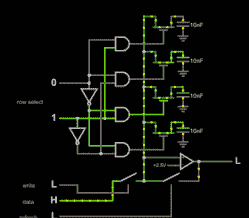
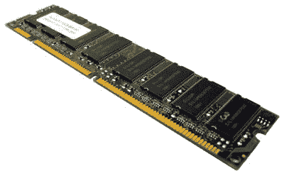

# DDR-5？DDR-4，我们几乎不认识叶

> 原文：<https://hackaday.com/2020/01/29/ddr-5-ddr-4-we-hardly-knew-ye/>

本月的 CES 见证了 SK 海力士推出的最大速度 DDR5 内存[。据报道，Micron 和其他供应商也在对类似的设备进行采样。你还不能通过正常渠道得到它们，但是既然你也不能得到接受它们的主板，那就不是一个大问题。我们听说英特尔的 Xeon Sapphire Rapids 将成为首批利用新技术的主板之一。但这回避了一个问题:它是什么？](https://www.anandtech.com/show/15375/ces-2020-sk-hynix-shows-off-64-gb-ddr54800-rdimm)

## SDRAM 基础知识

概括地说，对于需要 RAM 内存的系统来说，有两个主要的竞争者:静态和动态。还有像 FeRAM 和 MRAM 这样的新技术，但经典的选择是在静态和动态之间。静态 RAM 实际上只是一堆触发器，每个位一个。这很简单，因为你设置好了，然后就忘记了。后来你读了它。也可以很快。问题是一个触发器通常需要至少四个晶体管，经常多达六个，所以你只能在某个区域装这么多。功耗通常也很高，尽管现代设备可以做得很好。

因此，虽然静态存储器在单板计算机和小型设备中很流行，但 PC 或服务器将无法装载千兆字节的静态存储器。动态存储器只是用一个小电容来存储每一位。你仍然需要一个晶体管来控制一些公共总线上的电容，但是你真的可以把它们装进去。不幸的是，有一个大问题:电容器放电相当快。你必须想办法定期刷新记忆，否则它会忘记。例如，典型的 DDR2 模块需要每 64 毫秒刷新一次。

真实设备使用电容器的行和列来最大化空间，并且还允许刷新发生在整行上。这意味着一个有 4096 行的设备需要每 15.6 微秒刷新一次，这样每一行都可以保留它的数据。刷新本身只需要几纳秒。

 在一个典型的阵列中，有一行和一列总线。电容器连接到 FET，FET 可以接通或断开列总线上的电容器。FET 的栅极连接到行总线。行信号选择一整行 fet。长列总线具有一些电容和电阻，因此在信号稳定之前需要一点预充电时间，然后多路复用器从正确的列中选取位。写作正好相反。如果你想感受一下，你可以玩一个[模拟的动态记忆线](http://tinyurl.com/um4pvff)。

那是动态 RAM 或 DRAM。但是 SDRAM 呢？SDRAM 是一种动态 RAM，具有与内存控制器的同步接口。控制器允许您一次堆叠几个命令，并且控制器处理所有处理行和列的逻辑，甚至可以自动执行刷新步骤。控制器缓冲命令和数据，以实现比许多其他技术更高的带宽。

## 历史

SDRAM 可以追溯到 1992 年，到 2000 年已经将大多数其他形式的 DRAM 赶出了市场。行业组织 JEDEC 于 1993 年标准化了 SDRAM 的接口，因此使用不同品牌的内存一般不会有问题。

普通 SDRAM 每个时钟周期可以接受一个命令并传输一个字的数据。最终，JEDEC 定义了双倍数据速率或 DDR 标准。这仍然每周期接受一个命令，但是在同一个时钟周期内读取或写入两个字。它能够这样做是因为它在同步时钟的上升沿传输一个数据字，在下降沿传输另一个数据字。实际上，这意味着一个命令的内部读取是两个字，这允许内部时钟小于 I/O 时钟。因此，如果 I/O 时钟为 200 MHz，内部时钟可能为 100 MHz，但每个 I/O 时钟的数据传输仍然是两个字。

 这种做法非常奏效，他们发明了 DDR2，在内部将 RAM 重组为四个字宽，然后以突发方式发送或接收四个字。当然，时钟速度并没有真正改变，所以你增加了延迟。DDR3 再次将内部数据的大小加倍，延迟也相应增加。

DDR4 是一种背离。它没有将内部存储器总线增加一倍，而是在内部存储器组之间交叉存取以增加吞吐量。较低的电压也允许较高的时钟速度。DDR4 出现在 2012 年左右，尽管它直到 2015 年才达到临界质量。

听起来内存带宽在上升，对吗？算是吧。带宽的增长或多或少与多核处理器的增长同步。因此，虽然原始带宽有所增加，但一台典型机器的每核带宽在很长一段时间内没有太大变化。事实上，随着典型 CPU 中内核数量的快速增长，平均数量正在下降。因此，是时候制定新的标准了。

## DDR5

现在我们有了 2017 年定义的 DDR5。据报道，DDR5-3200 SDRAM 的带宽是 DDR4-3200 的 1.36 倍，还可能更高。我们还听说预取大小将再次翻倍，至少是可选的。

| 类型 | 带宽 | 电压 | 预取 | 年 |
| 特别提款权 | 1.6 GB/秒 | Three point three | one | One thousand nine hundred and ninety-three |
| 复员方案 | 3.2 GB/秒 | Two point five | Two | Two thousand |
| DDR2 | 8.5 GB/秒 | One point eight | four | Two thousand and three |
| DDR3 | 8.5 GB/秒 | One point eight | eight | Two thousand and seven |
| DDR4 | 25.6 GB/秒 | One point two | eight | Two thousand and seventeen |
| DDR5 | 32gb/秒 | One point one | 8/16 | Two thousand and nineteen |

从上表可以看出，在 26 年的时间里，原始 SDR 内存的带宽增加了 20 倍。还不错。16 字预取特别有趣，因为这将允许芯片在一次提取中填充典型的 PC 的高速缓存。

还有一些其他的优势。例如，如果您曾经尝试将 SDRAM 与您自己的电路或 FPGA 设计进行接口，您会喜欢环回模式。如果你是一个内存猪，模块的最大容量现在是 64 GB，高于 16 GB。

顺便说一下，有一个 LP-DDR5 规格，这是一个低功耗版本，适用于手机等设备。该规范是去年发布的，我们还没有听到对该领域产品的大抢购。LP-DDR4 规格允许两个频率缩放点，因此您可以用功率来换取速度。LP-DDR5 有三种不同的可能设置。此外还有 GDDR 标准——上次我们检查时达到了 GDDR6 用于图形处理和其他高性能应用。相比之下，LP-DDR5 的每 I/O 位带宽为 6.4 Gb/s，而 GDDR6 的带宽高达数百 Gb/s，具体取决于位宽。

## 那现在怎么办？

除非你正在运行一个繁忙的服务器或其他真正加载所有 CPU 核心的东西，否则你不会真正感受到 DDR4 和 DDR5 之间的实际差异。不过话说回来，谁不想要好的基准呢？

此外，对于典型的工作站负载，真正的技巧是拥有足够的 RAM，不需要经常访问磁盘。如果您有一个众所周知速度很慢的旋转磁盘盘片，情况尤其如此。读写 RAM 内存所花费的时间在您的实际性能中并不是很长。对于固态硬盘，这并不像以前那么糟糕，但典型的固态硬盘吞吐量仅比 DDR3 稍快，即使更快的驱动器可能即将出现。因此，除非您正在处理非常密集的多核工作负载，否则您可能最好使用 32 GB 的 DDR3，而不是 4 GB 的 DDR5，因为更大的内存将使您不会经常遇到更慢的操作。