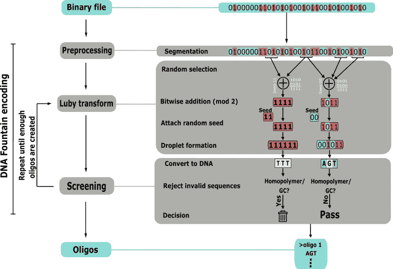

# DNA 现在代表数据和知识积累

> 原文：<https://hackaday.com/2020/02/18/dna-now-stands-for-data-and-knowledge-accumulation/>

技术经常观察自然以提高效率，我们可能在复制自然存储数据的方式方面接近新的突破。也许有一天你的拇指驱动器会成为你真正的拇指。莎士比亚的全部作品可以存放在无限多的猴子身上。DNA 可以成为一种数据存储机制！随着围绕这一前沿的所有轰动效应，似乎一剂现实是有序的。

## 伟大的潜力

拥有 30 亿个碱基对的人类基因组可以存储高达 750 兆字节的数据。事实上，每个细胞都有两套染色体，所以几乎每个人类细胞都有 1.5GB 的数据。你可以将 1650 亿个细胞装入一张 microSD 卡的体积中，这相当于 165 兆字节，而且这是在你保留细胞其余部分的所有开销而不仅仅是 DNA 的情况下。这也没有对数据存储进行任何优化。

这种数据密度远远超出了我们目前的数字存储能力。在极小的单元上存储近乎无限的数据可能会改变一切。除了容量之外，还有长寿和复制的承诺，维护不会丢失且易于转移的永久记录(如医疗记录)，甚至是一种托词或数据传输的元素，以及设计自我复制机器的能力，其目的是广泛传播信息。

那么，DNA 数据存储的技术水平在哪里呢？有很多承诺，但它真的有效吗？

## DNA 的本质

我们被告知，DNA 是生命的蓝图，关于细胞如何形成和相互作用的信息被编码在腺嘌呤、胸腺嘧啶、鸟嘌呤和胞嘧啶的核苷酸中，与它们的互补物一起形成长链。当需要从这个数据库中收集信息时，酶会沿着它的长度拉开链，复制一半 RNA，然后将 RNA 转移到核糖体，在那里 RNA 被镜像复制到适当的蛋白质中。想想这有多强大。基本上每个细胞都包含读写数据所需的机制。

甚至还有一个数据完整性的机制。我们有多条染色体，因为如果链太长，它们会在错误的地方断裂，所以将它们分开可以确保这不会发生。当细胞分裂时，整个染色体分裂成两半，然后与半链配对的核苷酸与链结合，形成两个完整的拷贝。

## 像机器一样使用 DNA

我们用机器做这件事的方式是不同的。首先，每个核苷酸可以保存两位信息的想法是行不通的。事实证明，有些序列效果不好，容易出错或中断。此外，需要一些开销来标记开始和停止以及索引。第二，阅读和写作的方法需要大量的副本。这一过程包括许多扩增步骤，以产生足够的数据拷贝，这些拷贝将被分离出来并进行批量分析。自从人类基因组计划开始和发现快速测序 DNA 的技术以来，基因科学界在过去的二十年里取得了长足的进步，但它仍然有很长的路要走。

对现有技术的简短描述是，目前写 DNA 仍然相当缓慢、潮湿和复杂。现代生物化学使用一个术语叫做寡核苷酸，或 oligo，是 DNA 或 RNA 的一小段。这些寡核苷酸长达数百个碱基，通常代表一个基因或一组基因。它们是由几家公司设计和订购的( [Twist Bioscience](https://www.twistbioscience.com/) 和 [IDT](https://www.idtdna.com/) 是目前的大公司)，它们基本上采用网络形式，你可以上传一个文本字符串，它们在玻璃或硅蚀刻阵列上逐个碱基地生长寡核苷酸。化学反应使第一个核苷酸与底物结合，然后有一个加热、暴露于下一个碱基、冷却的过程，使下一个碱基与阶梯中的下一个梯级结合。重复这一过程，直到寡聚物完成，这可能需要一些时间。[Twist](https://www.twistbioscience.com/company/blog/ASimpleGuidetoPhosphoramiditeChemistryandHowitFitsinTwistBioscience%27sCommercialEngine)的这篇文章可能是对这一过程最容易理解的解释。

在过去的十年里，最大的进步是自动化了这个过程，使得液体量更少，井更小，周期更快。2019 年，一家名为 Catalog 的公司能够实现每秒 4 兆比特的写入速度，主要使用 i [nkjet 打印机来存放碱基](https://www.catalogdna.com/blog/hot-news-for-the-summer-from-catalog)。

 [https://www.youtube.com/embed/JG-mrnnD8UY?version=3&rel=1&showsearch=0&showinfo=1&iv_load_policy=1&fs=1&hl=en-US&autohide=2&start=309&wmode=transparent](https://www.youtube.com/embed/JG-mrnnD8UY?version=3&rel=1&showsearch=0&showinfo=1&iv_load_policy=1&fs=1&hl=en-US&autohide=2&start=309&wmode=transparent) 

一旦寡聚物生成完成，科学家们就有了一大堆相同的寡聚物。然后他们通常在它身上进行 [PCR](https://en.wikipedia.org/wiki/Polymerase_chain_reaction) ，这本质上是一台 DNA 复印机，它通过使用一种酶来快速复制 DNA，使其在一堆碱基中分裂成两半，这样这两半又变成完整的链，然后一遍又一遍地重复，[这是一个我们在过去写得更深入的主题](https://hackaday.com/2016/03/22/enzymes-from-the-deep-the-polymerase/)。他们做的另一个过程是 [CRISPR-Cas9](https://en.wikipedia.org/wiki/CRISPR_gene_editing) ，这允许他们获取完整的基因组，在特定的位置切割它们，并在寡聚体中拼接或进行其他编辑。

好消息是读取这种 DNA 的速度明显更快。我们以前用的是[桑格测序法](https://en.wikipedia.org/wiki/Sanger_sequencing)，它利用附着在碱基上的荧光染料来确定下一个碱基，但最新的热门是 [Illumina 染料测序](https://en.wikipedia.org/wiki/Illumina_dye_sequencing)，它也使用荧光染料，但并行而不是串行。了解他们是如何工作的让我崩溃，但要点是 Illumina 比 Sanger 更快更便宜([相对来说](https://www.illumina.com/systems/sequencing-platforms/miseq/order-miseq.html))。然而，两者都非常潮湿，需要大量的化学物质和链的拷贝来进行测序。

## IO 操作和文件结构

认为我们将永远需要湿实验室和 PCR 来读取和写入 DNA 是短视的。50 年前在磁带上存储数据的房间大小的机器就像现在在 DNA 上读写数据的房间大小的机器一样令人惊叹。问题是 DNA 操作所需的步骤和化学反应的数量明显高于磁带。在实用化和小型化之前，需要发现一种全新的读写方法，当它实用化和小型化，并且我们有能力快速读写单个分子时，DNA 的结构可能不是最好的方法。如果木卫一需要复杂而昂贵的机器，DNA 储存的所有优势都将消失。

由于 DNA 的脆弱性，理解和组织数据是另一个问题。一个小组提出了一种叫做 [DNA 喷泉](https://dnafountain.teamerlich.org/)的存储数据的方法，这种方法接近理论上的最大信息量。它还考虑了寡核苷酸长度限制、碱基对百分比(不能有太多 GC 到 ATs)和相同碱基的长串(AAAAAAAAA)。编码结构构建了大量的 38 字节有效载荷，其中包含数据、Reed-Solomon 纠错码和 4 字节的随机数生成器种子，该种子可以转换为索引，并转化为 oligos。然后，这一堆寡聚物可以被复制和测序，以提取数据并解码。目前读写 DNA 的方法并不适用于全链和染色体；它们有微小的 DNA 寡聚体。混合两个批次的寡核苷酸，您可能无法恢复原始数据。

With DNA Fountain, a sequence is coded using a special process, and an index is attached. If the ‘droplet’ passes the acceptance tests then the oligo is create. If not, they repeat with different sequences. Eventually all of the data is captured in droplets, some of which overlap to get redundancy and error correction.

总之，建立一个包含您想要的数据的细胞需要使用 DNA Fountain 对寡聚体进行编码，合成寡聚体，使用 CRISPR-Cas9 将寡聚体插入功能性 DNA，然后将该 DNA 嵌入细胞。这不是不可能，但是需要一船昂贵的设备。

## 备份

一旦你决定将 DNA 作为你的存储介质，备份可能会成为整个事情中最简单的部分，你现在就可以用 [PocketPCR 热循环仪](https://hackaday.com/2020/01/26/put-the-power-of-pcr-in-your-pocket-with-this-open-source-thermal-cycler/)以低廉的价格进行备份。然而，将 DNA 保存在细胞中可能更有意义，因为它们已经建立了读写数据和复制的机制，并且它们保护 DNA。这意味着一些 DNA 必须专用于这个单元结构，但是考虑到这类似于文件系统的开销。细胞中有 DNA，特别是细菌中有 DNA，这意味着做备份就像上完厕所不洗手一样简单。在这种情况下，DNA 代表“这是讨厌的，好吗？”

## 寿命

一匹生活在大约 70 万年前的马的 DNA 已经被成功测序。有了这种保留的可能性，我们可以相信我们的 Windows ME ISO 备份可以持续远远超过计算机运行它的能力，我们的推特历史将困扰人类学家几千年。当然，我们不知道使用现有技术是否能超过这种寿命，但已经做了一些研究来找出如何确保 DNA 不会比这更快分解。

然而，DNA 代表墨西哥辣椒附近的变性(J 是不发音的)，当东西变热时，在 70-100 摄氏度之间就会散开。这使得它比普通的电子设备好不了多少，而且它还特别容易受到紫外线的伤害。为了解决这些问题，DNA 可以被包裹在二氧化硅和二氧化钛中。有趣的是，一些有机溶剂并没有真正损害 DNA，所以溶解掉二氧化硅并相对容易地提取 DNA 是可能的。然而，这些额外的步骤使它不适合快速数据访问，并且在封装时不可能复制，所以对于短期存储，DNA 仍然必须暴露。

## 结论

DNA 是发现新缩写词的缩写，是一种经过数亿年发展起来的数据存储技术，它非常擅长做这件事。与细胞的能力相比，人类开发的电子产品在许多方面都相形见绌，但在其他方面却表现出色。有没有可能弥合这一差距，并利用两者的不同方面来创造更好的机器呢？考虑到进展的时间表，我们现在比 1952 年发现 DNA 结构和 1947 年发明晶体管时更接近于掌握这种桥梁，我们很可能能够在未来几十年进一步小型化和加速接口，达到商业上可行的程度。我们可能会看到一个新的摩尔定律在分子数据存储接口方面出现。

换句话说，这可能成为现实。目前，写入和读取 DNA 的过程太慢，需要太多的化学过程和反应，但这已经足够平常了，人们现在经常做一些有趣的事情，如[在 DNA 中嵌入视频](https://hackaday.com/2017/07/13/movie-encoded-in-dna-is-the-first-step-toward-datalogging-with-living-cells/)和[在](https://www.newscientist.com/article/2226644-3d-printed-bunny-contains-dna-instructions-to-make-a-copy-of-itself/) [3D 打印兔子](https://www.nature.com/articles/s41587-019-0356-z.epdf?referrer_access_token=CDw-5yQTZEXUgsLjimBJQdRgN0jAjWel9jnR3ZoTv0M4Woj1cE3OBfuw5I5lxno_c7GoY2-6n89GH-ivEpAEqp599jv2thRs0yYrFWLX0uhL-yOBGr7izUHb6A_VXsDhIzH-X9LqmDtLbh1CQPVL1ZEmgbHvovMgfRn7cT3Dxsb7LLHLNznGlNVOlTf40oMDFkDeMGeGKFuAvucJXtLTN8g4cazg3y5XANPQtJ9sprZzbzs_RxOJoCVhxhHNO5N5fda_h7SYo23GAS2ioa2PzCdLG79Z-by1qqVTyhNhOQ4VwPmkKdKVo_IRAPHK4hPv&tracking_referrer=www.newscientist.com)中嵌入 gcode 。

一种全新的信息作战模式是使其发挥作用所必需的。有可能 DNA 并不是最好的方式，而有利于另一种对硅更友好的分子存储机制。你认为我们文明的什么证据会存在几千万年？唯一留下的真正证据可能只是我们的化石和 DNA，这让我想知道普通感冒是否是一个恐龙跳舞的编码视频，它以多种方式传播开来。