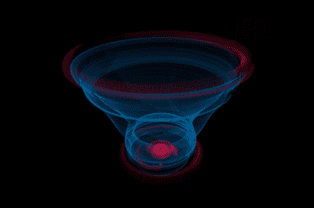
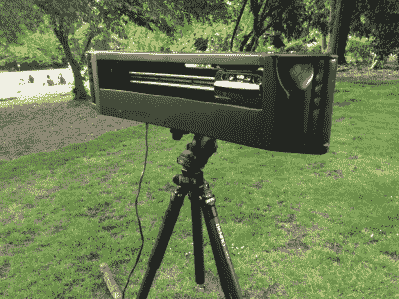

# 为身临其境的未来打造相机

> 原文：<https://hackaday.com/2020/02/28/building-cameras-for-the-immersive-future/>

迄今为止，绝大多数人类摄影作品都是二维的。这些年来，3D 显示器以各种形式出现和消失，但随着技术的进步，我们开始看到越来越多的沉浸式显示技术。当然，使用这些显示器需要内容，而捕捉三维内容需要特殊的工具和技术。Kim Pimmel 来到 hack aday super conventi on 给我们做了一个关于先进的 AR 和 VR 相机技术的当前艺术状态的报告。

【金】对光线绘画技巧的兴趣探索了体积以及 2D 的概念。

金拥有丰富的先进显示器经验，在该领域拥有令人印象深刻的履历。他曾在微软的赫萝镜头工作过，现在负责 Adobe 的 Aero 项目，这是一个针对创意人员的 AR 应用程序。Kim 的旅程始于年轻时，首先是用他家的 Yashica 35mm 相机做实验，在那里他发现了对捕捉图像的热爱。多年来，他尝试了各种各样的设备，收到了妻子作为礼物送给他的佳能 DSLR 相机，后来又摆弄了一下立体现实主义的 35mm 3D 相机。后者导致金对三维捕捉技术越来越着迷。

通过在 AR 和 VR 显示器领域的工作，Kim 熟悉了理光 Theta S 360 度相机和 Oculus Rift 耳机的组合。这使得用户实质上可以坐在一个照片球内，看到他们周围的三维图像。虽然这很有说服力，但[Kim]指出，很多 360 度的内容都存在框架问题。没有办法引导观察者朝向你想让他们看到的那部分图像。

 [https://www.youtube.com/embed/aUAeNts1Sug?version=3&rel=1&showsearch=0&showinfo=1&iv_load_policy=1&fs=1&hl=en-US&autohide=2&wmode=transparent](https://www.youtube.com/embed/aUAeNts1Sug?version=3&rel=1&showsearch=0&showinfo=1&iv_load_policy=1&fs=1&hl=en-US&autohide=2&wmode=transparent)

## 移动摄像机以匹配虚拟环境中发生的情况

正是这种想法引导金走向他自己的建设。受约翰·盖塔和他的团队在《黑客帝国》(1999) 中实现的子弹时间效果的启发，他希望创造一个能够产生三维图像的移动摄像机装置。出发去家得宝，他找了一些弯曲的淋浴杆作为他的运动平台。一路上，Kim 面临着一系列机械方面的挑战，从学习如何安全地安装弯曲组件，到减少运动平台的抖动。他还采取了非传统的措施，比如在 Cinema4D 中设计 3D 打印组件。通过艰苦的工作和坚持不懈的努力，这个装备走到了一起，使用由 Arduino 触发的 GoPro Hero 4 进行图像捕捉。构建是成功的，但仍然有一些问题，相机在运动过程中倾向于倾斜。

The rig packs a twin-lens camera and is portable for shooting in the field.

令人鼓舞的结果只会激起金正日进一步实验的欲望。他再次从头开始，这次选择了一台能够拍摄原生 3D 照片的富士相机。这次用步进电机代替了简单的有刷电机，提高了运动的流畅度。可用性调整还包括在不使用时在车厢上安装一把锁，以及在 LCD 屏幕上实现一个简单的用户界面。所有这些都被包装在一个木制框架中，这使得 Kim 可以在移动中拍摄立体视频，并可以方便地安装在三脚架上。结果令人印象深刻，拍摄的视频在 AR 中观看时看起来很棒。

## 更智能的运动

随着平稳的相机运动排序，金现在正在试验他的创造性 CNC 构建，旨在二维移动相机以捕捉更多的三维数据。这导致了对市场上用于沉浸式图像捕捉的商业选择的讨论。Adobe、三星、脸书和 RED 都有各种产品，大多数设备都是镶嵌着无数透镜的几何斑点。还讨论了光场相机，包括已倒闭的 Lytro 公司的工作，以及沉浸式体验中的其他问题，如运动和触觉反馈。如果你想更多地研究光场相机，可以看看亚历克斯·霍恩斯坦在之前的超级会议上的演讲。

虽然完全身临其境的 AR 和 VR 体验还有很长的路要走，但 Kim 很好地解释了将使这些事情成为现实的进展。这是一个激动人心的时刻，很明显，有大量令人敬畏的技术正在酝酿之中。我们迫不及待地想看看接下来会发生什么！