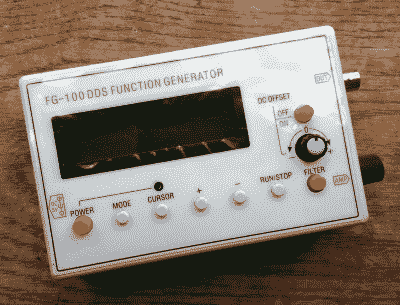
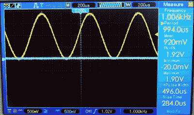
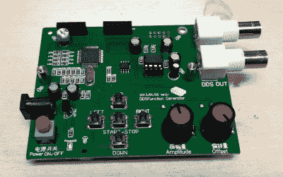

# 回顾:未命名的中文 DDS 函数发生器

> 原文：<https://hackaday.com/2020/02/25/review-unnamed-chinese-dds-function-generator/>

Best forgotten: my awful 2018 function generator.

我一生都在收集随机的测试设备，这给我的军械库留下了一个缺口，那就是我没有低频函数发生器。这很容易解决，但有两点。我喜欢探索出口电子产品的廉价端，我对函数发生器的需求低于我花费大量现金的愿望。过去，我曾试图通过挑选一件极其便宜的乐器来平衡这些相互竞争的力量；[那次我以一个柠檬](https://hackaday.com/2018/05/17/review-fg-100-dds-function-generator/)结束，但是闪电会在同一个地方打两次吗？我花了 10 英镑(13 美元)买了一个不同的廉价函数发生器，并开始寻找答案。

## 太好了，他们忘了给它命名

当我打开它的防静电包装时，我可以告诉我的 DDS 函数发生器是一款优质产品，因为无论是谁制造的，都不准备在上面签名，而且我看不到它的型号。因此，我将它称为未命名的中文 DDS 函数发生器。玩笑归玩笑，它似乎是一种通用类型，可以从各种常见的网上零售商那里找到。它采用约 100 毫米×80 毫米的 PCB 形式，顶部有一个无处不在的字母数字显示模块，以及几个用于输出的 BNC 插座。通过一组瞬时动作按钮进行控制，还有几个电位计用于电平和 DC 偏移。最后，有一个 2.1 毫米桶插孔，通过它将接受 7 伏至 9 伏 DC。令人惊讶的是，它的极性没有标注，但快速检查一下它所连接的电解电容，发现中心引脚为正。

以前的廉价函数发生器是带有电阻梯形 DAC 的 ATmega328，它在其频率范围内既有巨大的失真，又有不一致的幅度。我不指望它能与四位数和信号发生器相提并论，但只要它能提供它声称的波形，并且在其范围内具有相同的幅度和偏移，我就很满意。所以我的第一个任务是连接示波器，看看它如何处理正弦波。

The function generator is certainly more reliable than the USB screenshot feature on a Hantek ‘scope!

好消息是这个生成器确实如它所声称的那样。从 1 Hz 低端到 65.5 kHz 高端，正弦波形保持不变，两个电位计上选择的幅度和失调 I 也保持一致。其他波形也是一样的，方形、三角形、锯齿波、随机噪声，出人意料的是，ECG 波形在 1 Hz、200 mS 时基下看起来非常逼真。那是为了新奇的电影道具吗？还有一个独立的高频方波输出，可以提供 1 MHz 至 8 MHz 的逻辑电平。

这是一个功能强大的函数发生器，但是坏消息在哪里呢？正如你从 10 英镑的支出中所期望的，这并不是一个完美的函数发生器。在较高频率下，其采样阶跃在示波器上变得可见，但在操作中最令人烦恼的是，电位计缺乏精确控制。获得正确的振幅和偏移可能是一个令人沮丧的过程。尽管如此，对于这样一个便宜的仪器来说，这两个都不是游戏结束的时刻，即使有了它们，也足以满足我的需要。

## 这个意想不到的有用工具的动力是什么？

Laid bare, the function generator’s chips.

松开两颗螺丝，取下液晶显示器，设备的内部秘密就暴露出来了。它的核心是一个 ATmega16，带有一个 R/2R 电阻梯形 DAC，由一组 10kω和 20kω电阻组成，之后是一个 NE5532 双通道运算放大器，大概可以处理幅度和 DC 失调。最后，ICL7660 开关电容倍压器出人意料地采用了插座 DIP-8 封装，据猜测可以提供足够的 DC 开销来提供一定范围的输出电压。除此之外，唯一的半导体是一个 78L05 电压调节器，使它成为一个非常简单的设备。

总之，你应该花 10 英镑买这个函数发生器吗？老实说，我在它身上花了一半的钱，期望另一个娱乐性的坏垃圾来逗你开心，而不是惊喜地收到一个按预期工作的单元，并从一个便宜的函数生成器中提供我所需要的东西。在这种情况下，它是一颗未经雕琢的钻石，如果你需要一个音频函数发生器，并且不介意一些缺点，那么你一定要看看它。