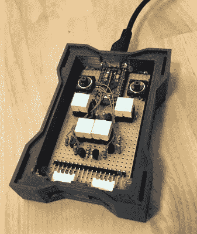

# 使用 DIY 耳机运动追踪来提升游戏效果

> 原文：<https://hackaday.com/2020/02/02/up-your-game-with-diy-headset-motion-tracking/>

虽然虚拟现实游戏在过去几年里有了很大的进步，但许多人仍然很乐意盯着他们的显示器。但这并不是说，这些花哨的头部跟踪技巧不会成为他们的保留节目中受欢迎的一部分。对于那些真正想在游戏中投入精力的玩家来说， [[Adrian Schwizgebel]创造了 qeMotion](https://www.instructables.com/id/QeMotion/) 。

 这里的想法很简单:将一个运动传感器连接到一个标准的游戏耳机(这里是 MPU-6050 IMU)，并使用其中的数据通过 USB HID 仿真虚拟地“按压”按键。许多第一人称射击游戏都提供了通过分别按 Q 或 E 向左或向右倾斜的功能，所以[Adrian]所要做的就是将适当的加速度计读数映射到这些按键上，以便与热门游戏无缝合作，如*汤姆克兰西的彩虹六号围攻*和*叛乱。*

这个概念可能很基本，但是执行起来却一点也不简单。[Adrian]并没有仅仅在他的耳机上贴上一个 Arduino，而是为他桌子上的电子设备设计了一个非常光滑的 3D 打印外壳。虽然它们尚未全部实现，但这些设备具有指示灯和按钮，可以在各种模式之间切换。耳机上的传感器同样被装入一个非常专业的 3D 打印盒中，并配有一根漂亮的编织电缆将其连接到桌面单元。

我们已经有一段时间没有看到头部跟踪项目了，而且大多数都使用了类似 Wii 遥控器的东西。在一个人的头部添加传感器通常不是一个理想的情况，但如果你无论如何都要戴着耳机听游戏和聊天，这真的不是问题。如果你的头发对于 qeMotion 来说太漂亮了，[你可以尝试用计算机视觉做类似的事情](https://hackaday.com/2015/09/14/head-gesture-tracking-helps-limited-mobility-students/)。

 [https://www.youtube.com/embed/ipy3bQsr_oE?version=3&rel=1&showsearch=0&showinfo=1&iv_load_policy=1&fs=1&hl=en-US&autohide=2&wmode=transparent](https://www.youtube.com/embed/ipy3bQsr_oE?version=3&rel=1&showsearch=0&showinfo=1&iv_load_policy=1&fs=1&hl=en-US&autohide=2&wmode=transparent)

