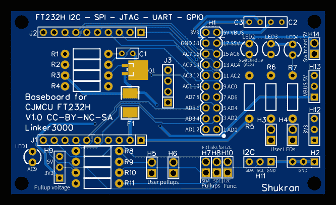

# 用 Shukran 解决你的问题

> 原文：<https://hackaday.com/2020/02/04/slice-through-your-problems-with-a-shukran/>

我们敢打赌，大多数黑客都熟悉 FTDI，因为它是黄金标准 USB-UART 接口的制造商。在超便宜的 CH340 和 CP2102 等器件变得普遍之前，如果你需要将 USB 电缆转换为 TTL UART 设备，“FTDI”(可能是 FT232RL)是实现这一目标的方法。但是 FT232*系列中的一些器件可以发挥更大的作用。为了获得比 UART 更多的功能，[linker3000]设计了[shuk ran](https://github.com/linker3000/shukran)来释放 FT232H 的全部潜力。

ft 232h 很有趣，因为它是一个非常通用的接口设备。根据不同的配置，它可以将 USB 转换为 UART、JTAG、SPI、I2C 和 GPIO。想要为新传感器制作驱动程序原型？当您可以使用 FT232H 和适当的库直接从开发机器上驱动它时，为什么还要麻烦地刷新您的 Teensy 呢？

Shukran 实际上是许多优秀互联网零售商提供的“CJMCU FT232H”模块的突破。该板是一个分线点，一侧露出 USB-A 连接器，另一侧是标准的 0.1”接头，中间是 QFN FT232H 和所有无源器件。但是裸露的 0.1”头部(在正方形中！)需要进一步的试验板或一套跳线才能使用。进入 Shukran。在这种配置中，CJMCU 板价格低廉，可处理 SMT 元件，而 Shukran 易于组装，使用简单。

Shukran 为您提供了 led、按钮和开关，以及一组位于精心分组和标记的接头上的上拉电阻(例如，用于 I2C)。但最重要的是，它提供了一个融合电源。你有没有因为忘记内嵌一个牺牲性的 USB 集线器而关掉你电脑的 USB 控制器？这个保险丝应该可以解决这个问题。如果你有兴趣制作这些方便的工具，在顶部链接的 GitHub repo 中可以找到源代码和详细的 BOM 以及使用说明。