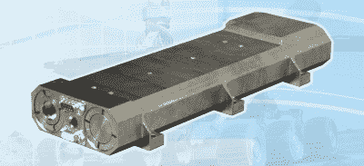
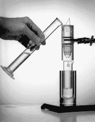
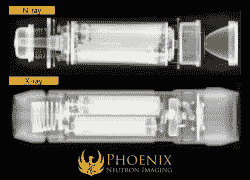
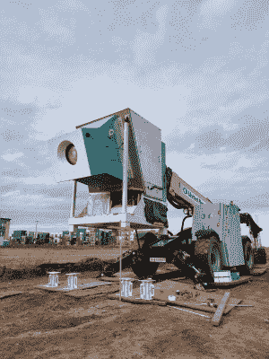

# 你从哪里得到中子的？核聚变、科学、医学和工业用中子源

> 原文：<https://hackaday.com/2020/03/16/where-do-you-get-your-neutrons-neutron-sources-for-nuclear-fusion-science-medicine-and-industry/>

我们可能都知道中子是什么，或者至少在物理课上听说过。然而，这些小束的夸克不仅仅是原子核内的填充物。自由中子除了是使物质尽可能稳定的一个重要部分之外，还可以有多种用途。

从分裂原子(核裂变)，到通过添加中子来改变原子的组成(嬗变)，再到使用中子探测水和检查材料，中子是科学、医学和工业应用中的重要工具。这意味着朝着更好的中子源的目标发展了很多。虽然核裂变是获得大量中子的有效方式，但对于大多数应用来说，使用更紧凑、更简单的方法，其中一些使用核聚变来代替。

在这篇文章中，我们将看看中子源的许多应用，以及这些中子源本身。

## 不起眼的中子

严格定义，中子是[强子](https://en.wikipedia.org/wiki/Hadron)，就像质子一样。这意味着它们都是由两个或更多价夸克组成的复合粒子。在质子和中子的情况下，我们发现它们都含有三个夸克。这使得它们成为强子的重子子类型。区别在于，一个中子有两个下夸克和一个上夸克，而一个质子有两个上夸克和一个下夸克。这听起来可能令人困惑，但对于理解亚原子世界如何影响我们周围的一切是至关重要的。

在原子核之外，[中子是不稳定的](https://en.wikipedia.org/wiki/Free_neutron_decay)，半衰期大约为 10 分 11 秒，之后它β衰变为质子。一个中子的下夸克发出一个 W^–玻色子，然后衰变为一个电子和一个反中微子:

或者使用夸克符号:

这些β衰变中大约有 1/1000 也会产生γ辐射，这是一种内部[轫致辐射](https://en.wikipedia.org/wiki/Bremsstrahlung)的形式。当发射的β粒子(电子)与(带正电荷的)质子相互作用时，就会发生这种情况。

## 一般有点不稳定

在原子核内，中子也不一定是稳定的。一个核素(束缚中子和质子的集合)形成一个量子力学系统，它可能形成也可能不形成稳定的能态。本质上，如果核素中存在较低的能量状态，就会发生中子衰变。这方面的一个例子是碳-14 (6 个质子，8 个中子)，它衰变为更稳定的氮-14 (7 个质子，7 个中子)。

在束缚中子衰变中，我们看到与自由中子衰变相同的过程。这不同于[逆β衰变](https://en.wikipedia.org/wiki/Inverse_beta_decay)和[电子俘获](https://en.wikipedia.org/wiki/Electron_capture)，通过这两个过程，核素中的一个质子可以转变成一个中子。后一种类型对我们的目的很有用，我们将在下一节中看到。

## 随意产生自由中子

由于中子不能在核素外长时间存在，这意味着自由中子必须在需要它们的地方产生。实现这一点的最简单的方法是取一种显示出[中子发射](https://en.wikipedia.org/wiki/Neutron_emission)的同位素作为其放射性衰变链的一部分，如[锎-252](https://en.wikipedia.org/wiki/Isotopes_of_californium#Californium-252) 或铍-13:

使用放射性同位素作为中子源的明显缺点是它不能被关闭，并且随着更多的核素进入稳定的新状态或者当它们进一步衰变时不发射中子，每单位时间发射的中子越来越少。这里的部分解决方案是使用[光分解](https://en.wikipedia.org/wiki/Photodisintegration)，由此伽马射线被用来激发核素到它发射中子的点。例如，在铍的唯一稳定形式的情况下:

有趣的是，这让我们想到了另一个有趣的中子源:氘和氚的核聚变(D-T):

在简单的惯性静电约束( [IEC](https://en.wikipedia.org/wiki/Inertial_electrostatic_confinement) )装置(如 fusor)中使用(便宜的)D-T 燃料相对容易，这使它们成为科学研究和医学的流行中子源，允许装置随意产生中子，并在装置的寿命期间以恒定的速率产生中子。

## 火星上的中子

多年来一直在火星上进行科学研究的好奇号火星车现在有一个名为 [DAN](https://msl-scicorner.jpl.nasa.gov/Instruments/DAN/) 的仪器，这是中子动态反照率的简称。它使用中子束从大约 80 厘米的高度瞄准地面。与土壤相互作用后散射回传感器的中子提供了关于土壤内容物的信息，特别是其水分含量。这是由中子和氢的相互作用造成的。

VNIIA ING-10K neutron generator module. (Courtesy of VNIIA)

这款舞蹈仪使用的是 VNIIA(俄罗斯一家公司)生产的 [ING-10K](http://test.vniia.ru/eng/ng/nauka.html) 中子管基脉冲[中子发生器](https://en.wikipedia.org/wiki/Neutron_generator)。它每脉冲发射 10 个 ⁷ 中子，在 3 年的寿命中额定为 10 个 ⁷ 脉冲。这些中子发生器通常使用 D-T 聚变，使用线性加速器将氘、氚或其组合加速成金属氢化物靶，该金属氢化物靶也包含这些同位素。有了足够的能量来克服[库仑势垒](https://en.wikipedia.org/wiki/Coulomb_barrier)，这些同位素的核素将发生聚变，并释放出中子。

## 医学中的中子

中子管类似于碰撞束聚变概念，以及前面提到的[聚变器](https://en.wikipedia.org/wiki/Fusor)和[聚合井](https://en.wikipedia.org/wiki/Polywell)的概念，因为它们使用 IEC 的原理来实现聚变。fusor 使用两个球形网格，使用相反的电荷来加速同位素，而 polywell 基本上也是如此，但试图消除这些物理网格，以提高聚变反应的效率。

不管确切的配置如何，这种 IEC 装置在医疗领域引起了极大的兴趣

A simple technetium-99m generator from 1958 at Brookhaven National Laboratory.

同位素，具体来说就是[钼-99](https://en.wikipedia.org/wiki/Isotopes_of_molybdenum) ( ^(99) 钼)。这种特殊的同位素是亚稳态[锝-99m](https://en.wikipedia.org/wiki/Technetium-99m)(^(99m)Tc)——其衰变产物——的前体，之后 ^(99m) Tc 衰变为 ^(99) Tc，半衰期为 6.01 小时。这里， ^(99m) Tc 作为一种放射性示踪剂在医学上至关重要，因为它发出可清晰检测的 104 keV 伽马射线，所以经常用于人体成像研究。

不幸的是， ^(99) Mo 的主要来源来自少数裂变反应堆，在这些反应堆中，铀-235 靶受到中子的轰击。由于维修和替换反应堆被取消，这些反应堆遭受了长时间的停工，钼的短缺变得非常严重。这导致了替代方案的探索，其中之一是使用 IEC 聚变装置作为中子源。

一家名为 [Phoenix LLC](https://en.wikipedia.org/wiki/Phoenix_%28nuclear_technology_company%29) 的公司提出了一种很有前景的方法，该方法使用[线性加速器聚变装置](https://physicsworld.com/a/record-breaking-fusion-reaction-could-transform-medical-isotope-production/)产生中子，中子照射铀靶，使其裂变并产生 ^(99) Mo 和其他同位素。然后, ^(99) Mo 可以在[锝-99m 发生器](https://en.wikipedia.org/wiki/Technetium-99m_generator)中被分离并运送到医院，这是每天都在做的事情。凤凰城表示，这种 99%钼的生产预计在 2021 年开始，预计在 2022 年实现商业规模。

## 中子成像

使用中子对物体成像与使用 X 射线非常相似，主要区别在于方式不同

Example of neutron imaging versus X-rays of a flashlight. (Courtesy of Phoenix, LLC)

它们产生一个图像。使用 [X 射线](https://en.wikipedia.org/wiki/X-ray)，产生的图像取决于遇到的材料的密度，因此最终图像取决于 X 射线被衰减的程度。利用[中子成像](https://en.wikipedia.org/wiki/Neutron_imaging)，与材料的相互作用决定了有多少中子将到达传感器，以及它们的物理(分子)属性是什么。结果类似于 X 射线，但由于中子与 X 射线相互作用的方式不同，两者有很大的不同，如右图所示。

Prototype NEMESIS explosives detector. (Provided by Phoenix LLC)

在中子成像中，在中子产生后，它们必须减速到成像所需的速度。中子的速度将影响穿透深度和最终成像结果，从而允许微调该过程。中子成像的使用范围从检查成品(包括焊缝、铸件、涡轮叶片、核燃料棒和工业及其他领域的高精度部件)的[到探测爆炸物的](https://www.bindt.org/News/December-2019/neutron-imaging-past-present-and-future/)等拟议用途，如在战区。

与中子成像不同的是[中子活化分析](https://en.wikipedia.org/wiki/Neutron_activation_analysis) (NAA)，这基本上是好奇号的 DAN 模块所做的。

基于核聚变的中子发生器的使用在中子成像和相关领域变得越来越普遍，因为它有可能成为更小、更高效的设备。美国军方的[复仇女神](https://www.prnewswire.com/news-releases/pnl-awarded-36-million-in-army-contracts-300307423.html)(发射中子的移动爆炸物传感和识别系统)计划就是一个例子，它可能使小型设备的使用能够非常容易地检测到简易爆炸装置(IED)和地雷等爆炸物，甚至是金属探测器和探地雷达难以检测到的复杂的无金属地雷。

参与涅墨西斯计划的是前面提到的凤凰有限责任公司，该公司表示相信，这种 NAA 和中子成像设备在未来不仅可以用于危险的任务，还可以用于更常规的任务，如桥梁检查和大概的航空电子设备检查。据菲尼克斯称，目前大部分的努力都在改进检测算法，并使设备更加坚固和经济。

## 超越科幻

虽然其中许多听起来可能相当不可思议，例如“观察”地面内部以发现任何埋在那里的爆炸物的能力，或者查看涡轮叶片或焊缝内部的裂缝，但人们可以将此视为 X 射线等常用技术的进步。尽管在 20 世纪早期及以后，人们发现 X 射线及其同类很容易产生，但以不需要使用核裂变反应堆的有效方式产生大量中子的过程却阻碍了发展几十年。

融合装置有许多优点，维护也相当简单。对于非密封聚变装置，连续供应氘-氚(或氘-氘)燃料，除了更换因中子活化而变得具有放射性的发生器部件之外，装置无需维护即可运行。这些成分属于低到中等放射性废物，类似于实验室和医院产生的废物，易于处理。

虽然使用中子源进行环境分析的手持扫描设备的前景仍有待时日，但中子成像很有可能在许多方面改善生活，就像 X 射线一样。