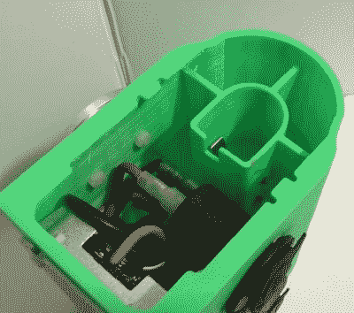

# DIY 发电站将 Ryobi 电池投入使用

> 原文：<https://hackaday.com/2020/02/20/diy-power-station-puts-ryobi-batteries-to-work/>

任何一个拥有一些无线工具的人都可能为它们收集了相当多的电池。如果你是一名专业承包商，拥有一支可以在一天工作中更换的电池队伍是必要的。但是如果你只是偶尔做 DIY 项目，这些电池可能会经常闲置不用。

为了给他不断增加的 Ryobi 电池寻找替代用途，[【Chris NaF is】想出了一个便携式发电站设计](https://www.thingiverse.com/thing:4168822)，让他可以利用所有储存的能量。由于支持多种充电标准，甚至集成了工作灯，这款设备非常适合在停电时使用，或者在野营时随身携带。

 不久前，Ryobi 标准化了 18 V 电池，因此[Chris]正在使用 10 A DC-DC 降压转换器将其降压至更普遍有用的 12 V。由此，他得到了一个标准的“点烟器”汽车电源连接器，可与小逆变器或移动收音机等各种移动设备兼容。还有两个 2.4 USB“A”端口和一个快速充电 3.0 兼容 USB-C 端口，用于为您的移动设备充电。

顺便说一下，这个项目是一个很好的例子，说明在构建自己的硬件时，3D 打印是多么强大。用传统的家庭制造方法，在不牺牲作为捐赠者的工具的情况下，试图为 Ryobi 电池制造一个接口是非常困难的。但是有了一对卡尺和一点时间在你选择的 CAD 软件包中，就有可能设计和建造一个像真东西一样的精确匹配。

顺便提一下，这应该使设计适应其他电池类型相对容易，[尽管编辑 STLs 确实带来了自己的独特挑战](https://hackaday.com/2018/05/16/3d-printering-when-an-stl-file-is-not-quite-right/)。这个项目未来的改进可能是将电池接口做成一个独立的部分，可以替换掉，而不必重新打印整个东西。

 [https://www.youtube.com/embed/p9G_shkDBt4?version=3&rel=1&showsearch=0&showinfo=1&iv_load_policy=1&fs=1&hl=en-US&autohide=2&wmode=transparent](https://www.youtube.com/embed/p9G_shkDBt4?version=3&rel=1&showsearch=0&showinfo=1&iv_load_policy=1&fs=1&hl=en-US&autohide=2&wmode=transparent)

