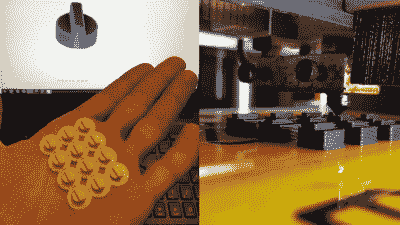

# 乐高微型吉他:音乐理论的积木

> 原文：<https://hackaday.com/2020/02/20/lego-microtonal-guitar-building-blocks-of-music-theory/>

除了当人踩在上面时变成软明胶之外，乐高还有什么做不到的吗？令人难以置信的尺寸范围使它们成为如此多才多艺的积木，这使它们的用途远远超出了游戏室的地板，正如【托尔加汉·çoĝulu】用他的[乐高微型吉他](https://www.youtube.com/watch?v=rPCEImSfCwc)展示的那样。

他的乐高玩具现在怎么办？如果你在西方世界，微音就是指西方音阶中每八度 12 个半音之间的音。微音比半音小，所以它们可以给音乐带来更丰富的味道，这在东方文化中得到了证明。在过去，[托尔加汉]已经用标准的品线制作了带有  固定和可调品的微型吉他。在他的小儿子用乐高复制了他的设计后，他决定把它变成现实。

[Tolgahan]和一个朋友设计并打印了一个兼容的基板指板，并将其粘在一把旧的古典吉他上。然后，他和他的儿子花了几个小时挖掘他们的贮藏物，寻找 1x 1 和其他 1x 的零件来建造指板。

这就是真正有趣的地方——他们印刷了大量特殊的 1×1 部件来构建可移动的音品。因为它们是 1x1，所以它们也可以用来教音乐，只要简单地将它们移到音阶或所教歌曲的音符上，不管它来自哪个半球。拨开你的方式过去休息，观看故事发挥出来，并听到这个乐高吉他为自己。

如果[Tolgahan]和他的儿子使用[机器学习来分类他们的乐高](https://hackaday.com/2019/12/16/lego-machine-uses-machine-learning-to-sort-itself-out/)，可能不会花这么长时间来找到所有这些 1x1。

 [https://www.youtube.com/embed/rPCEImSfCwc?version=3&rel=1&showsearch=0&showinfo=1&iv_load_policy=1&fs=1&hl=en-US&autohide=2&wmode=transparent](https://www.youtube.com/embed/rPCEImSfCwc?version=3&rel=1&showsearch=0&showinfo=1&iv_load_policy=1&fs=1&hl=en-US&autohide=2&wmode=transparent)

通路〔t0〕adafruit〔t1〕