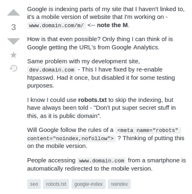

# 本周安全:Chrome Bugs 和非 bug、Kr00k 和 Letsencrypt

> 原文：<https://hackaday.com/2020/02/28/this-week-in-security-chrome-bugs-and-non-bugs-kr00k-and-letsencrypt/>

谷歌 Chrome 在周一发布了一个新版本来修复三个漏洞，其中一个漏洞的代码已经公开。前两个 bug 还没有太多信息公布。它们是 Unicode 国际化中的整数溢出问题，以及流中的内存访问问题。第三个问题，V8 中的类型混淆，也悄悄地得到了解决，但是 Exodus Intel 的一个团队花时间查看了补丁并[找出了问题所在](https://blog.exodusintel.com/2020/02/24/a-eulogy-for-patch-gapping/)。

实际的漏洞隐藏在一些奇异的 Javascript 技术中，但简单地说，在 V8 没有注意到的情况下改变数据类型是可能的。这使得恶意代码可以写入被攻击变量的头区域。现已损坏的堆栈可被操纵至任意代码执行点。研究人员指出，即使谷歌的发布时间表很快，一个坚定的攻击者也可能有几天时间来虚拟地零日利用从代码更改中挖掘的漏洞。[通过登记簿的故事](https://www.theregister.co.uk/2020/02/25/google_chrome_security_bugs/)。

### 没有的 Chrome 问题

第二个关于 Chrome 的故事本周出现在我的办公桌上:Chrome 80 引入了一个新功能 ScrollToTextFragment。这项有用的新功能允许你在 URL 中嵌入一串文本，当加载该地址时，Chrome 将滚动页面以显示该文本。对于某些用例，这是一个无价的特性。需要在线突出显示大文档中的特定文本吗？

下面由[Paul Kinlan] 编写的 [bookmarklet 代码是开始使用这个特性的简单方法。将这段代码粘贴到书签的 URL 中，放在书签栏上，突出显示网页中的一些文本，然后运行 bookmarklet。它应该打开一个新的标签与新的网址，准备使用或发送给别人。](https://paul.kinlan.me/scroll-to-text-bookmarklet/)

```
javascript:(function()%7Bconst%20selectedText%20%3D%20getSelection().toString()%3Bconst%20newUrl%20%3D%20new%20URL(location)%3BnewUrl.hash%20%3D%20%60%3A~%3Atext%3D%24%7BencodeURIComponent(selectedText)%7D%60%3Bwindow.open(newUrl)%7D)()
```

既然我们在安全性专栏中讨论了这个问题，那么这个故事肯定还有更多。Brave 的一位隐私专家【Peter Snyder】[对该功能](https://github.com/WICG/ScrollToTextFragment/issues/76)的隐私含义表示担忧。他的观点在一些地方被[重复和歪曲。他提出了什么论点？简单地说，立即滚动到页面上的一个确切位置不是正常的用户行为。因为现代网页和浏览器会延迟加载图像，所以可以推断出链接指向了页面的哪个位置。他举了一个监控 DNS 的公司网络的例子。这并不是说整个 URL 都通过 DNS 泄露了，而是说 DNS 可以指示页面的单个组件何时被加载，尤其是当它们是来自其他网站的嵌入图像时。](https://www.theregister.co.uk/2020/02/20/chrome_deploys_deeplinking/)

虽然这种担心并不是荒谬的，但在我看来，这是一个非常薄弱的论点，被媒体过度炒作了。

### Whatsapp 群组可在谷歌上搜索

[](https://webmasters.stackexchange.com/questions/14698/google-is-indexing-unintended-content-that-is-either-unpublished-or-a-secret-par) 搜索引擎索引不打算公开的东西并不新鲜。围绕谷歌如何找到要索引的 URL 有一点神秘，StackExchange 充满了大量的例子[网站管理员对出现在谷歌搜索中的非公共文件夹挠头](https://webmasters.stackexchange.com/questions/14698/google-is-indexing-unintended-content-that-is-either-unpublished-or-a-secret-par)。

也就是说，过去几天流传着一个故事，WhatsApp 和 Telegram group 的邀请正在被谷歌索引。到目前为止，官方的说法是，所有的索引链接都必须是公开共享的，谷歌只是从它们公开发布的地方捡起来。

看来 [WhatsApp 已经开始将](https://www.bleepingcomputer.com/news/security/whatsapp-telegram-group-invite-links-leaked-in-public-searches/)聊天邀请链接标记为“noindex”，这是一种礼貌的方式，要求搜索引擎忽略该链接。

如果有证据表明链接没有在网上公开发布就被索引了，那么我们就有了一个更大的故事。否则，一切都按预期运行。

### Letsencrypt 使攻击更加困难

Letsencrypt 对他们的验证过程进行了一项不可见的更改，使流量重定向攻击变得更加困难。新功能[多视角验证](https://letsencrypt.org/2020/02/19/multi-perspective-validation.html)，意味着当你验证你的域名所有权时，Letsencrypt 将从多个地理区域测试该验证。通过 BGP 攻击来欺骗域的所有权是可能的，但是对于来自另一个国家或同时来自多个国家的流量来说，这种攻击要困难得多。Letsencrypt 目前使用单个云的不同区域，但计划进一步多样化，并使用多个云提供商进行更强的验证。

### Kr00k 号

Eset 的研究人员带给我们的是，Krook 是某些无线芯片中的一个简单缺陷。到目前为止，该漏洞似乎仅限于博通和赛普拉斯芯片发送的 WPA2 流量。他们在对[克拉克](https://hackaday.com/2017/10/16/oh-great-wpa2-is-broken/)做一些后续研究时发现了 Kr00k。

让我们来谈谈 WPA2。WPA2 有一个 4 次握手过程，它安全地确认双方拥有共享密钥，然后建立一个共享临时密钥，也称为会话密钥。该密钥在执行握手的两个设备之间是私有的，这意味着同一无线网络上的其他设备不能嗅探其他设备发送的流量。

当设备断开连接或解除关联时，会话密钥将重置为全 0，在执行另一次握手之前，不应发送任何数据包。这里有一个错误:已经在输出缓冲区中的包仍然被发送，但是用零密钥加密，使得它们很容易被解密。由于触发取消身份验证事件很简单，因此攻击者可以获得明文数据包的样本。TLS 的普遍存在是一个可取之处，但是任何未加密的流量都是易受攻击的。Eset 在 2019 年向厂商通报了该漏洞，至少部分设备已经打了补丁。

### 交换

上周二，微软 Exchange 获得了一个安全补丁，解决了导致远程代码执行漏洞的一对错误。第一个 bug 是在 Exchange server 安装上由[生成的](https://xkcd.com/221/)加密密钥。那一代人似乎缺乏一个好的熵源，因为显然每个 Exchange 安装都使用完全相同的密钥。

这个 bug 的第二部分是反序列化问题，其中加密的有效负载可以包含要运行的命令。因为加密密钥是已知的，所以任何用户都可以访问易受攻击的端点。利用的过程如此琐碎，一定要马上给你的服务器打补丁。

### TODO:删除漏洞

这一个只是幽默。一项英特尔虚拟化特性似乎在完成之前就已经被推送到 Linux 内核中。知道未完成的代码往往包含什么吗？bug 和漏洞。CVE-2020-2732，在这种情况下。目前还不清楚这种攻击到底是如何工作的，但本质是虚拟客人被允许以意想不到的方式操纵系统状态。