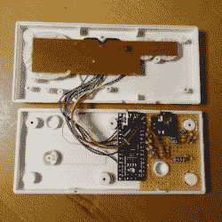

# 一个值得骄傲的俄罗斯方块，只有一个纳米

> 原文：<https://hackaday.com/2020/02/28/a-tetris-to-be-proud-of-with-only-a-nano/>

俄罗斯方块可能是在 PC 和 Amiga 等机器上首次登陆西方的，但它在[阿莱克西·帕杰诺夫]手中的起源是在一台 Electronika 60 上，这是 20 世纪 70 年代早期 PDP-11 的苏联克隆版。因此，这些翻滚的方块对处理器能力的要求很低，游戏可以在最简陋的硬件上实现。相对现代的硅，如[的 Arduino Nano Tetris 控制台](https://github.com/c0pperdragon/ArduinoGameConsole)中的 Atmega328 应该没有问题，但做出这种假设是错过了成就的质量。

 在 20 世纪 80 年代典型的家用或台式电脑中，处理器会得到大量专用硬件的支持，但由于 Arduino 没有这些硬件，因此用具有四个灰度级的 288p 视频信号和四声道音乐创建游戏的壮举是非常令人印象深刻的。除了 Nano 之外，只有一些无源组件，看不到 CRT 控制器或声音芯片。

整个装置被封装在一个 NES 控制器的复制品中，无源元件在纳米控制器旁边的一块条形板上。有一个基本的电阻 DAC 来产生灰度，音频不是您可能期望的直接 PWM，而是一个非常简单的 DAC，通过以视频线路频率对电容进行充电和放电来实现。在休息时间下面的视频中可以看到和听到结果，虽然我们肯定以前听到过类似的曲调，但它看起来是一个非常可玩的小游戏。

 [https://www.youtube.com/embed/HPVpsAUs4aY?version=3&rel=1&showsearch=0&showinfo=1&iv_load_policy=1&fs=1&hl=en-US&autohide=2&wmode=transparent](https://www.youtube.com/embed/HPVpsAUs4aY?version=3&rel=1&showsearch=0&showinfo=1&iv_load_policy=1&fs=1&hl=en-US&autohide=2&wmode=transparent)

