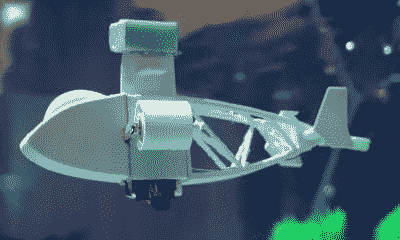

# 迷你遥控直升机变成更小的潜艇

> 原文：<https://hackaday.com/2020/03/06/mini-rc-helicopter-becomes-even-smaller-submarine/>

我们通常认为潜艇是相当复杂的机器，这是有充分理由的。保持电子设备防水自然是相当困难的，在水下航行时保持中性浮力是一项相当大的工程挑战。但事实证明，如果你愿意跳过潜艇设计中那些相当关键的元素，整个事情会突然变得容易得多。很大的惊喜，对吧？

这正是彼得·斯里波尔对待他最新项目的方式，他声称这是世界上最小的遥控潜艇。我们没有资格说这是真的还是假的，但我们肯定有兴趣看看他是如何建造小型潜水器的。由于它最初是一架廉价的红外直升机，如果你想自己制造一架，这实际上是一个相当容易实现的项目。

The larger prototype version is also very cool.

在测试了红外通讯在水下是否能正常工作后，[彼得]从直升机上卸下了马达和电子设备。马达的电线被缩短了，接收器的印刷电路板涂上了厚厚的环氧树脂，试图将最糟糕的水挡在外面，但除此之外，它们没有被修改。

如果你想知道压载系统是如何工作的，这里没有。3D 打印的身体使马达稍微向下倾斜，所以当潜艇向前移动时，它也被拉向更深的水中。也没有任何控制表面，两个马达之间的不同推力用于向左和向右转弯。这并不是一个特别灵活的飞行器，但在休息后的视频中，看起来他们肯定很开心。

寻找稍微复杂一点的 3D 打印潜水器？别担心，[我们会保护好你的](https://hackaday.com/2017/05/24/hackaday-prize-entry-underwater-glider-offers-low-power-exploration/)。

 [https://www.youtube.com/embed/6M90pRMSMKs?version=3&rel=1&showsearch=0&showinfo=1&iv_load_policy=1&fs=1&hl=en-US&autohide=2&wmode=transparent](https://www.youtube.com/embed/6M90pRMSMKs?version=3&rel=1&showsearch=0&showinfo=1&iv_load_policy=1&fs=1&hl=en-US&autohide=2&wmode=transparent)

【感谢布劳布尔的提示。]