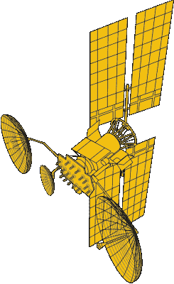
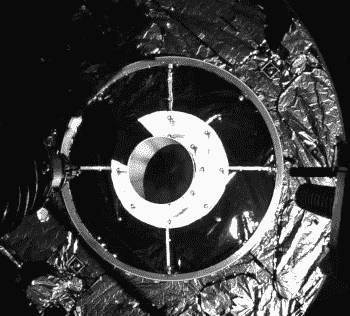

# 诺斯罗普·格鲁曼公司测试太空拖车

> 原文：<https://hackaday.com/2020/03/17/northrop-grumman-tests-space-tow-truck/>

在早期，卫星不会存在很长时间。在 1957 年由苏联发射后，Sputnik 1 只花了大约三个月的时间就进入大气层并燃烧殆尽。但是不断地向太空推进意味着卫星很快就会一次在轨道上停留数年。并不是说它们总是能运行那么长时间；美国的*探索者 1 号*在轨道上停留了十二年多，但是仅仅四个月之后它的电池就没电了。

当然，那时候，没人太担心这类事情。当你一只手就能数清地球轨道上的航天器数量时，如果其中一个在那里停留超过十年又有什么关系呢？碰撞的可能性非常低，基本上是不可能的，如果卫星已经死亡，并且没有干扰与其功能对等的通信，那就更好了。

随着越来越多的航天器发射升空，碰撞的可能性逐年增加，但这种漫不经心的太空管理方式一直延续到现代，几乎没有改变。事实上，如果 SpaceX 这样的公司没有规划由数千颗卫星组成的巨型星座，它可能还会持续几十年。由于担心如此多的“太空垃圾”会堵塞宝贵的近地轨道，现代卫星越来越多地被设计成带有自动处理系统，这有助于确保它们即使在系统故障的情况下也能安全脱离轨道。

这对未来是好消息，但对我们目前的情况没有帮助。数以千计的卫星在地球上方的轨道上，它们将需要在未来几年内得到处理。好消息是，它们中的许多处于足够低的高度，最终它们会自己燃烧起来，如果有必要加速它们的灭亡，正在开发加速燃烧过程的方法。

不幸的是，地球同步轨道上的通信卫星的情况稍微复杂一些。在 35，786 公里(22，236 英里)的高度，让这些航天器脱离轨道是不现实的。实际上，更容易的方法是把它们带到太空中，让它们永远不再回来。但是，如果卫星在做出退役决定之前发生故障或耗尽推进剂，该怎么办呢？

这正是任务扩展飞行器(MEV)为 T1 开发的场景，在 2 月份进行了历史性的真实世界测试后，看起来这种“太空拖车”可能正是我们需要的，以确保宝贵的地球同步轨道在未来几十年得到保护。

## 意想不到的公司

Fragile: Handle with Care.

理论上，任务扩展飞行器背后的想法很简单。它飞到一颗卫星上，牢牢地附着在上面，然后毫不夸张地把它拖到它需要去的地方。在卫星完全报废的情况下，目的地将是一个所谓的“墓地轨道”，永远不会与另一个飞行器相交。如果卫星只是没有推进剂，但其他功能正常，那么 MEV 可以在剩余的任务时间里保持连接；接管航天器无法独自完成的操纵和推进任务。

这个概念只有一个问题:这些卫星从未被设计成与其他航天器对接。事实上，他们根本不应该出现在另一辆车的 100 公里范围内。在展开的太阳能电池板和扩展的天线阵列之间，接近一颗大型通信卫星并试图捕获它并不完全不同于试图抓住一颗仙人掌。除了最微妙和准确的抓手，任何事情的结果都将是立即和异常不愉快的。

那么，你打算在哪里截获这样一颗卫星呢？不会有正式的对接口或专用的捕获点。再说一次，这是一个发射到太空的飞行器，假设它将在完全隔离的情况下运行，直到它被永远推入深空。在设计的时候，没有人会想到一个方便的手提把手。

## 卫星解剖学的一课

有这么多不同的卫星设计在使用，而其中很少能很好地适应任务中期的维修尝试，MEV 背后的工程师们必须找到某种通用的结构部件，可以用作临时的抓钩夹具。与目前在轨的航天器 100%兼容是不可能的，但如果他们至少能确保 MEV 能够拦截它遇到的大多数目标，这将是朝着正确方向迈出的一步。

MEV “docks” with the engine of a target satellite.

有点讽刺的是，完美的抓取点最终是卫星的一部分，否则在这一点上毫无用处:发动机。几乎每颗地球静止卫星都将拥有所谓的“远地点发动机”，这是一种液体推进剂推进器，用于在航天器与运载它进入太空的助推火箭分离后，将航天器送入圆形地球静止轨道。

这种发动机的喷嘴不仅是搜索目标表面的理想视觉细节，而且它安装到卫星上的区域显然被设计成能够承受相当大的结构载荷。简而言之，推进卫星的最佳位置就是工程师最初设计的推进点。

为了将自己牢牢地固定在目标卫星的引擎上，MEV 使用了一个可扩展的探针，这与用于将螺钉固定在空心墙上的锚没有什么不同。探针被小心地插入发动机的“喉咙”，然后在燃烧室内部膨胀，这样它就太大了，无法出来。用这种方法对发动机的损坏似乎是不可避免的，但同样，在这一点上，卫星要么完全失效，要么耗尽所有推进剂。在这两种情况下，引擎在 MEV 拜访它之前就已经注定要失败了。

## 十年的工作

MEV 的设计运行时间至少为 15 年，诺斯罗普·格鲁曼公司希望它能在其寿命期内为多颗卫星服务。理论上，它可以花 10 年时间为一颗旧的通信卫星提供辅助推进，一旦替换卫星准备好，就将它送往深空，如果另一颗卫星需要它的服务，它还可以继续工作几年。凭借一支 mev 车队，该公司可以为整个行业提供轨道“道路救援”。

为此，诺斯罗普·格鲁曼公司为首次任务选择了一个优秀的候选人。Intelsat 901 是一颗 Ku 波段卫星，发射于 2001 年 6 月，最近推进剂不足，作为预防措施，它自己进入了墓地轨道。2 月 25 日，任务扩展飞行器 1 (MEV-1)在这个轨道上与国际通信卫星组织 901 相遇，并开始对接操作。这一事件不仅标志着两个商业航天器的首次对接，也是首次与最初没有设计对接能力的航天器进行对接。

不久，MEV-1 将把 Intelsat 901 拖回标准轨道，在那里它将继续正常运行五年多。之后，卫星将返回墓地轨道，MEV-1 将在时钟上至少剩下十年的时间内分离。由于能够在每次任务中延长多个昂贵的地球同步通信卫星的寿命，任务扩展飞行器有望为诺斯罗普·格鲁曼公司及其未来客户带来丰厚的利润。

 [https://www.youtube.com/embed/_rgglvA5DdI?version=3&rel=1&showsearch=0&showinfo=1&iv_load_policy=1&fs=1&hl=en-US&autohide=2&wmode=transparent](https://www.youtube.com/embed/_rgglvA5DdI?version=3&rel=1&showsearch=0&showinfo=1&iv_load_policy=1&fs=1&hl=en-US&autohide=2&wmode=transparent)

