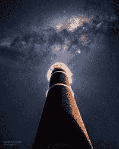
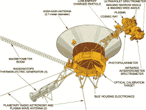
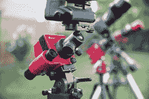
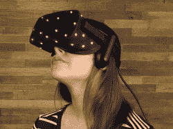
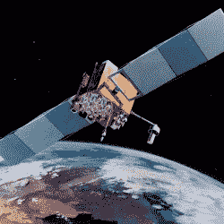

# 恒星追踪器:在任何空间从下往上看

> 原文：<https://hackaday.com/2020/04/02/star-trackers-telling-up-from-down-in-any-space/>

在很多情况下，跟踪位置是至关重要的。在地球上，这通常是相对直接的，几个世纪以来，系统已经发展到可以让一个人至少粗略地确定自己在这个星球上的位置。但是对于太空中的卫星来说，这就更难了。他们是如何保持他们的通讯天线指向地球的？

星星是一个明显的方位点。旅行者 1 号和 2 号太空探测器上的姿态和关节控制子系统(AACS)有一个不令人羡慕的任务，即保持航天器的通信碟形天线与地球上的通信碟形天线精确对准，从深空看，这是一个不可思议的微小目标。

回到地球上，[星体追踪器](https://en.wikipedia.org/wiki/Star_tracker)的概念在试图拍摄夜空的摄影师中变得非常流行。即使在你的客厅里，VR 系统也依赖于知道用户身体的位置和空间中的任何外围设备。在本文中，我们将了解这种位置跟踪的历史和当前应用。

## 天体导航

Milky Way over Uruguayan lighthouse. (Credit: Mauricio Salazar)

[天体导航](https://en.wikipedia.org/wiki/Celestial_navigation)已经实行了几千年。理论上，你所需要的只是你的眼睛和一些关于太阳、月亮和星星如何在天空中移动的知识来获得方向感。但这并不能告诉你你在地球表面的位置。

在人类历史的大部分时间里，船只会停留在海岸的视线范围内，很少穿过大片水域。当他们穿越时，他们通常会使用[航位推算](https://timeandnavigation.si.edu/navigating-at-sea/navigating-without-a-clock/dead-reckoning)，利用已知的位置、航向和速度。虽然[纬度](https://en.wikipedia.org/wiki/Latitude)的概念已经出现了一段时间，但是精确测量纬度需要[测角仪器](https://timeandnavigation.si.edu/navigating-at-sea/navigating-without-a-clock/celestial-navigation)，比如公元前 200 年左右发明的[星盘](https://en.wikipedia.org/wiki/Astrolabe)，或者 16 世纪发明的[六分仪](https://en.wikipedia.org/wiki/Sextant)。

星盘、六分仪或类似的仪器测量已知天体之间的角度，由此可以推断出纬度。经度的确定[是一个主要问题，最终归结为](https://en.wikipedia.org/wiki/History_of_longitude)[有一个精确的时钟](https://www.getmyboat.com/journal/how-to/a-brief-overview-of-celestial-navigation/)，因为经度和太阳时直接相关。直到 19 世纪，当钟表变得足够可靠和负担得起，替代方法([月球距离法](https://en.wikipedia.org/wiki/Method_of_lunar_distances))不再受欢迎时，才能解决既准确又[可在船上](https://en.wikipedia.org/wiki/Marine_chronometer)或移动车辆上使用的钟表的发明。

## 在太空中寻找自己的路

Voyager 1 drawing with its components.

虽然在令人难以置信的巨大太空真空中航行似乎比在地球上航行更难，但基本上适用相同的原则。最重要的是至少要有一个参照点。在基于地球导航的情况下，这可以是太阳、月亮或天空中任何已知轨迹和位置的明亮的星星。

对于一个太空探测器来说，当谈到导航时，“在星辰大海中航行”这个常见的比喻是相当贴切的。旅行者号、[卡西尼号](https://www.researchgate.net/publication/225910636_An_Introduction_to_the_Design_of_the_Cassini_Spacecraft)和其他航天器上的姿态和关节控制子系统(AACS)构成了导航和定位系统的核心。在[卡西尼](https://en.wikipedia.org/wiki/Cassini%E2%80%93Huygens)的情况下，它使用了许多传感器，包括[恒星参考单元](https://www.researchgate.net/publication/252809096_Stellar_reference_unit_for_CASSINI_mission) (SRU)，惯性参考单元(IRU)和太阳传感器(SSA)。这些 sru 是基于 CCD 的恒星跟踪器，与其他单元一起使航天器知道它在空间的相对位置。

旅行者号飞船使用了类似的 AACS 系统，过去的其他飞船以及旅行者 1 号和旅行者 2 号之后的探测器也是如此。对于姿态参考，使用了恒星跟踪器、恒星扫描仪、太阳跟踪器、太阳传感器和行星肢体跟踪器。旅行者号的 AACS 使用一个太阳传感器作为偏航和俯仰参考，一个恒星跟踪器以直角连续跟踪一颗明亮的星星作为滚动参考。[伽利略](https://en.wikipedia.org/wiki/Galileo_%28spacecraft%29)参考了一个随着航天器旋转部分旋转的恒星扫描仪。[麦哲伦](https://en.wikipedia.org/wiki/Magellan_%28spacecraft%29)使用[恒星扫描仪](https://www.oxfordreference.com/view/10.1093/oi/authority.20110803100528705)在每隔几圈的特殊操作中获得两颗明亮恒星的位置。

Star tracker with DSLR camera attached. (Credit: astrobackyard.com)

追踪器不仅在太空中有用。为了拍摄银河系和夜空的照片，胶片或相机传感器需要长时间曝光，以便从(微弱的)星光中收集足够的光。因为地球不断旋转，恒星的位置也在移动，这使得即使十秒钟的曝光时间也变得模糊不清，更不用说半分钟或更长时间了。在过去，随着星星旋转相机或望远镜是通过将枢轴与地轴对齐，并以预设的旋转速度~~转动[来确定自己在地球上的位置](https://astrobackyard.com/star-tracker-astrophotography/)~~ 来完成的。更现代的天体摄影设备使用一个照片传感器来固定一颗或多颗恒星，移动安装在追踪器顶部的相机，以获得清晰的图像。

## 太空中的物体

至少在目前，追踪一个人的位置的最后边界不是外层空间，而是我们的客厅。大量的 R&D 资金正被投入到创造更加真实和自然的虚拟现实体验中。这要求系统不仅能跟踪用户在虚拟世界中的位置，还能跟踪他们的肢体当前的位置。

Good view of the infrared LEDs on an Oculus Rift CV1, used in its tracking system. (Credit: iFixit.com, CC BY-NC-SA)

在 VR [中，位置跟踪](https://en.wikipedia.org/wiki/Positional_tracking)旨在确定显示器、控制器或身体部位的偏航、俯仰和滚动。这里有两个主要的选择:要么用户身上的传感器跟踪他们周围的标记，就像 [Oculus Rift S](https://en.wikipedia.org/wiki/Oculus_Rift_S) 所做的那样，要么用户周围的传感器跟踪用户身体或控制器上的标记，就像 [Oculus Rift CV1](https://en.wikipedia.org/wiki/Oculus_Rift_CV1) 恰当命名的星座系统。当然，每种解决方案都有自己的一系列优点和缺点。

通常用于(CGI)电影和视频游戏的[动作捕捉](https://en.wikipedia.org/wiki/Motion_capture)的方法也类似。虚拟现实和动作捕捉之间的最大区别是，对于动作捕捉来说，给主体穿上带有标记的特殊服装是可以接受的，同时还经常包括面部运动的更精细的细节，这在虚拟现实中不如跟踪手指的运动有趣。你不会想仅仅为了玩游戏而花 20 分钟去打扮。

## 好的跟踪无处不在

 无论是在天体表面、恒星之间的空间还是虚拟现实中导航，当你在客厅里在宠物好奇的目光中疯狂挥舞时，确定位置和方向仍然是一个挑战。只有被导航的实际空间会改变。

地球上导航技术的改进已经导致人类探索并定居在这个星球上的几乎每一片土地上，创建精确的地图，并以越来越高的精度在地球的海洋、陆地和天空中定位我们自己。随着时间的推移，除了太阳和星星之外，我们学会了创建自己的标记，使用灯塔、无线电信标，并最终使用[卫星星座来导航](https://en.wikipedia.org/wiki/Satellite_navigation)。

在太空中，我们的探测器也不再仅仅依靠恒星导航。美国宇航局深空网络为太阳系内外的任何航天器提供通信和跟踪服务。在这个时间点上，只有网络中最大的 [70 米天线](https://deepspace.jpl.nasa.gov/about/complexes/70-meter/)仍然可以与航海家号探测器[通信并跟踪它们，因为它们正在进一步探索深空](https://voyager.jpl.nasa.gov/mission/status/)。

这是一个有趣的逆转，早期的水手可以在七大洋中航行，后来的太空探测器可以在太阳系中航行，现在却被用来在你探索我们集体想象中的世界时跟踪你。