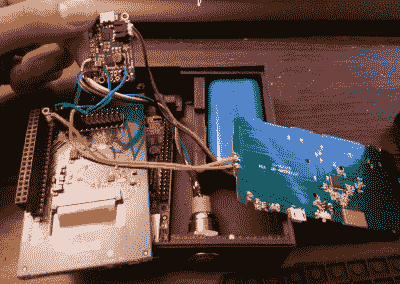

# 这个小巧的码头将为您指路

> 原文：<https://hackaday.com/2020/03/13/this-compact-pi-terminal-will-show-you-the-way/>

Raspberry Pi 为那些希望构建一个可以随身携带的小型移动终端的人带来了令人难以置信的前景，这种终端可以扔进你的包里，每当有黑客攻击要做时就可以拿出来。但是要让小巧的 Linux 主板达到这一点需要做大量的工作。你需要找到一个合适的小键盘，设计一个定制的外壳，并把它连接起来，不让任何讨厌的魔法烟雾逸出。

但是[remag293]最近的一个项目可能会让那些希望涉足定制移动电脑世界的人变得更容易一些。这个四四方方的手持设备有你需要的一切，也有你不需要的一切。一个基本机箱，一份简短的零件清单，以及绝对最少的布线。有什么不喜欢的？即使您没有制作该设备的精确克隆，它也是快速引导您自己的定制终端的极好参考。

 那么 3D 打印的表壳里面有什么呢？不是很多，真的。显然有一个树莓皮，一个 3.5 英寸的 TFT 触摸屏显示器，和一个微型键盘。键盘是蓝牙类型的，除了从其外壳中释放出来并连接到显示模块上的插头以获得电源之外，它还是普通的。

至于你从外面看不到的部分，有一个 3.7 V 4400 mAh 电池组和一个 Adafruit PowerBoost 1000 模块来处理充电和配电。除了侧面的大发光按钮(如果你愿意，你当然可以用更低调的东西来代替)，就这些了。当所有这些都在一起时，您就有了一台电池供电的计算机，可以轻松上路。

如果你正在寻找一个大一点儿的东西，而且不仅仅是一点儿非传统的东西，[你可以从打印一份完整的网络版开始。毕竟，如果你打算建造自己的非传统便携式电脑，你不妨全力以赴。](https://hackaday.com/2019/09/20/3d-printed-virtuscope-is-a-raspberry-pi-4-cyberdeck-with-a-purpose/)