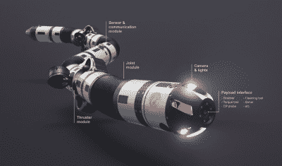

# 机器鳗鱼照看海底管道

> 原文：<https://hackaday.com/2020/03/15/robotic-eels-take-care-of-undersea-pipelines/>

我们不知道 [Eelume](https://eelume.com/) 是否真的存在，或者它只是一个好的 CG 和设计概念，但当我们看到下面的视频时，我们想立即开始工作。什么是 Eelume？一种永久生活在海底的机器鳗鱼。

如果你必须处理水下的东西，比如管道，这可能比派潜水员去海底更划算。我们喜欢自然的运动，我们真的很喜欢这个单元可以切换电池和工具头的方式。

 不过，我们确实有些疑问。你如何摆脱一个电池，拿起另一个？肯定会有一些电池容量不能互换，但这不是很有效，因为新电池必须给内部电池充电。也许你可以在两端添加电池。一些静态图片没有清楚地显示电池是如何安装的，尽管它们显示了灵活的关节，传感器，相机和推进器，这些都是模块化的。

根据该网站，工具可以放在任何一端，还有一个机器人手臂。该装置可以明显地将自身成形为 U 形，以将两端压在同一区域。一般来说，我们喜欢模仿自然的机器人，但这是我们见过的最实用的例子之一。

该网站上有一个视频，看起来是一个拴在游泳池里的真实硬件，但我们不知道该设备有多少是远程控制的，有多少是自动控制的。水下通信非常挑剔，通常需要水面上的天线或非常低的频率(因此，没有太多的带宽)。虽然完全复制这可能是一个壮举，但它可能会激发一些黑客友好的鳗鱼。

许多水下航行器似乎在模仿生物生命。从外形上看，我们必须记住获奖的水下滑翔机[，尽管它没有起伏。](https://hackaday.com/2017/05/24/hackaday-prize-entry-underwater-glider-offers-low-power-exploration/)

 [https://www.youtube.com/embed/plOqk-n9B20?version=3&rel=1&showsearch=0&showinfo=1&iv_load_policy=1&fs=1&hl=en-US&autohide=2&wmode=transparent](https://www.youtube.com/embed/plOqk-n9B20?version=3&rel=1&showsearch=0&showinfo=1&iv_load_policy=1&fs=1&hl=en-US&autohide=2&wmode=transparent)

