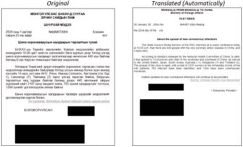

# 本周安全:在家工作版

> 原文：<https://hackaday.com/2020/03/20/this-week-in-security-working-from-home-edition/>

当世界静观其变，等待冠状病毒过去的时候，通常疯狂的安全新闻节奏已经稍微放缓。谷歌也不例外， [Chrome 81 也因此被延迟](https://www.zdnet.com/article/google-pauses-chrome-and-chrome-os-releases-due-to-coronavirus-outbreak/)。Chrome 和 Chrome OS 的主要更新无限期暂停，但安全更新将照常继续。事实上，谷歌已经证实，安全相关的更新将被打包为 Chrome 80 的次要更新。

### 伪装成中国病毒的中国病毒

说到新冠肺炎，Check Point Research 的研究人员偶然发现了利用当前健康恐慌的恶意软件活动。一对恶意 RTF 文档被发送到不同的蒙古目标。这些文件是用一种名为“[御道](https://www.anomali.com/blog/multiple-chinese-threat-groups-exploiting-cve-2018-0798-equation-editor-vulnerability-since-late-2018)的工具创建的，针对的是一组较老的微软 Word 漏洞。

这种特殊的攻击将其有效负载放在 Microsoft Word 启动文件夹中，等待下次启动 Word 运行下一阶段。这是一个聪明的策略，因为它会暂时转移对恶意文件的注意力。最后的有效载荷是一个自定义 RAT(远程访问木马)，可以截图，上传下载文件等。

虽然标准的否认归因困难确实适用，但这一特定攻击似乎来自中国情报机构。虽然冠状病毒的角度是新的，但这场运动似乎可以追溯到 2017 年。

### HTTP Desync

用一个专用的前端服务器，然后是一个后端服务器或一组服务器来构建 web 服务是一种相当常见的做法。我最近将我托管的一些网站移植到这种模式，使用 Nginx 服务器作为共享前端，将流量路由到适当的 Apache 后端服务器。Nginx 比 Apache 的伸缩性更好，它有助于分配公共 IPv4 地址。有一种攻击利用了这种安排:HTTP 请求走私。

使用专用前端时，通常的做法是共享一个 TCP 连接，可能还有一个 SSL 连接，并在一个共享流中将所有流量发送到后端。尤其是在使用 SSL 时，性能提升非常显著。使用共享流确实会带来额外的复杂性。当前端和后端对请求的解释不同时会发生什么，后端如何确保请求是分开的？

早在 2005 年，有人设计了一种攻击，利用了这两个问题中固有的问题。最初的 [HTTP 请求走私攻击](http://projects.webappsec.org/w/page/13246928/HTTP%20Request%20Smuggling) ( [白皮书](https://www.cgisecurity.com/lib/HTTP-Request-Smuggling.pdf))就像在一个请求中包含两个“内容长度”报头一样简单。人们发现，在前端和后端软件的某些组合中，前端将使用最后一个“内容长度”报头来解释请求，而 web 服务器本身将使用第一个报头。然后，通过一些仔细的请求处理，攻击者可以向前端发送一个 HTTP 请求，并让后端将这个请求解释为两个独立的请求。这似乎是一种不太引人注目的攻击，除非您考虑到许多部署依赖前端服务器进行请求验证和安全控制。如果您可以通过将恶意请求嵌入到无害的请求中来绕过前端，那么您就有可能直接攻击后端服务器。

请求走私并没有作为一种可行的攻击流行起来，而且这么长时间过去了，所有的主要产品都自动捕捉并减轻了这种特定的攻击。在 DEF CON 27 上发布的 [HTTP Desync](https://portswigger.net/research/http-desync-attacks-request-smuggling-reborn) 是对这种旧攻击的新尝试。这种攻击不是两次指定 content-length，而是同时使用 content-length 和 chunked 编码。这是达到相同最终目标的另一种方法，给出两种不同的长度，有不同的理解。[James Kettle]在他的 DEF CON 演讲中提到了一些聪明的技巧，比如在“Transfer-Encoding: chunked”头中添加非标准的空格。一端认为头是非标准的并忽略它，另一端可能会在处理头之前清除空白，导致 desync。

您可能认为 SSL 可以防范这种技术，但是我们描述的场景是 SSL 证书安装在前端服务器上。所有传入的请求都被解密并交织在一起，然后在到后端的途中可能会也可能不会被重新加密。因为正是这种交错导致了这类漏洞，所以 SSL 连接没有影响。

面对这种攻击，你能做什么呢？举个最简单的例子，绕过对某个端点的源 IP 限制。你的 WordPress 站点的/wp-admin 页面被限制为只有一个 IP 地址吗？HTTP Desync 可以绕过这一限制。在另一个例子中，[James]能够转储前端正在使用的所有定制 HTTP 头，然后伪造其中的一些头来获得对整个 web 服务的管理访问权。整个演讲非常棒，请看下面:

 [https://www.youtube.com/embed/w-eJM2Pc0KI?version=3&rel=1&showsearch=0&showinfo=1&iv_load_policy=1&fs=1&hl=en-US&autohide=2&wmode=transparent](https://www.youtube.com/embed/w-eJM2Pc0KI?version=3&rel=1&showsearch=0&showinfo=1&iv_load_policy=1&fs=1&hl=en-US&autohide=2&wmode=transparent)

本周的相关新闻， [[Emile Fugulin]查看了 HTTP Desyncs](https://medium.com/@emilefugulin/http-desync-attacks-with-python-and-aws-1ba07d2c860f) ，发现亚马逊的应用程序负载平衡器在默认配置下，当与 Gunicorn 后端配对时，存在潜在的漏洞。如果你用的是 ALB，他建议看看“routing . http . drop _ invalid _ header _ fields . enabled”选项，如果可以的话就打开它。Gunicorn 已经打了补丁，所以也要确保你运行的是最新版本。

### 安全产品中的远程代码执行

这很尴尬。[趋势科技披露了其产品](https://threatpost.com/trend-micro-fixes-critical-flaws-under-attack/153911/)中的一组五个安全漏洞，并透露其中两个已被攻击者主动利用。详细信息有点少，但似乎这两种在野外发现的攻击在被利用之前需要某种程度的身份验证。最令人担忧的两个漏洞是 CVE-2020-8598 和 CVE-2020-8599，这两个漏洞都允许在任何身份验证之前进行远程攻击。有趣的是，漏洞公告列出了一个缓解因素，转述如下:你有防火墙和 NAT，对吗？如果您使用趋势科技，请确保它是最新的，并可能对您的工作站上打开的端口进行快速审核。

### 巴格楚姆、网飞和伦理学

这个故事来得正是时候。一位未透露姓名的安全研究人员发现了网飞在处理会话 cookies 时的一个缺陷，以及他们对几个端点使用不安全的 HTTP 连接。是的，网飞仍然容易受到火灾的影响。

这可能是故事的结尾——网飞应该支付他们的 bug 赏金，修复他们不安全的子域，一切都会好起来。相反，当我们的匿名研究人员通过 Bugcrowd 提交他的发现时，这家公司负责处理网飞的 bug bounty 计划，官方的回应是，这一发现不属于奖励范围。这并不奇怪，对于研究人员来说，不同意目标公司关于漏洞有多重要的观点是正常的。正如人们可能预料的那样，一旦研究人员被告知他的发现超出了范围，他就将它们公之于众——并很快受到 Bugcrowd 的正式斥责。显然，超出范围的 bug 提交仍然在范围之内，足以保密。更令人担忧的是，Bugcrowd 的文档似乎没有包括一个设定的时间表，而是暗示所有的披露都必须首先获得目标公司的许可。

bug-boundaries 很棒，但是 Bugcrowd 让研究人员陷入了一个丑陋的第 22 条军规。我认为拒绝支付，然后继续在一个问题上控制研究人员是道德败坏的。

本周就到这里，注意安全，做一些安全研究！