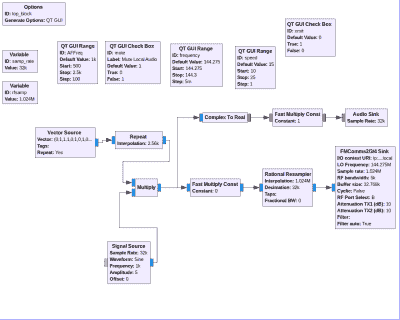
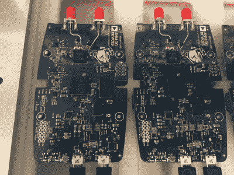
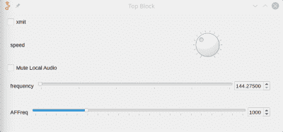

# 冥王星可能不是一颗行星，但它是一个 SDR 收发器

> 原文：<https://hackaday.com/2020/04/14/pluto-might-not-be-a-planet-but-it-is-an-sdr-transceiver/>

我们看到的许多 SDR 项目都使用廉价的 USB 加密狗。它们很棒，但是有时候你想要更多，尤其是有时候你想要传递。ADI 公司的 ADALM-Pluto SDR 很容易买到，价格为 200 美元，有时低至 100 美元，它使用模拟 AD9363 和 Zynq FPGA 进行发送和接收。虽然您通常使用该器件将 IQ 信号传输到主机，但您也可以在该器件上运行 SDR 应用程序。这需要您深入研究 Zynq 工具，这很有趣，但这是另一个话题。在这篇文章中，我将向你展示如何使用 GNU Radio 在 2m 业余无线电波段制作一个简单的莫尔斯电码信标。

我的长椅上有一个已经有一段时间了，我玩了一会儿。有几种方法可以和 GNU Radio 一起使用，看起来效果很好。你必须黑掉它，把频率范围降低一点。当然，一旦你拓宽了频率范围，它可能不“符合规格”,但它似乎工作得很好。被黑客攻击的设备不是以 20 MHz 带宽从 325 MHz 到 3,800 MHz 工作，而是以 56 MHz 带宽从 70 MHz 收发到 6,000 MHz。这是一个简单的技巧，你只需要做一次。它告诉设备，它有一个稍微好一点的板载芯片，我们猜测芯片是相同的，但按性能排序。因此，虽然规格可能有点偏离，你可能不会注意到。

## **准备**

 冥王星有几种不同的方式可以和它交流。首先，它看起来像一个插在你电脑上的驱动器。这对于更新固件之类的东西很方便。还有一种网络连接使用 USB 作为物理层。这让您可以来回移动数据，甚至得到一个命令提示符。

当然，如果你想把它和 GNU Radio 一起使用，你将需要一些块来和输入和输出对话。这里也有一些选择。ADI 公司维护[两组不同的模块](https://wiki.analog.com/resources/tools-software/linux-software/gnuradio)。看起来更老的是 PlutoSDR 块，但 IIO 块似乎更新，支持一堆设备。

不幸的是，构建这些模块可能会很痛苦。我在 Ubuntu repos 中使用发行版和 GNURadio 没有任何问题。但是当我切换到新的发布候选版本时，我无法构建它。看起来我需要手动构建一些库来让它工作，所以我只是在回购中坚持使用旧版本。

## **改变了同样的**

对于接收器，如果您构建了 IIO 或冥王星模块，这与您使用任何其他 SDR 接收器的情况非常相似。当然，有一些奇怪的地方。例如，因为设备是通过网络连接的，所以您必须提供一个连接字符串。如果能 ping 通`pluto.local`，可以用“ip:pluto.local”作为名字。如果没有设置 mDNS，您可能需要使用机器的 IP 地址。

其他都一样。当然，你需要考虑最小和最大采样速率(看看[的详细规格](https://wiki.analog.com/university/tools/pluto/devs/specs))。如果您将增益设置为自动，尝试手动设置增益时会出现错误。如果你设置增益超过限制，大约 70 分贝，你也会得到它们。

当然，冥王星和你的花园品种 SDR 加密狗之间的区别是，它有一个发射机，但如果你知道一点无线电，你不会发现传输非常混乱。智商进去，很低的射频出来。

## 冥王星的灯塔

我决定为两米波段制作一个莫尔斯电码信标。我是业余无线电操作员，信标会发送我的呼号，这是完全合法的。结果显示了 GNURadio 工作方式的一些细微差别。

你可以在 [GitHub](https://github.com/wd5gnr/cwbeacon) 上找到`grc`文件。您会注意到发射部分非常简单。当然，还有 RF 接收器，以及一个 rational 重采样器，用于将 CW 音从 32 kHz 采样速率转换为接收器使用的更高采样速率。Pluto 只能接受特定的采样率，在高采样率下生成侧音是没有用的，所以重采样器将较低的采样率转换为较高的采样率。你可以把新的采样率想象成`interpolation*(old_sample_rate/decimation)`。

真正的诀窍是如何让你想要发送的莫尔斯码调制正弦波。可能有很多方法，但我使用了矢量源。我必须承认我从[argilo]那里得到了这个想法，他在 GitHub 上有很多 SDR 的例子。

## **矢量**

即使 GNURadio 的新版本有其他的机制，一般来说，GNURadio 中的所有东西都是一个流。所以我需要一个看起来像我要发送的代码的流。源有一个流，其中 0 代表静音，1 代表音调。所以单个 1 是一个 dit，连续三个是 dah 或 dash。0 组合起来形成不同大小的空间。现在有两个问题。获得正确的速率，并得出矢量数据，这是令人惊讶的乏味。

固定利率很容易。每当有人得到一个样本时，矢量源就会得到一个样本，这相当于采样率。不过 1/32000 的 dit 给你 31 s 左右，相当快了。重复模块对样本进行插值。这意味着，对于每个样本，在从向量中获取另一个样本之前，它会重复一定次数。你可以通过调整插值来调整速度。

以秒为单位的代码元素长度的公式约为`1.2/speed`，其中速度以每分钟字数为单位。有一个 GUI 小部件可以选择速度。重复块中的公式为:`int( samp_rate*(1.2/speed))`。请记住，降低速度也会增加消息结束时的延迟。

这意味着向量中的一个 1 在 repeat 块的输出端变成了一串 1。你把正弦波乘以这些 0 和 1，就可以了。这仍然需要收集数据。

## **懒惰**

 没错，你可以用手来做，但那出奇的繁琐。我决定花点时间把它做好，然后写[一个小的 C 程序](https://github.com/wd5gnr/cwbeacon)来生成向量。事实是，你可以在 C 代码中进行插值，但这会产生很长的向量，而且在运行时也很难改变速度。

C 代码确实允许您调整代码元素和空格的内容。这是一个简单的程序，没有多余的装饰，但它完成了工作。由于没有命令行选项，您可以在中重定向文件并重定向输出文件。

我手动在末尾添加了一串零来隔开信标。将它添加到程序中可能是个不错的主意，这样你可以指定一个以秒为单位的间隙和采样速率，它会添加正确数量的零。如果您进行了修改，不要忘记采样率除以重复块的速率。

## **侧音**

我决定我想有音频出来的扬声器时，传输。至少有两种方法可以做到。我可以使用另一个信号源来产生信号音，并用 1 和 0 的数据流对其进行门控。然而，由于调制音已经达到 1 kHz，因此将其传输到音频是有意义的。一个复杂到真实的模块将东西设置到连接声卡的音频接收器。我在里面放了一个快速乘法常数，把音调乘以 1。这将允许您控制音量，但我只是想静音，所以 GUI 部件可以在 0 和 1 之间改变常数。

## **使用中**

如果你想试试这个，你应该改变我在信标上的呼号。你还需要选择一个你所在地区没有使用的好频率，尽管冥王星的输出很弱，不太可能干扰不在步行距离内的中继器。

如果你运行流程图，你会从你的电脑扬声器听到信标的侧音。如果你有一个调频收音机，如果你把天线靠得很近，你应该也能在收音机上听到信标。因为音频音调是开和关的，你可能想把你的静噪一直调低到听完整个点或破折号，因为静噪通常会在前端切断一点。

用户界面很难看，但通过 GUI 提示字段和一些关注，它可以变得更好。如果你以前没有用过这些，可以看看我们的 GNURadio 教程系列。

我厌倦了当我只想处理它的代码部分时，信标总是发射，所以我添加了另一个乘法和一个小部件作为开关，这样就可以在不停止侧音的情况下将发射器的输出强制为零。

事实是，如果我对调制脉冲进行一点波形整形，信标会更好，但对于这种低功率信标来说，这不是什么大问题。你可能还想调整 CW 间距，使之更符合你的喜好，这在 C 程序中很容易做到。

## **值**

对于实验来说，冥王星是伟大的。不过，我真希望它能调到 30 MHz 以下。然而，如果你打算用它来进行业余无线电操作，你可能需要对输出进行一些滤波，当然也需要一些放大。提供的小天线也不会做任何实际的事情。

如果你想知道更多关于 GNURadio 的信息，我们做了一些你可能会喜欢的视频。请记住，您也可以将它用于[信号处理音频](https://hackaday.com/2017/02/11/baofeng-handy-talkie-meets-gnu-radio/)。

本帖中的硬件照片均来自[ADI Wiki](https://wiki.analog.com/university/tools/pluto)。