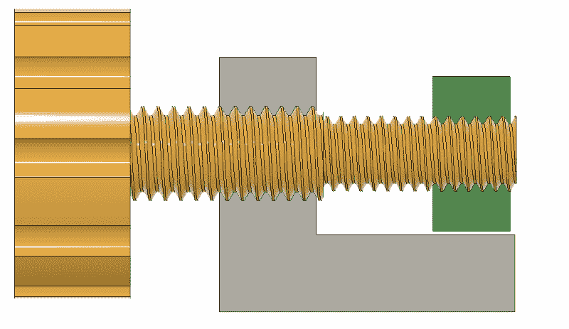

# 用于超精细调节的螺旋数学:差动螺钉

> 原文：<https://hackaday.com/2020/03/21/screwy-math-for-super-fine-adjustments-differential-screws/>

对于任何类型的精密机器，精度可调性是必需的。对于黑客来说，这通常涉及一个调整螺钉，其精度由螺距决定。这对于马克·雷霍斯特来说还不够好，他想把 3D 打印机的光学终端调整到 10 微米，所以他给自己做了一个[差动调整螺丝](https://hackaday.io/project/170424-differential-screw-z-axis-optical-endstop)。

Tiny adjustment can be made to the green block due to the thread pitch differences

差动螺旋的工作原理是在同一根轴上有两个螺距稍有不同的螺纹。每一段螺纹上的螺母不能相对于另一段旋转，当螺钉转动时，它们的相对位置的变化只相当于两个螺距之间的差值。

在这种情况下，差动螺旋作为具有 0.8 毫米螺距的普通 M5 螺栓开始使用。[标记]螺栓的机加工和螺纹部分，下至 M4 x 0.7 毫米螺纹。这意味着他每转一圈可以获得 0.1 毫米(100 微米)的调整。通过将螺栓旋转 1/10 圈，相对移动下降到 10 μm.

这一机制并不新鲜，至少始于 1817 年。如果你需要对预算进行微调，这是一种非常优雅的方式，你甚至不需要车床来制作自己的预算。您可以部分钻孔和攻丝连接螺母，或制作 3D 打印适配器来连接两个螺栓。

在预算范围内制造精密工具具有挑战性，但并非不可能。我们已经看到了一些有趣的[石墨空气轴承](https://hackaday.com/2019/12/28/ben-krasnows-take-on-diy-air-bearings/)，以及带有精密可调载物台的 [3D 打印显微镜](https://hackaday.com/2019/01/26/3d-printed-microscope-stage-offers-precise-movement/)。